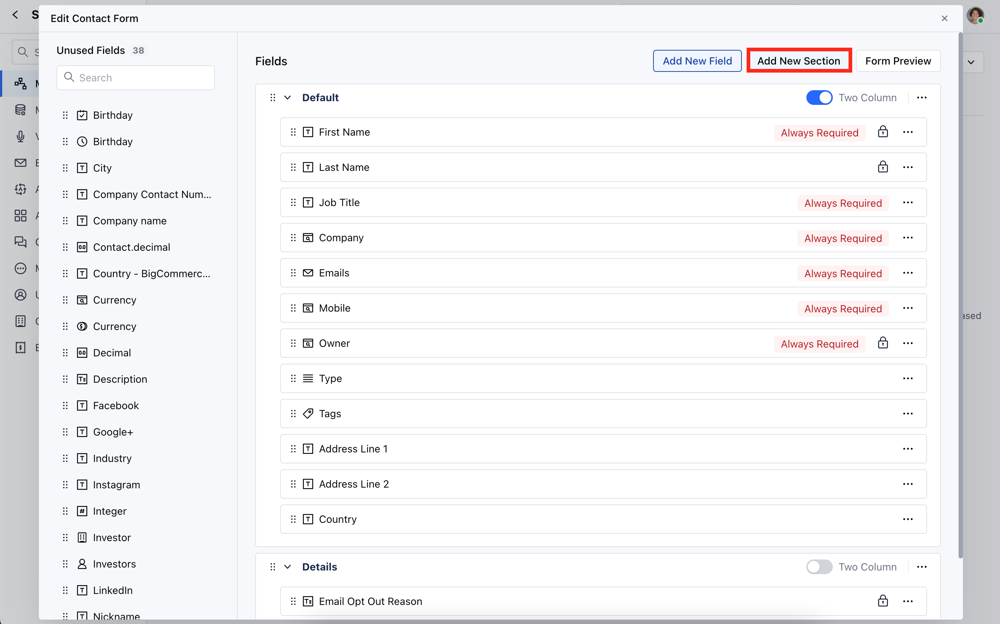
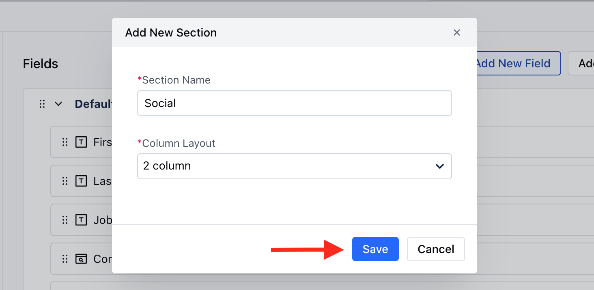
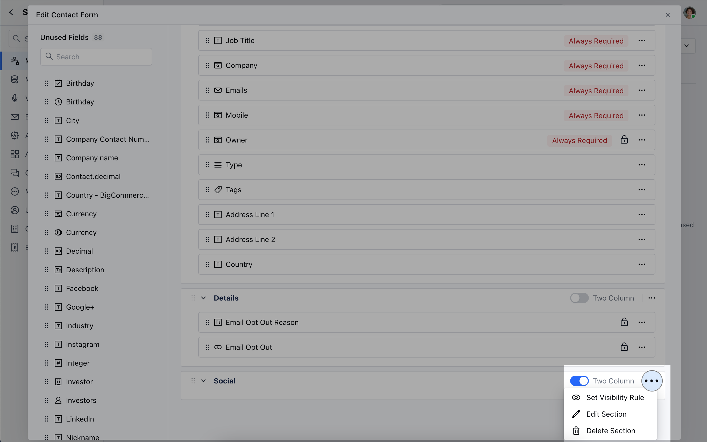

Customizing the module creation form allows businesses to adapt data collection according to their requirements. This flexibility ensures that the collected data is suitable and organized for their particular processes, ultimately improving efficiency and decision-making.

<iframe width="560" height="315" src="https://www.youtube.com/embed/tvrO8pUpU_g?list=PLyYol_VsdQ5kq3RxvfA2NaXeI_5bAaF1x" title="YouTube video" frameborder="0" allow="accelerometer; autoplay; clipboard-write; encrypted-media; gyroscope; picture-in-picture; web-share" allowfullscreen />

### How to Create New Section for Create Forms

To Create a New Section,

- Navigate to the **Profile Icon** on the top right corner
- Click on **Set Up**
- Head Over to the **Modules** Category
- Select the Module(**Contact, Company and Ticket Module)**

- Click on Customize the Create Module Form under Layout
- You can add a new section by clicking on the button **“Add new section”** displayed at the top right corner of the screen.

- A popup will appear, where you need to provide the following details:
  - **Section Name**
  - **Column Layout**

Click on **Save**

- You can easily adjust the column layout of the section by toggling the "Two Columns" button.
- Additionally, you can perform other actions on the section by clicking on the three dots:
  - **Set Visibility Rule :** Define when this section should be visible based on specific conditions.
  - **Edit Section : **Rename the section or change its column structure (one or two columns).
  - **Delete Section : **Remove the section and its fields will be moved to the unused fields section.

<Note>
  **Note:**

  - If the visibility rule is set on the section, then a tag would appear on the section that says “Conditional Visibility”.
  - You cannot delete a section if it contains any locked or required fields.
  - You cannot delete a section if it contains any fields that have been used as a condition for visibility or required rules of other fields or contain any of the primary fields.
</Note>