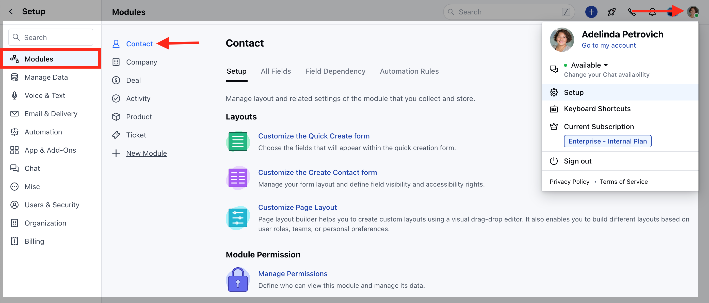
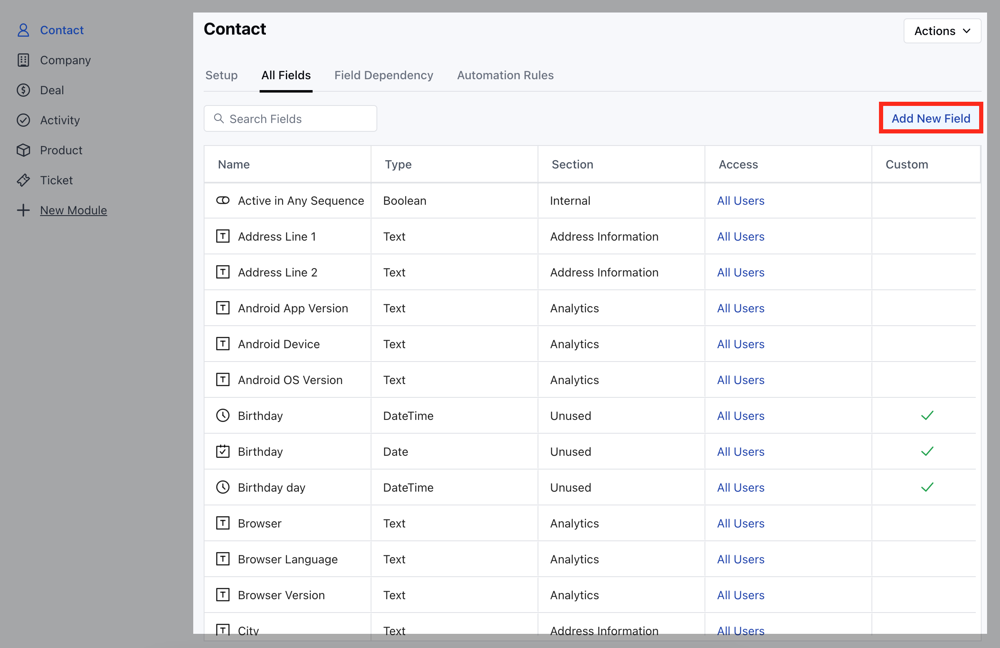
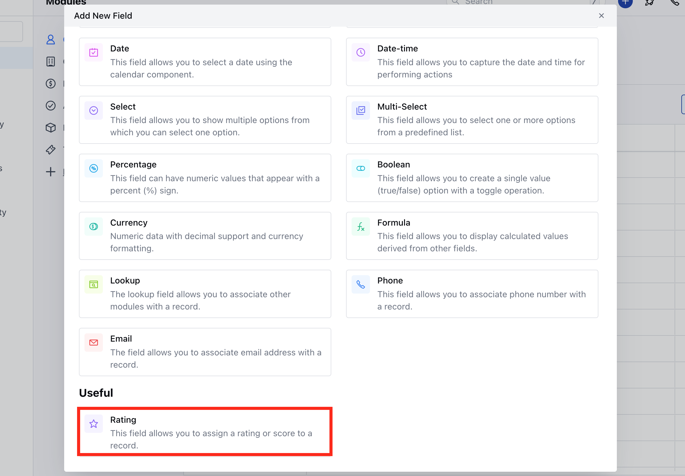
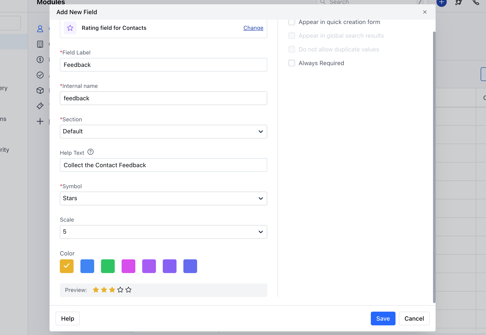

The rating field allows you to measure satisfaction levels, rate products or services, or evaluate performance based on specific criteria. It can also be used for performance evaluations on specific criteria or for capturing feedback.

To Create a Rating Field,

- Navigate to the **Profile Icon** on the top right corner
- Click on the **Set Up** 
- Head Over to the **Modules** Category
- Select the **Module** (**Contact, Company and Ticket Module)**

- Go to the **All Detail Form Fields** section
- Click on **Add New Field** to create a new custom field

- Select the **Field Type** as **Rating Field**

Provide the following details 

- **Field** **Label:** Define the label to identify the field.
  - **Internal Name:** Define the internal name for API integrations.
  - **Section:** Select the Section you wish the Field to fall under.
  - **Help Text:** Define Help Text to provide additional information to help your teammates understand the purpose of the field.
  - **Symbol:** Select the symbol for the rating you want to capture.
  - **Scale:** Define the scale or range for the rating, such as a 5-star rating on a scale of 1 to 5
  - **Colour:** Select colour in which the stars or hearts will be displayed when the user provides a rating value.
  - **Preview:** It will display the preview of the field based on what you select in symbol
- You can further choose to,
  - **Appear in Quick Creation Form:** Display this field in the quick creation form for easy access.
  - **Always Required:** Make this field mandatory if needed.
- Once done, click on**Save.** 

<Note>
  **Note:** This rating field will also be shown in the web forms and meeting schedulers.
</Note>