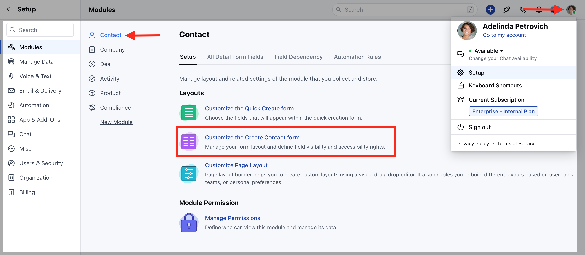
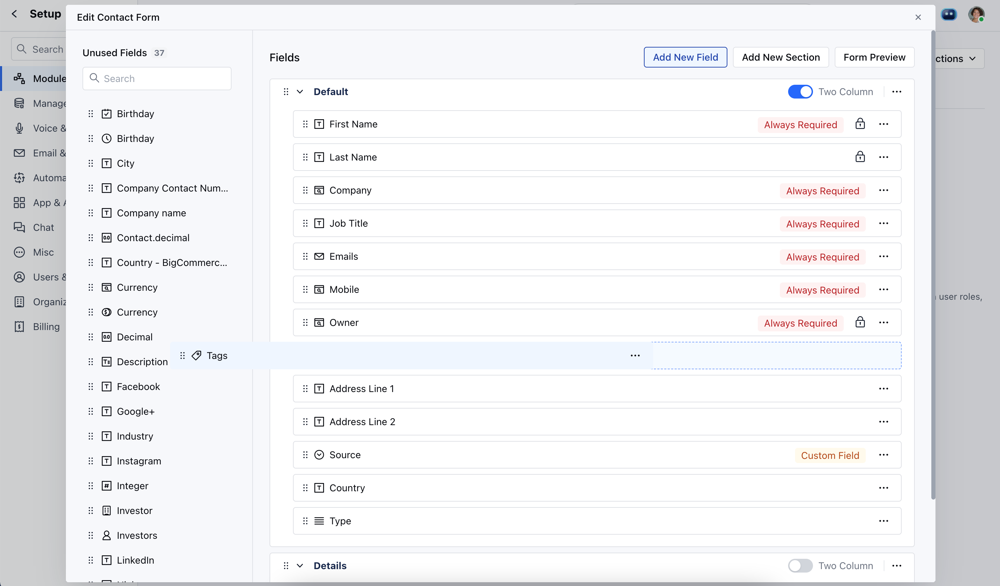

**Inactive Fields** have been renamed to **Unused Fields** in Salesmate. Unused Fields are essentially fields that are not needed in the Module Create Form and are moved to the Unused Field Section for organization.

These fields are hidden and not visible anywhere in the system to users. They are only displayed to users with permission to change the layout. However, their values can still be accessed and modified through the APIs of the admin profile.

<iframe width="560" height="315" src="https://www.youtube.com/embed/LU9pHuSNFQc?list=PLyYol_VsdQ5kq3RxvfA2NaXeI_5bAaF1x" title="YouTube video" frameborder="0" allow="accelerometer; autoplay; clipboard-write; encrypted-media; gyroscope; picture-in-picture; web-share" allowfullscreen />

### How to Move Custom Fields to Unused Section

To move the Unused Fields in Create Form,

- Navigate to the **Profile Icon** on the top right corner
- Click on **Set-Up** 
- Head over to the **Modules** section
- Select the preferred\*\* Module **(Contact, Company and Ticket Module)** 
- Click on **Customize the Create Form** 

- Select the field, drag and drop to move the fields to the Unused Fields Section 
- And vice versa to move the **Unused Fields** to the **Active fields**

<Note>
  **Note:** Please note that Required Fields and Locked Fields cannot be moved Unused section
</Note>