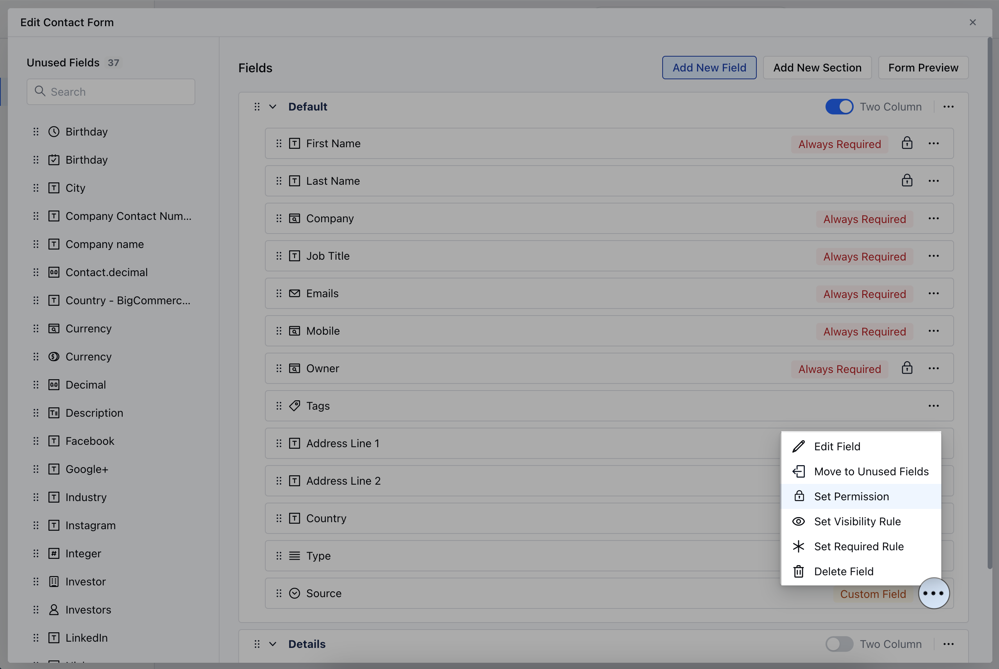
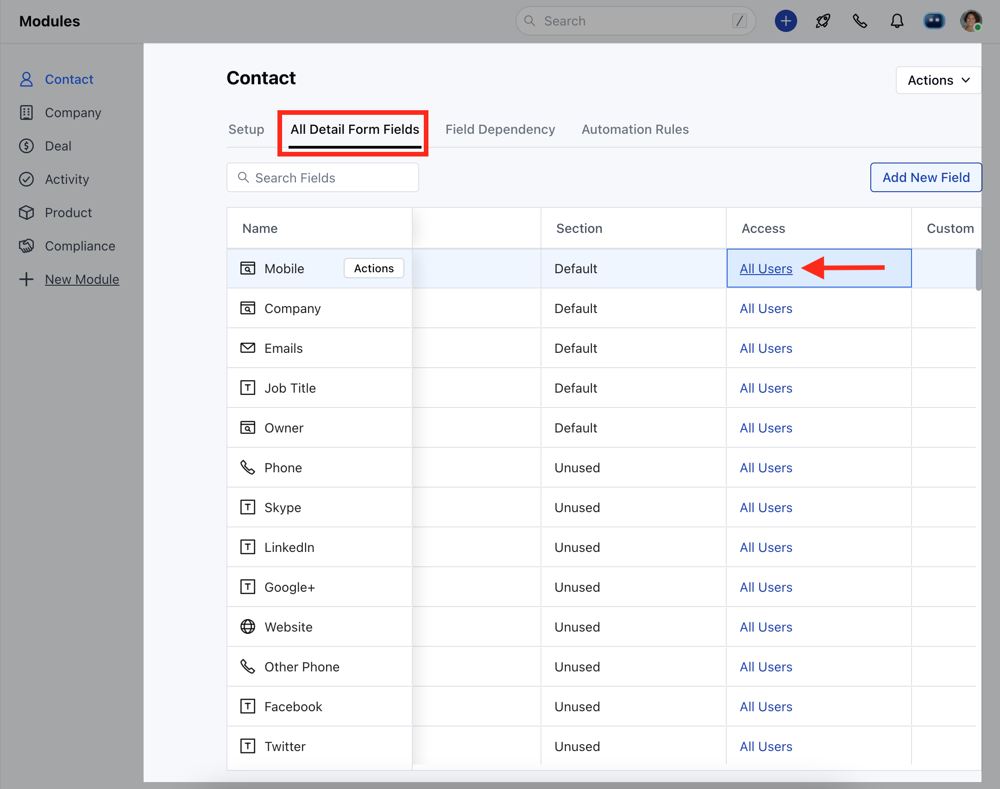
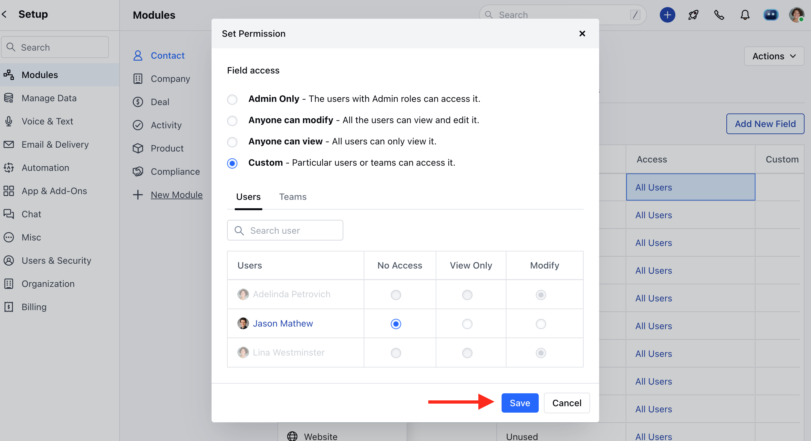

Setting Field Permission allows access to specific CRM fields for maintaining data security and privacy. It ensures that only authorized users can access and modify sensitive information, thereby safeguarding critical data.

<iframe width="560" height="315" src="https://www.youtube.com/embed/dFO1Ej1hLK8?list=PLyYol_VsdQ5kq3RxvfA2NaXeI_5bAaF1x" title="YouTube video" frameborder="0" allow="accelerometer; autoplay; clipboard-write; encrypted-media; gyroscope; picture-in-picture; web-share" allowfullscreen />

<Note>
  **Note:** Available for **Pro** and above Plans
</Note>

### How to Set Field Permission

To Set Field Permission,

- Navigate to the **Profile Icon** on the top right corner
- Click on Set Up
- Head Over to the Modules Category
- Select the Module(**Contact, Company and Ticket Modules)**

- Click on **Customize the Create Module Form** under Layout

- Choose the field for which you want to Set Permissions, then click on the three dots located at the corner
- Click on the **Set Permission** option

OR

- Go to **All Detail Form Field Section** 
- Choose the field for which you want to set permissions, then click on the corresponding permission option under the **Access** column

You can Set Permission from the following options 

- **Admin Only**: Limits access to admin users only, granting them exclusive view and edit privileges.
- **Anyone can Modify:** Allows all users with access to the link to view and edit the field.
- **Anyone can View:** Provides view-only access to all users.
- **Custom:** Offers more specific configurations, allowing you to assign view and edit permissions individually to users or teams. You can assign one of the following permissions to each user or group: **No access, View only, or Modify.**

<Note>
  **Note:** Please Note that Users with Manage Layout Permission can perform this action
</Note>