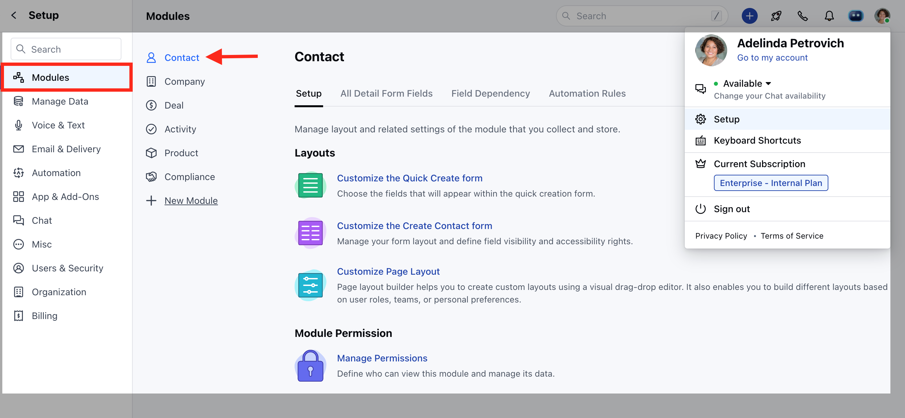
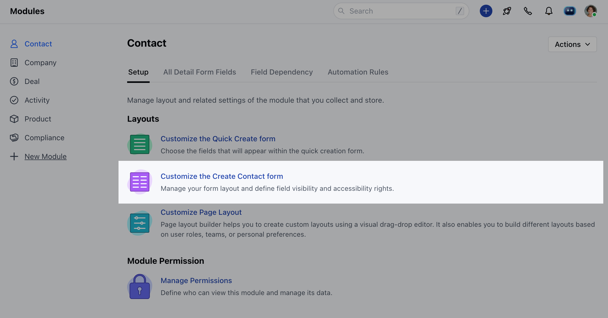

It ensures that only authorized users can access and modify sensitive information, thereby safeguarding critical data.

**Note:** Available for **Pro** and above Plans

<iframe width="560" height="315" src="https://www.youtube.com/embed/dFO1Ej1hLK8?list=PLyYol_VsdQ5kq3RxvfA2NaXeI_5bAaF1x" title="YouTube video" frameborder="0" allow="accelerometer; autoplay; clipboard-write; encrypted-media; gyroscope; picture-in-picture; web-share" allowfullscreen/>

###  How to Set Field Permission

To Set Field Permission,

Navigate to the **Profile Icon** on the top right cornerClick on Set UpHead Over to the Modules CategorySelect the Module(**Contact, Company, Deal, Products, and Custom Modules)**

Click on **Customize the Create Module Form** under Layout

Choose the field for which you want to Set Permissions, then click on the three dots located at the cornerClick on the **Set Permission** option

OR

Go to **All Detail Form Field Section** Choose the field for which you want to set permissions, then click on the corresponding permission option under the **Access** column

You can Set Permission from the following options **Admin Only**: Limits access to admin users only, granting them exclusive view and edit privileges.

- **Anyone can Modify:** Allows all users with access to the link to view and edit the field.

- **Anyone can View:** Provides view-only access to all users.

- **Custom:** Offers more specific configurations, allowing you to assign view and edit permissions individually to users or teams. You can assign one of the following permissions to each user or group:** No access, View only, or Modify.

- **

**Note:** Please Note that Users with Manage Layout Permission can perform this action
