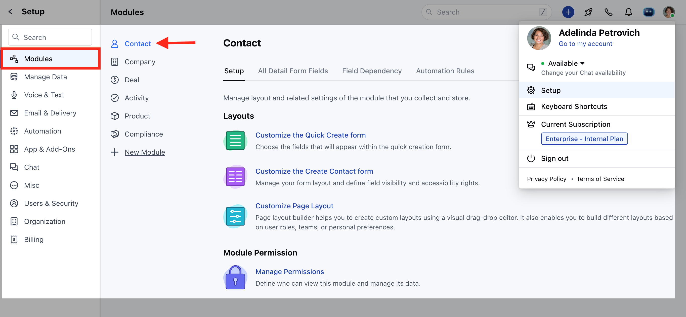
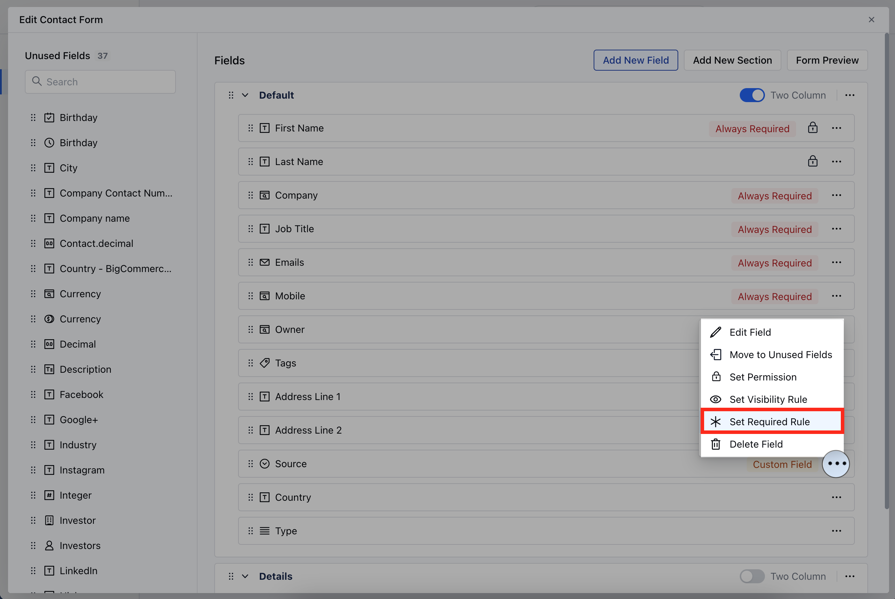
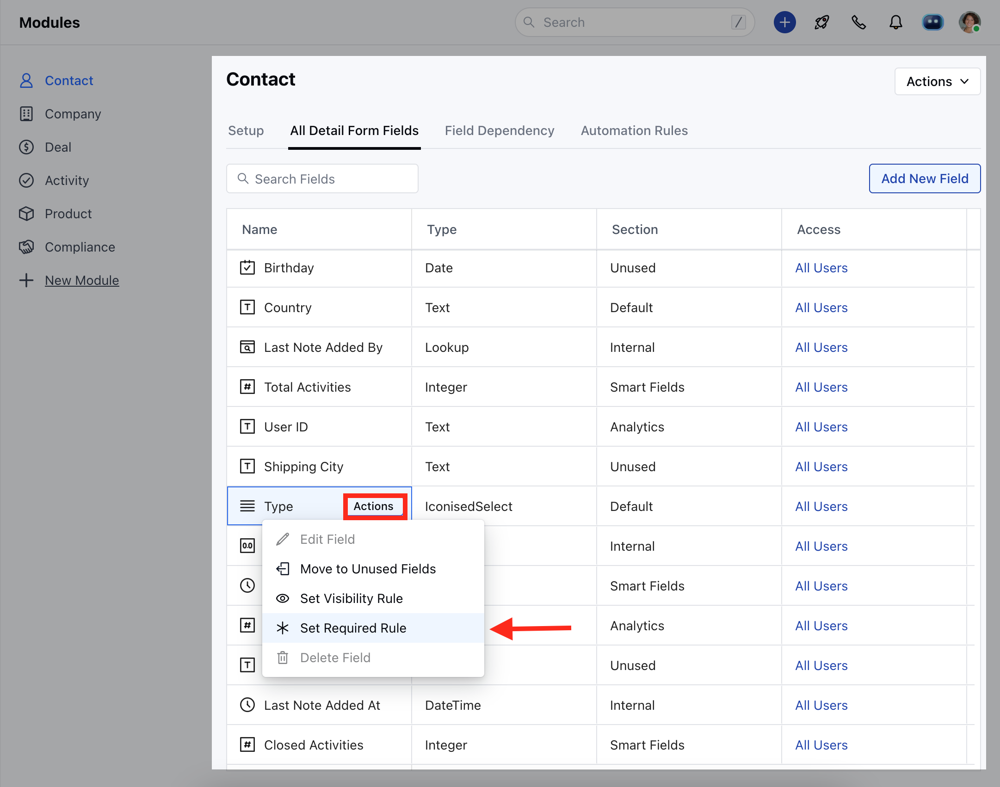
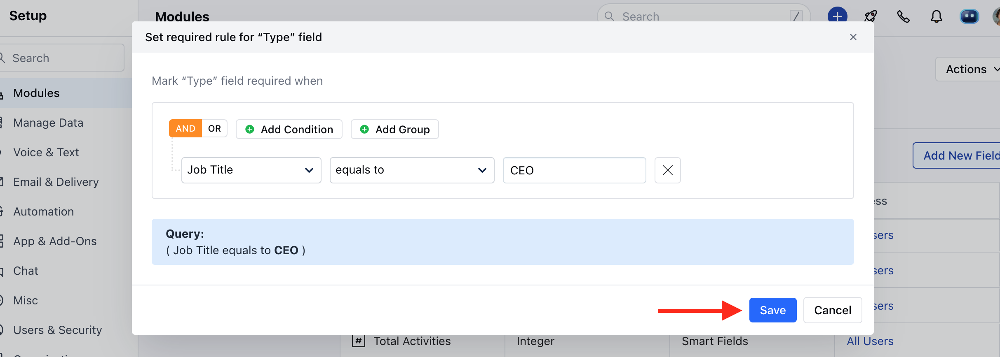

Setting the "Required" rule to fields in Skara ensures that certain data must be provided before saving or submitting a form, helping maintain data completeness and accuracy.

<iframe width="560" height="315" src="https://www.youtube.com/embed/dg7e9cmuHZA" title="YouTube video" frameborder="0" allow="accelerometer; autoplay; clipboard-write; encrypted-media; gyroscope; picture-in-picture; web-share" allowfullscreen />

<Note>
  **Note:** Available for **Pro** and above Plans
</Note>

### How to Set Field Required Rule

To Set the Field Required Rule,

- Navigate to the **Profile Icon** on the top right corner
- Click on **Set Up** 
- Head Over to the **Modules Category** 
- Select the Module(**Contact, Company and Ticket Modules)**

- Click on **Customize the Create Module Form** under Layout

- Choose the field for which you wish to Set the Required Rule, then click on the three dots located at the corner
- Click on the **Set Required Rule** option

OR

- Go to **All Detail Form Field Section** 
- To Set the Required Rule for a field, hover over the field you wish to modify and click on the **Actions** button.
- Click on the **Set Required Rule** option

- Set the Required Criteria
- Once the condition is set, hit **Save**.

<Note>
  **Note**: Please Note that a user with **Manage Modules** permission can configure these settings.
</Note>