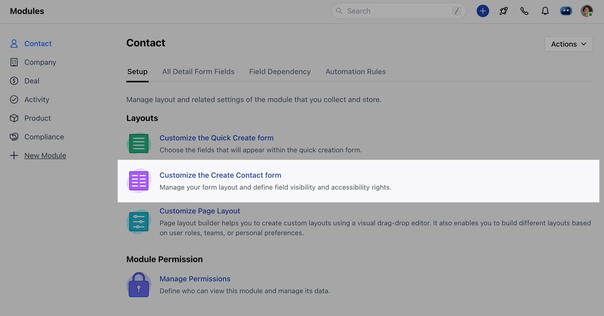
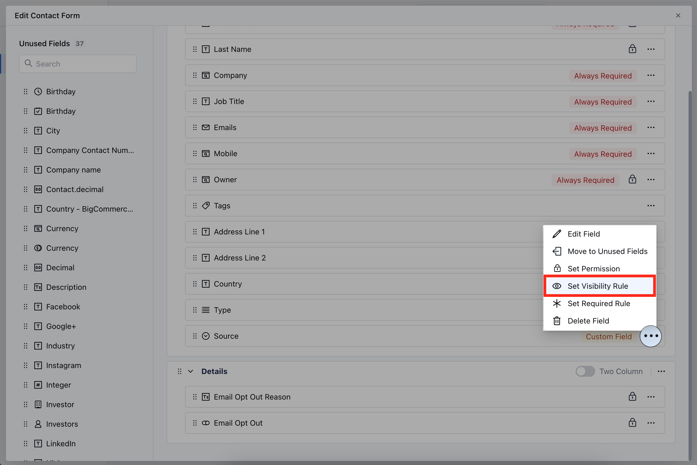
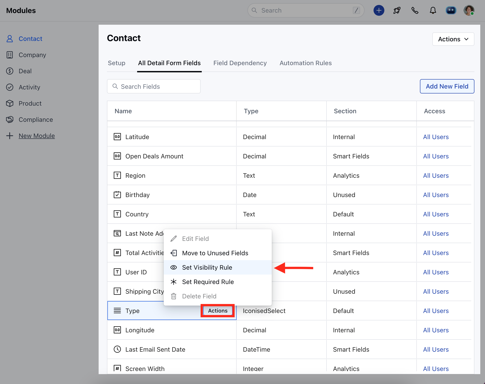
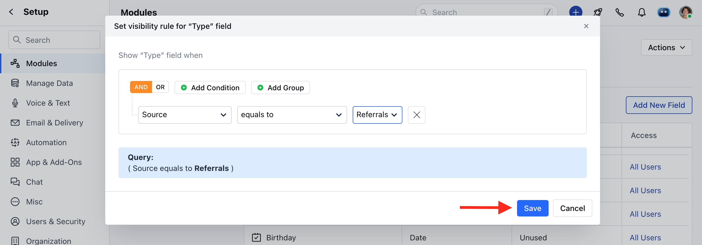

Set Field Visibility Rule to decide whether a specific field should be shown or hidden based on certain conditions. It helps make sure users see the right information at the right time

<iframe width="560" height="315" src="https://www.youtube.com/embed/Pe_1uzgmxjM?list=PLyYol_VsdQ5kq3RxvfA2NaXeI_5bAaF1x" title="YouTube video" frameborder="0" allow="accelerometer; autoplay; clipboard-write; encrypted-media; gyroscope; picture-in-picture; web-share" allowfullscreen />

<Note>
  **Note:** Available for **Pro** and above Plans
</Note>

### How to Set Field Visibility Rule

To Set the Field Visibility Rule,

- Navigate to the **Profile Icon** on the top right corner
- Click on the **Set Up**
- Head Over to the **Modules** Category
- Select the Module(**Contact, Company and Ticket Module)**

- Click on **Customize the Create Module Form** under Layout

- Choose the field for which you wish to Set the Visibility Rule, then click on the three dots located at the corner
- Click on the **Set Visibility Rule** option

OR

- Go to **All Detail Form Field Section**
- To set the visibility for a field, hover over the field you wish to modify and click on the **Actions** button.
- Click on the **Set Visibility Rule** option

- Set the Visibility Criteria
- Once the condition is set, hit **Save**.

<Note>
  **Note: **Please Note that a user with **Manage Modules** permission can configure these settings.
</Note>