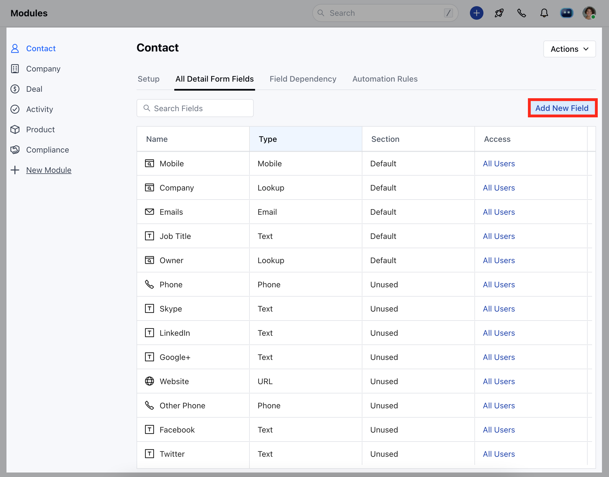
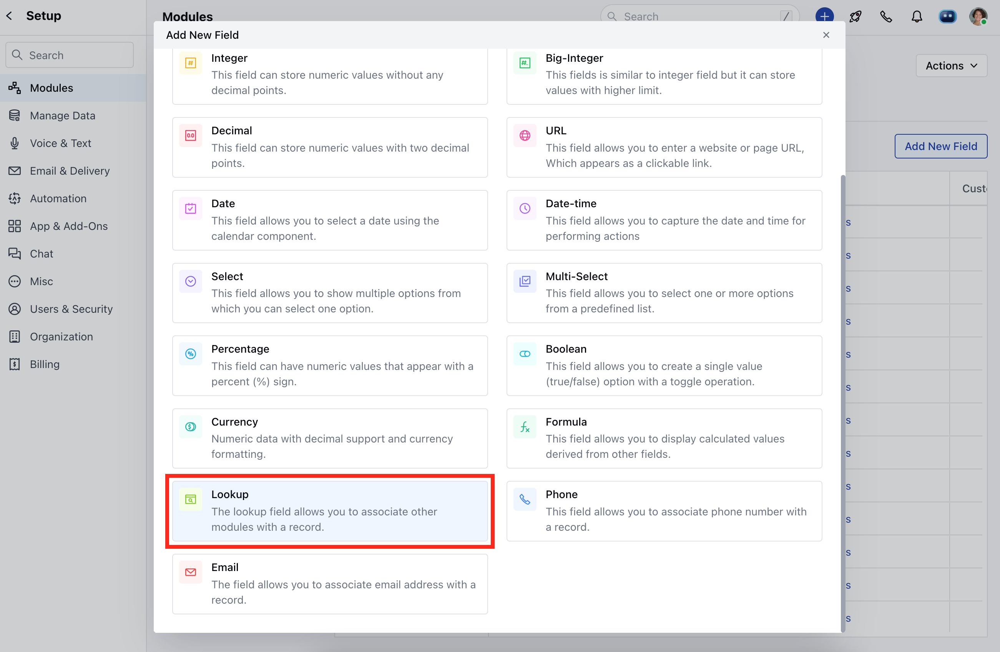
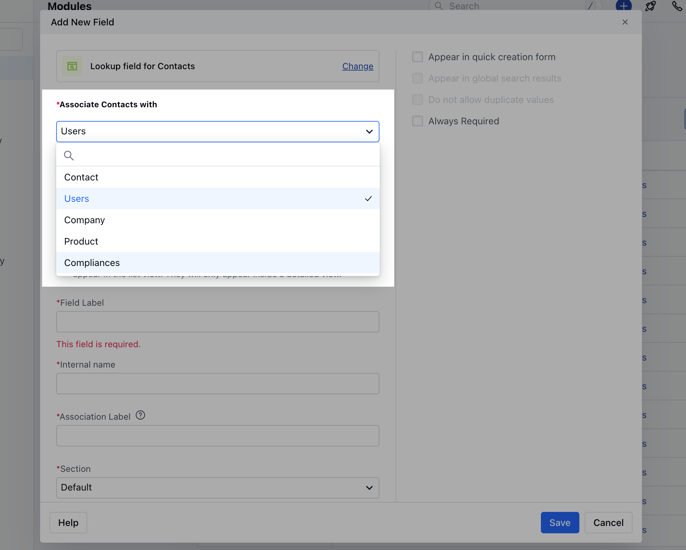
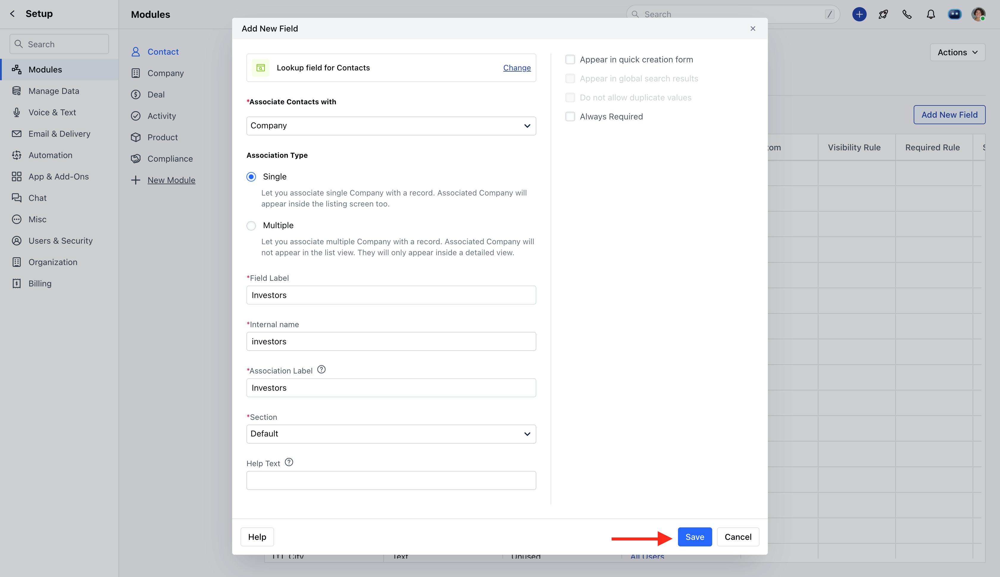

<Note>
  **Note:**

  - Lookup fields are only available for the Contact, Company and Ticket module.
  - You can create Lookup fields of the type Contact, Company and Ticket module, and Users.
  - Third-party integrations like Zapier, Hubspot, or others might not be fully compatible with this feature. 
  - We do not support bulk editing, mass operations, or workflow field updates for the lookup fields.
</Note>

We can create a relationship between two records using the lookup fields. For example, you can create a company-type lookup field to manage parent and child company relations. Or a contact type lookup field and track the investor who has invested in different companies.These relations can be of the type of one-to-many or many-to-many.

**One-to-Many (Single Lookup)**

- A child company will have a single parent company, but a parent company can have many child companies. E.g., Alphabet is the parent company of Google, Google Fibre, Capital G, Loon, and many more. So this is a one-to-many relationship. In Skara, you can create such a relationship using a Single Lookup.

**Many-to-Many (Multiple Lookup)**

- One investor can invest in multiple companies, but a single company can have multiple investors too. So this kind of relationship can't be achieved using Single Lookup and we require many-to-many relationships, and hence this can be achieved using the Multiple-lookup field.

### **Topics covered:**

- [How to Create a Look-Up Field](#how-to-create-a-look-up-field)
- [Filter using Look-Up Field](#filter-using-lookup-fields)
- [How do Multiple Look-Up Fields appear inside Skara ](#how-to-create-a-look-up-field)

### How to Create a Look-Up Field

Lookup fields are created in the same way as custom fields.

- Navigate to the **Profile Icon** on the top right corner
- Click on the **Set Up**
- Head Over to the **Modules** Category
- Select the Module(**Contact, Company and Ticket Module)**

- Go to the **All Detail Form Fields** section
- Click on **Add New Field** to create a new custom field

- Select the Field Type as a Look-Up Field

- You can select any of the following lookup field types **(Contact / Company / User/ Ticket Module)**

- Select the Lookup type:-
  - Single (1-to-Many relationship)
  - Multiple (Many-to-Many relationship)
- **Field** **Label:** Name the primary relationship with the record using the**Field Label ** 
- **Internal Name:** Define the internal name for API integration
- **Association Label:** Name the reverse relationship with the record using the **Association Label**
- **Section:** Select the **Section** for the custom field to appear.
- **Help Text:** Define Help Text to provide additional information to help your teammates understand the purpose of the field 
- Select if the field should be marked as required or not (If you are using 3rd party integrations to push the data inside Skara, then please keep this field as not required.)
- Hit **Save **

### Filter using lookup fields

Skara lets you filter records using the lookup field's primary relation. If you have created a single lookup field, then you will have the following options for your search query.

- **Contains**- Include records, whereas the name matches partially.
- **Does not contain**- Exclude records, whereas name matches partially.
- **Is**- Include records, whereas the name matches exactly
- **Is Not**- Exclude records, where the name matches exactly
- **Starts With**- Include records, whereas the starting of the name matches partially.
- **Ends With**- Include records, whereas the ending of the name matches partially.
- **Is Unknown**- Include records, whereas the relationship is not defined.
- **Has any value**- Include records, whereas the relationship is defined.

If you have created multiple lookup fields, then you will have the following options for your search query.

- **Is** -Include records, where related record matches exactly
- **Is Not** -Exclude records, where related record matches exactly
- **Is Unknown -** Include records, where the relationship is not defined.
- **Has any value**- Include records, where the relationship is defined.

<Note>
  ### Important Information

  - The single Lookup field's primary relation appears inside the listing screens of any module.
  - Multiple lookup field data will not be available inside grid listing screens. That info can only be seen on the record's detail page.
</Note>

### How do Multiple Lookup fields appear inside Skara?

- They will appear in the form of widgets inside the right sidebar. You can re-order the position of the widget as per your requirement.