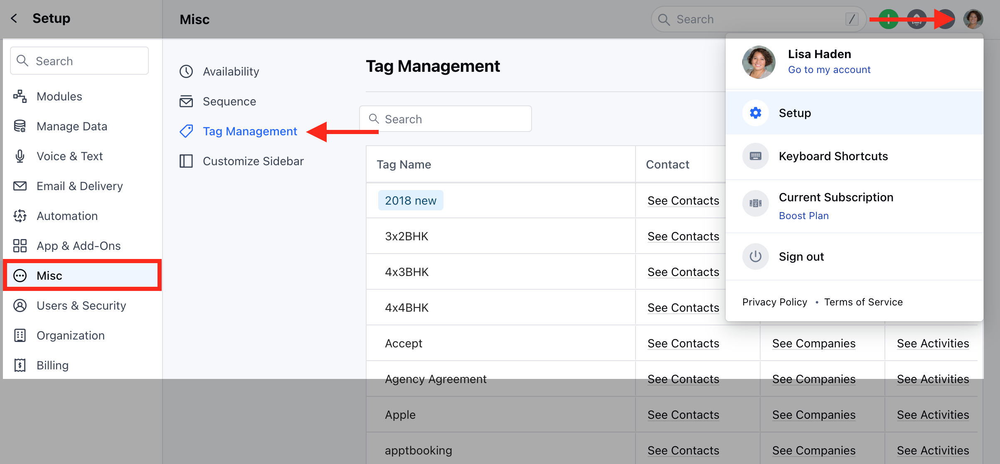
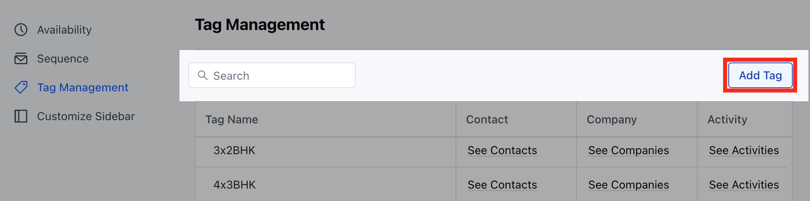
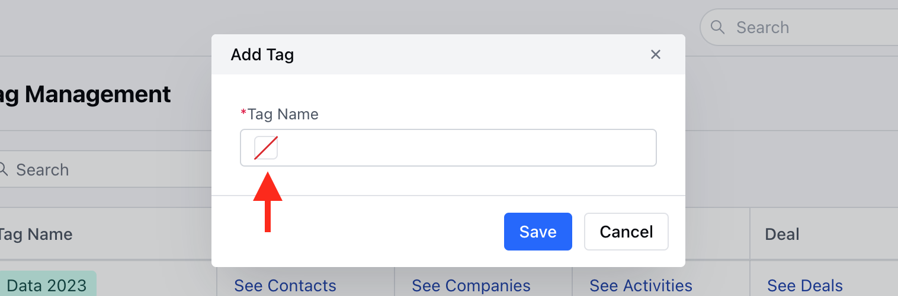
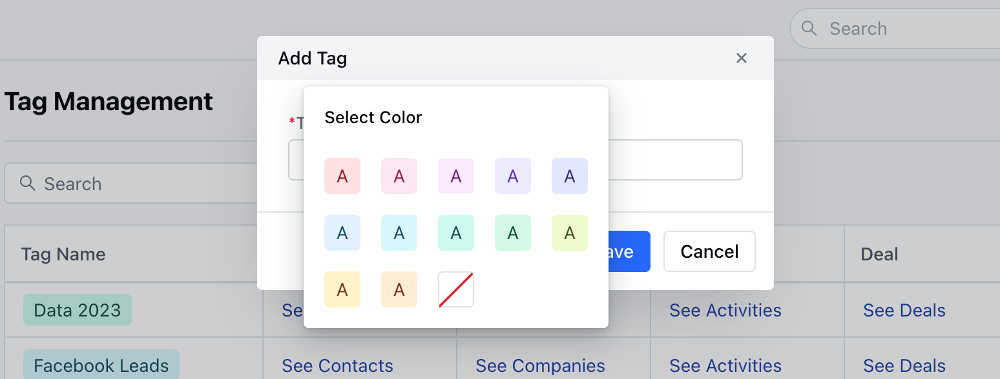
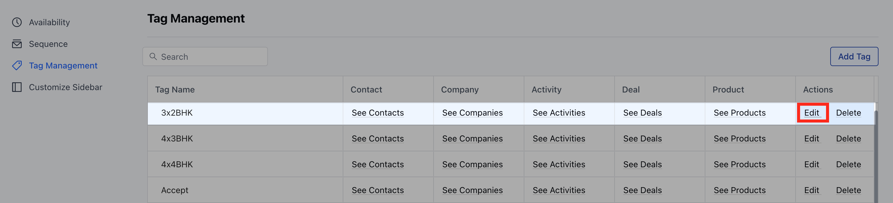
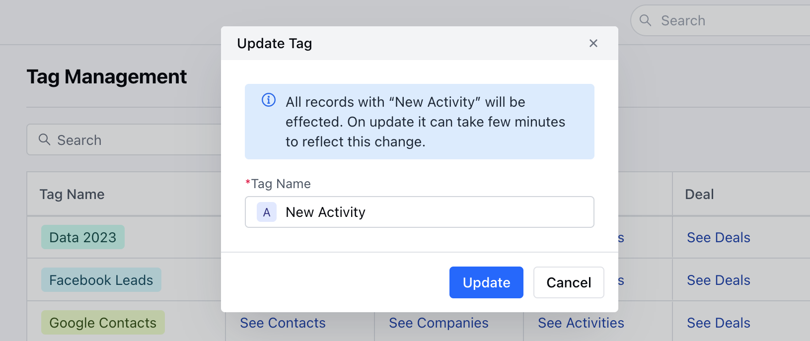

Tags are a versatile tool to keep your Data segregated, they help organize your Records by different segments and enable data-driven decision-making. Salesmate now allows you to customize the Tags with the color of your choice.You can add colors while,

<iframe
  width="560"
  height="315"
  src="https://www.youtube.com/embed/7vb1CQ_srKg?list=PLyYol_VsdQ5kq3RxvfA2NaXeI_5bAaF1x"
  title="YouTube video"
  frameborder="0"
  allow="accelerometer; autoplay; clipboard-write; encrypted-media; gyroscope; picture-in-picture; web-share"
  allowfullscreen
></iframe>

[**Creating a New Tag**](https://support.salesmate.io/hc/en-us/articles/23694312559257#h_01HBZJJ4HSDX444R1FB9W95NMQ)[**Update the Existing Tags**](https://support.salesmate.io/hc/en-us/articles/23694312559257#h_01HBZK9W8YXJK8BT4FM8QTECF7)

To add colors to the Tag,

Navigate to the**Profile Icon**on the top right cornerClick on**Set Up**Head over to the**Misc**categoryClick on Tag Management

### Creating a New Tag

Click on the Add Tag option

Click on the**Square icon**

Select the**Colour**

Enter the**Tag Name**Click on**Save**

### Update the Existing Tags

Select the Tag you wish to**Update**Click on the**Edit**option

Click on the**Square Icon**followed by selecting the ColorHit on the**Update**option

