A **tag** is a label attached to the record to identify and group the records. Tags are a great way to manage your records, perform workflow actions on them, and automate your sales process.Salesmate lets you add tags to Contacts, Companies, Activities, and Deals. Tagging can be useful when you want to quickly filter a particular set of records.

**Topics covered:** -

- [How to Create a New Tag](#how-to-create-a-new-tag)
- [How to Rename/ Edit Tags](#how-to-rename-edit-tags)
- [Bulk Updating the records via Tag](#bulk-updating-the-records-via-tag)
- [Filtering the records via Tag](#filtering-the-records-via-tag)
- [How to Delete a Tag](#how-to-delete-a-tag)

### How to Create a New Tag

You can add a tag directly to the record.

- Go to the Record where you want to apply the tag.
- **Tags:** Start Adding the tag and hit enter. This will auto-create a tag and get appended to the record.
- Click on **Save.**

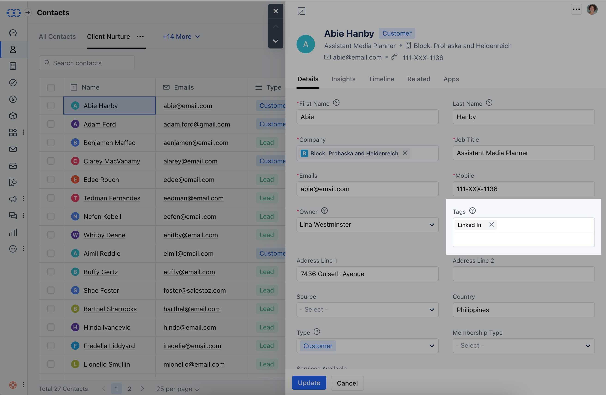

### Another way to add a new Tag:

- Navigate to the **Profile icon** in the top right corner.
- Click on the **Setup.**
- Head over to the **Misc** category.
- Click on **Tag Management.**

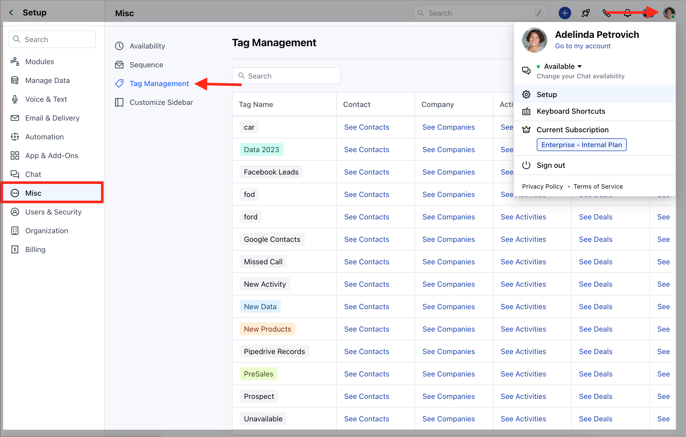

- Click the **Add Tag** button.

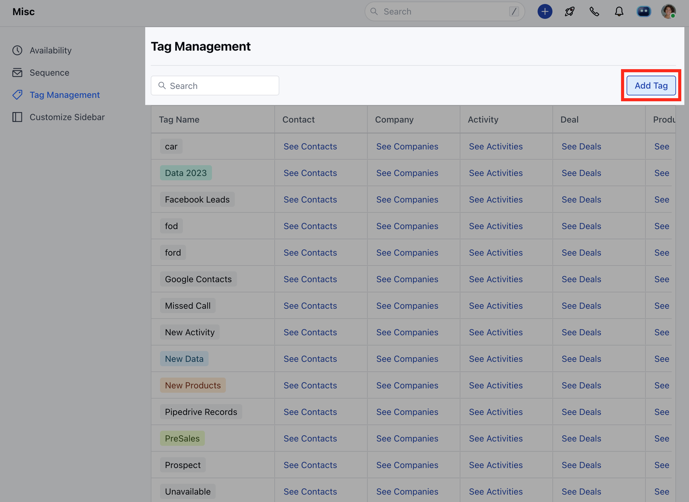

- Select the [Tag Colour](https://support.salesmate.io/hc/en-us/articles/23694312559257-Tag-Color-Customization)
- Enter the **Tag Name.**
- Click on **Add.**

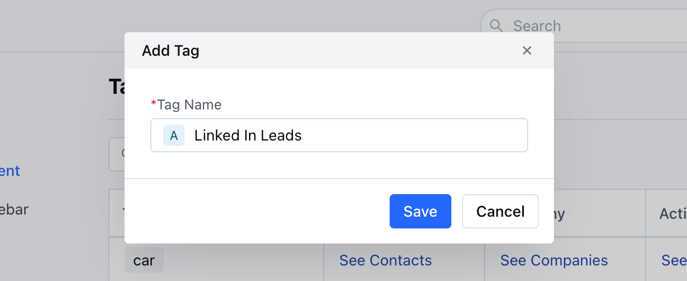

### How to Rename/ Edit Tags

To rename or edit a tag:

- Navigate to the **Profile icon** in the top right corner.
- Click on **Setup.**
- Head over to the **Misc** category.
- Click on **Tag Management.**
- Click on the **Edit** option

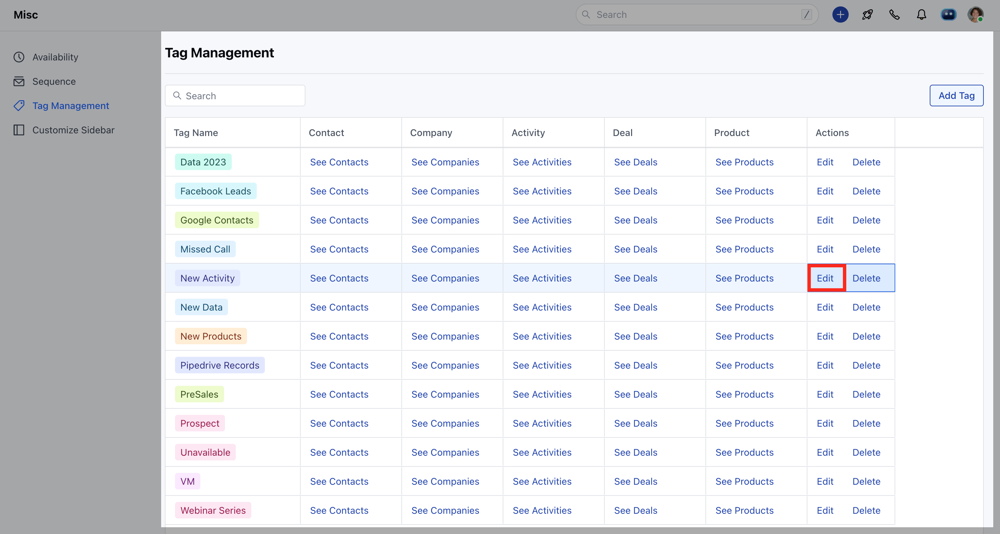

- Change the [Tag Colour](https://support.salesmate.io/hc/en-us/articles/23694312559257-Tag-Color-Customization)
- Enter the new **Tag Name.**
- Click on **Update**.

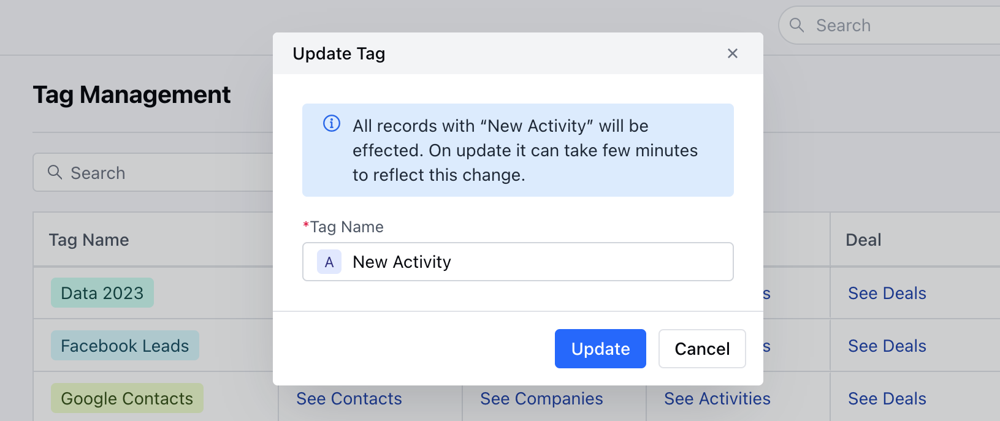

### Bulk Updating the records via Tag

To bulk update tags:

- Navigate to the preferred Module.
- Select the records on which you wish to update the tags.
- Click on **the Update** button.

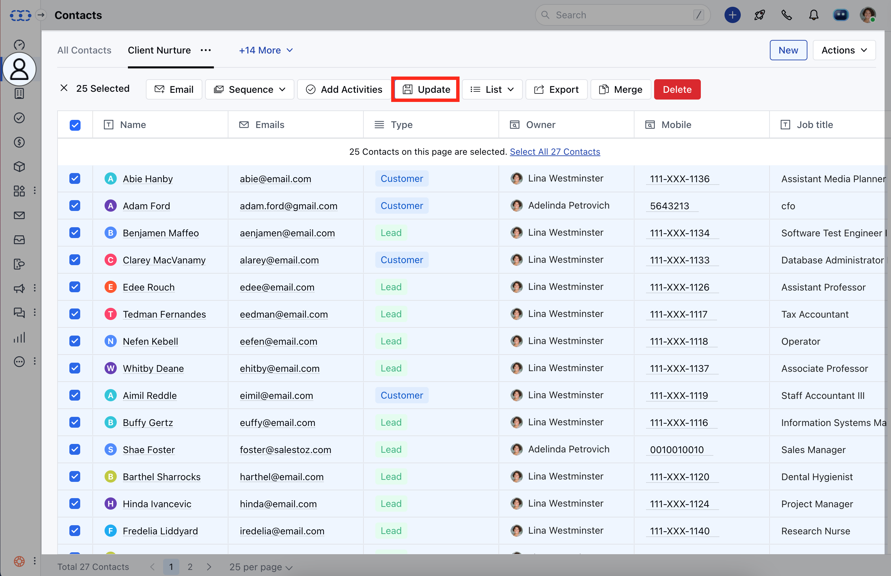

- Select the **Tag** field.
- Select the bulk update operation: Append, Remove, or Equal.
  - **Append**: This adds a new tag to your existing tag. You would see the new tag has been added keeping the old tag as well.
  - **Remove**: This will remove the entered tag from the record.
  - **Equal**: This will associate the entered tag with the record and remove all the other tags.

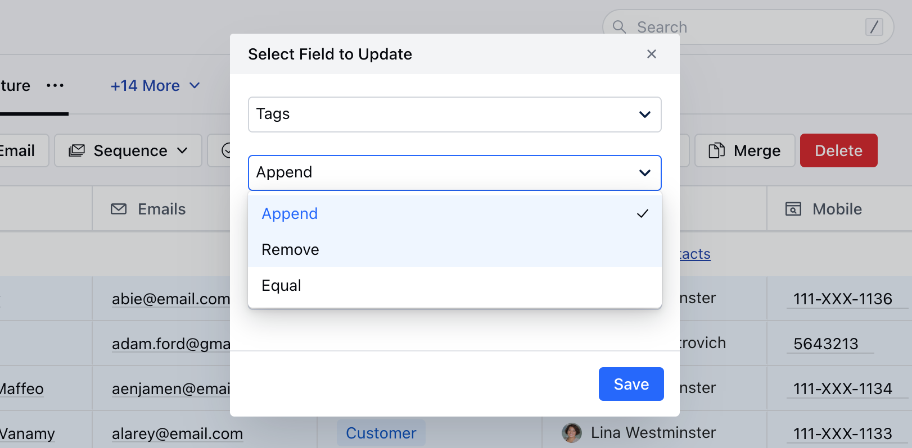

### Filtering the records via Tag

Tags are a great way to manage and filter records. It helps you keep your data handy whenever you need them. If you have imported or created records with certain Tags and you want to filter records for future use and manage them as a view, you can follow the below steps:-

- Go to the preferred **Module**
-  Click on the **Filters option**

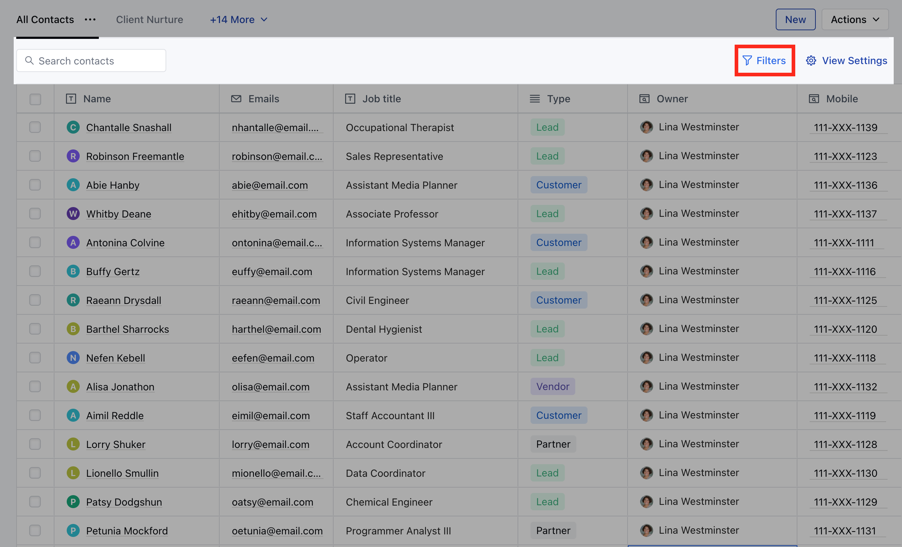

- Select Tag from the Module section.
- Filter your data with **Tags** and the required combination.

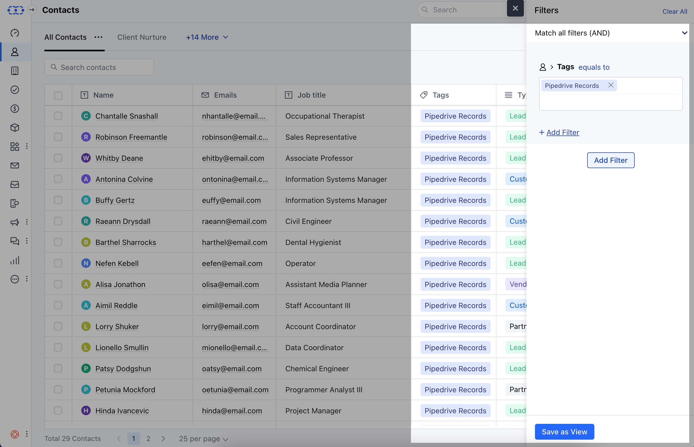

- Click on [**Save as View**](https://support.salesmate.io/hc/en-us/articles/115003184011-Smart-filters-and-Custom-views) to save the view for future usage
- You can edit the view in the future as well if required.

### How to Delete a Tag

When you delete a tag it will delete the tag and remove it from all the associated records.

To delete a tag:

- Navigate to the **Profile icon** in the top right corner.
- Click on **Setup.**
- Head over to the **Customizations** category.
- Click on **Tag Management.**
- Click on the **Delete**(trash) icon before a tag name.

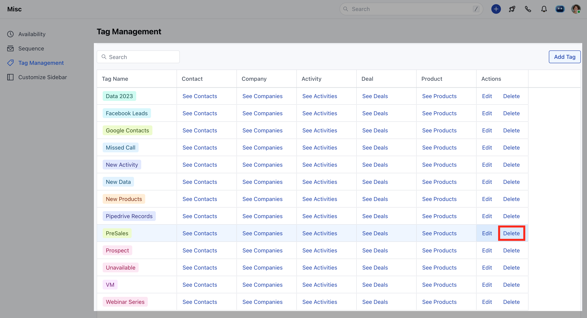

- Confirm the deletion by clicking **Yes**.

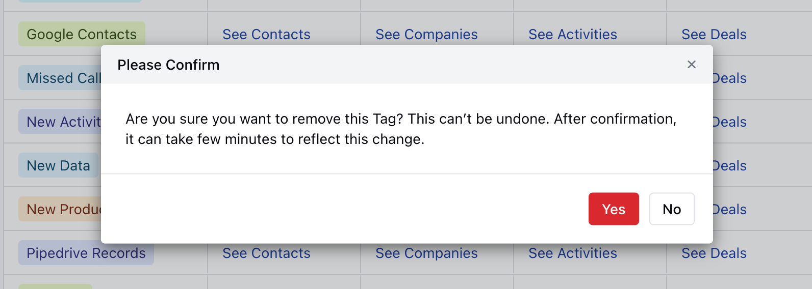

<Note>
  **Note:** Deleting or removing tags can cause associated views, reports, filters, and workflows to stop working.
</Note>