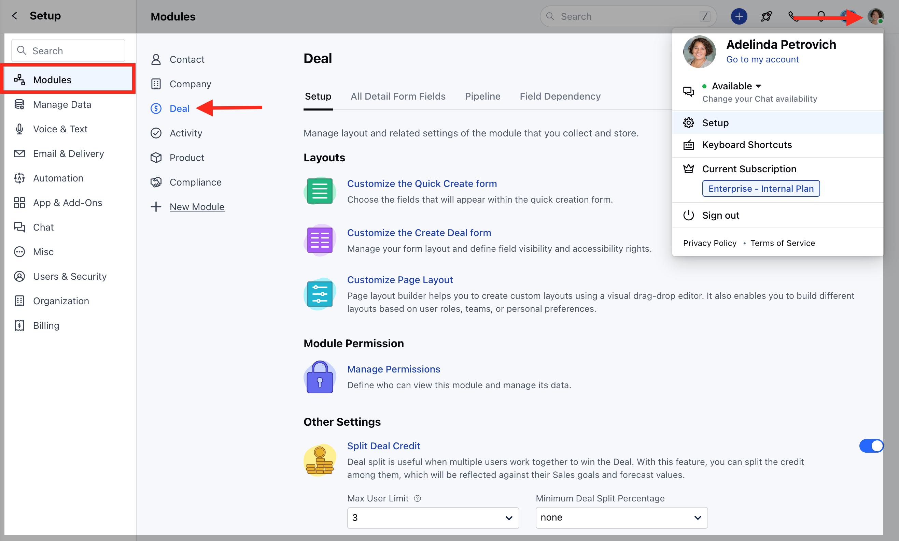
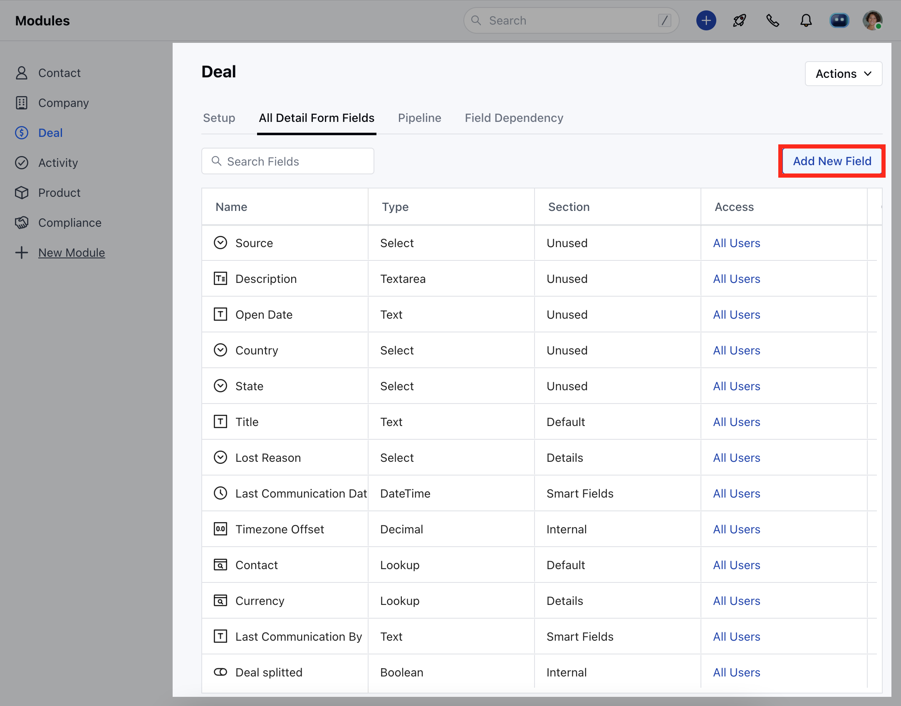
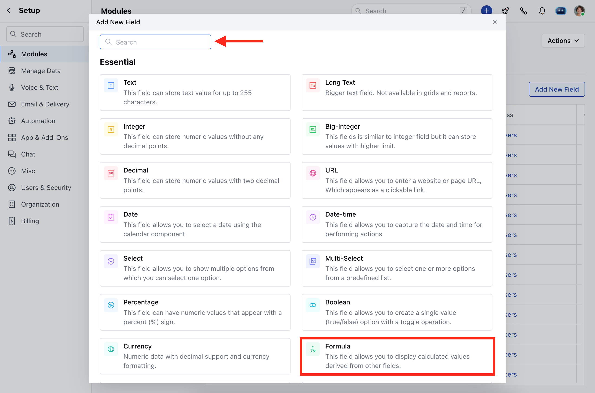
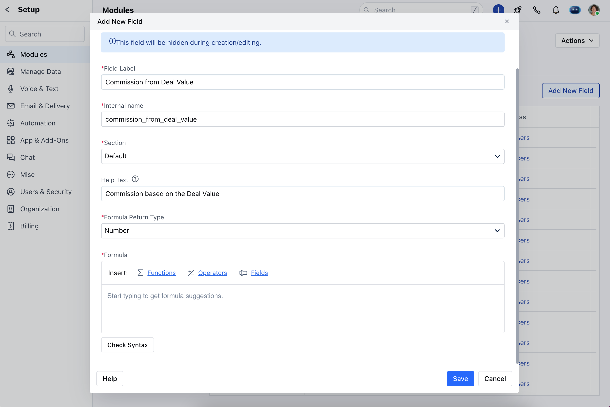
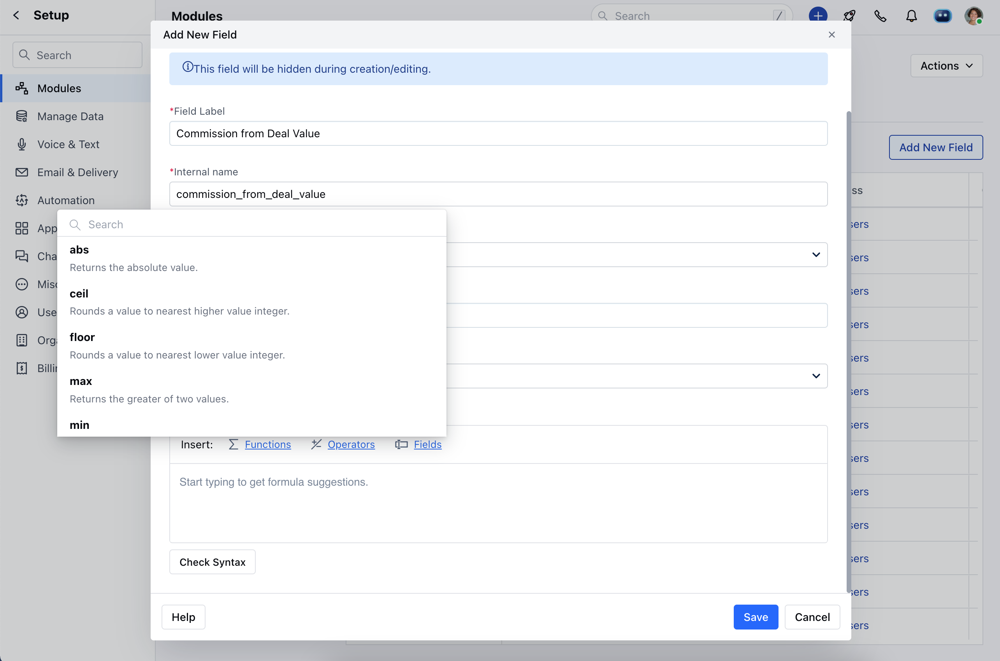
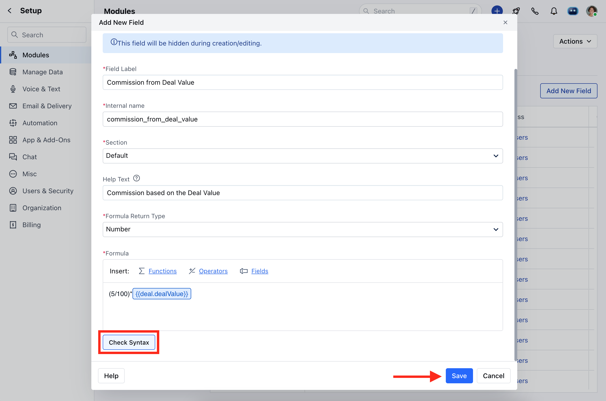
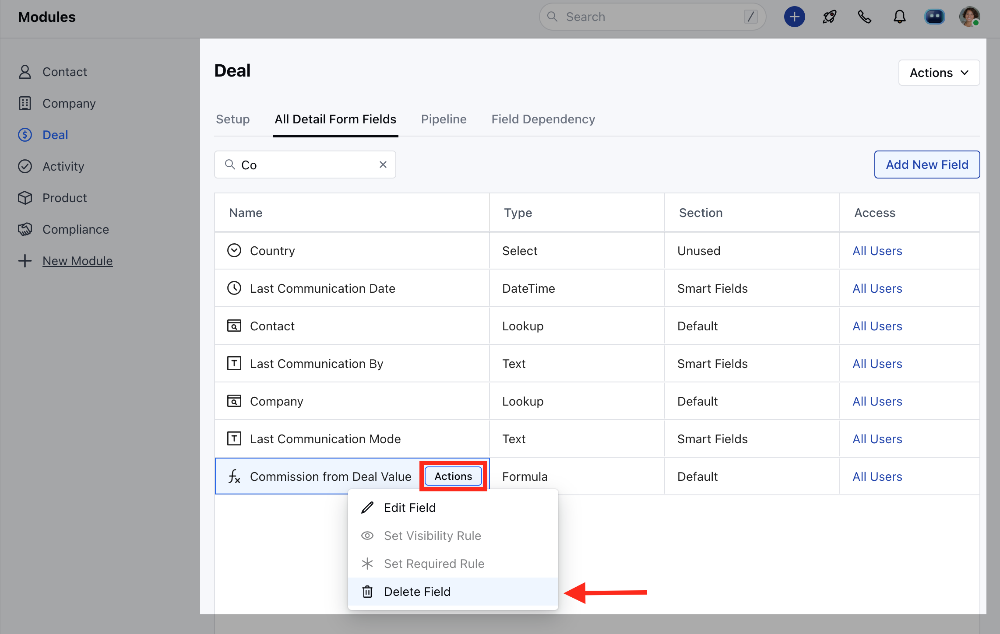
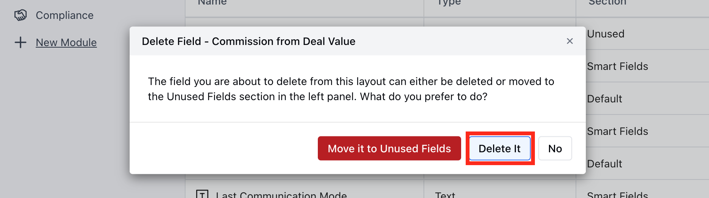
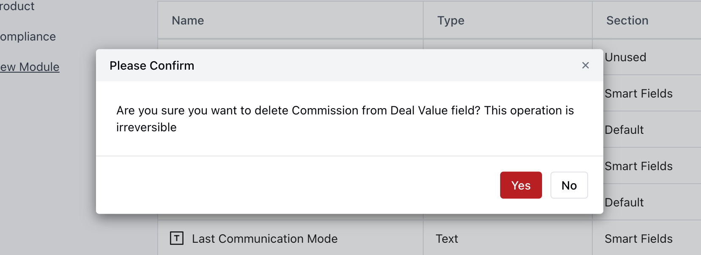

### What are Formula Fields?

Formula fields are read-only type fields for which the values are calculated automatically based on the formula or the expression that is set up by you. You can create formula fields across all the modules (Contact, Company, Activity, and Deal).
[Various use cases to use Formula Fields in Salesmate.](https://support.salesmate.io/hc/en-us/articles/6306800480281)

- [How to Create Formula Fields?](#how-to-create-formula-fields)
- [How to Delete Formula Fields?](#how-to-create-formula-fields)
**Note:** Formula fields are available from the Pro plan and above.

### How to Create Formula Fields?

To create a formula field, you can follow the steps listed down below

Navigate to the **Profile icon** in the top right corner.Click on the **Setup**. Head over to the **Modules** categorySelect the **Module** for which you wish to create the field.

Head to the **All Detail Form Fields** SectionClick on ** Add **New Field.

Quickly search or Select the **Formula field** under the field type.

After clicking on the Formula type field, a pop-up will open where you can set up the following things-**Label**- Name for your reference.

- ** Section **Name**- select the layout of the appearance.

- **Formula **Return **Type**- Return the type of data.

- ** Formula **- Define / Insert the required formula.

You can return the formula result in 6 ways-** Number **Currency **String **Date **Date Time **Boolean ** While inserting the formula, you will be able to choose from the available list of [functions, operators](https://support.salesmate.io/hc/en-us/articles/6295809955737), and the fields using which you wish to calculate the value.

Once you have entered your formula, you can check if the Syntax is valid or not by clicking on the **Check Syntax** button.Once you have verified the expression, click on **Save.

### How to Delete a Formula Field?

To Delete a Formula Field,

Navigate to the **Profile icon** in the top right corner.Click on the **Setup**. Head over to the **Modules** categorySelect the **Module** for which you wish to create the field.

Head to the **All Detail Form Fields** SectionWith the Quick Search option search for the Field you wish to Delete

A pop-up warning block will open confirming if you wish to Delete the field or Move it to the Unused section.

Click on **Yes** to proceed further or **No** if you don't want to delete the field.

- *Note**: Once deleted, the Field and its respective value cannot be retrieved and will be completely lost.
