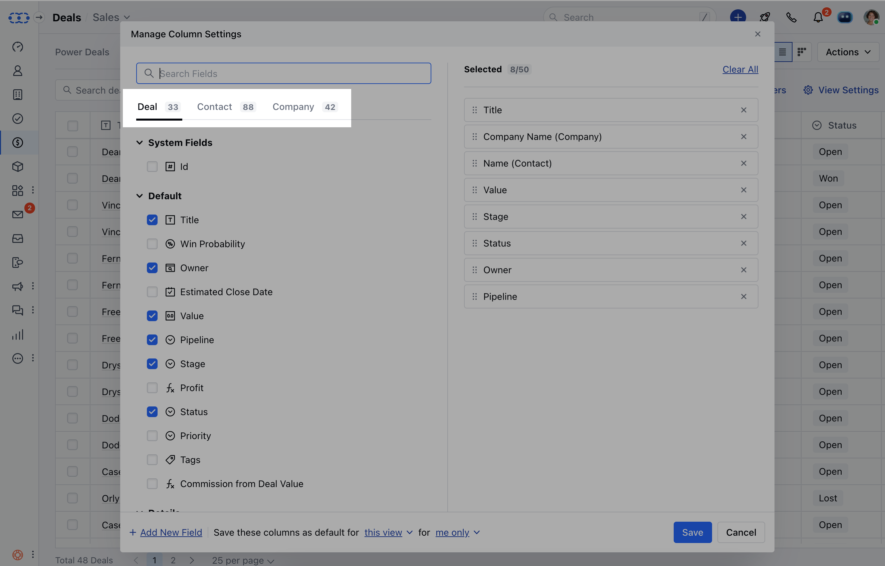
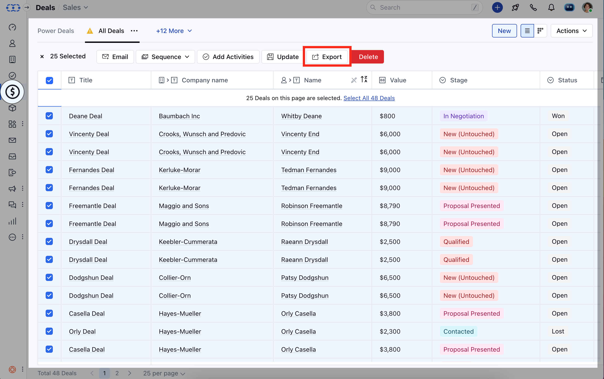
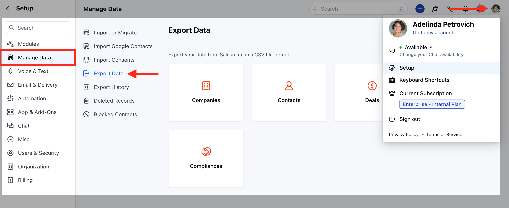
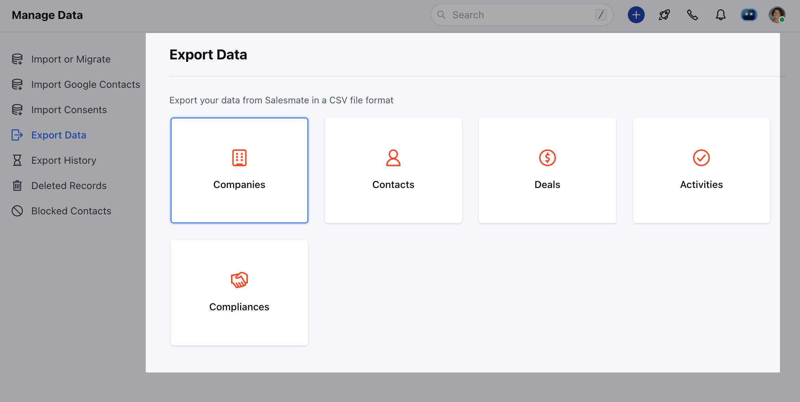
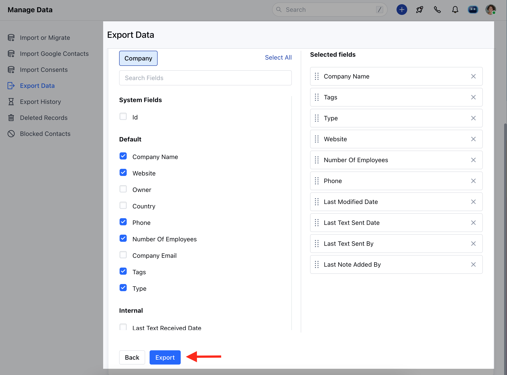
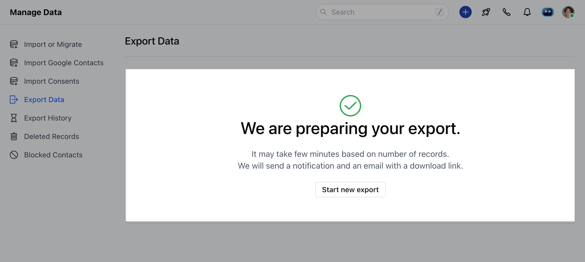
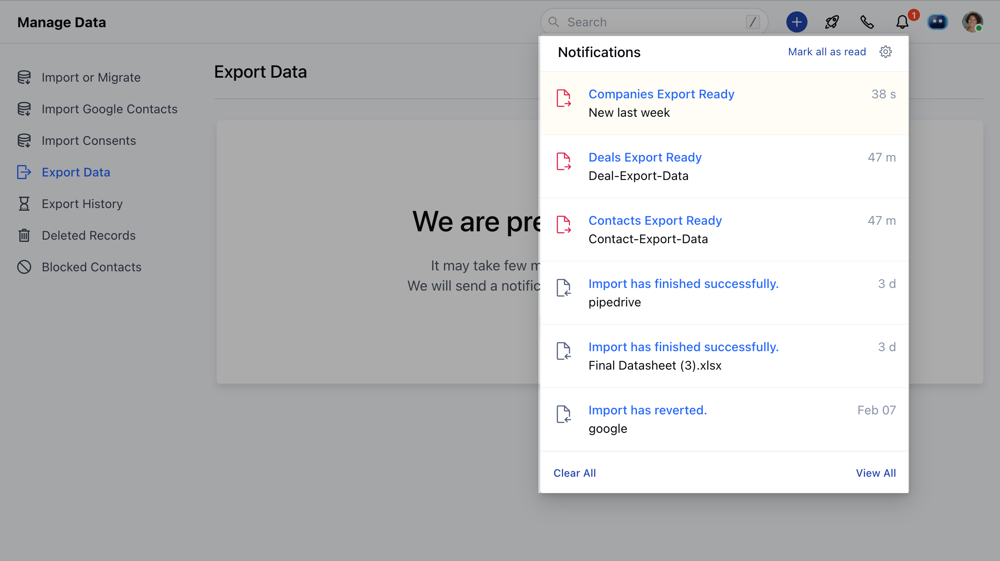
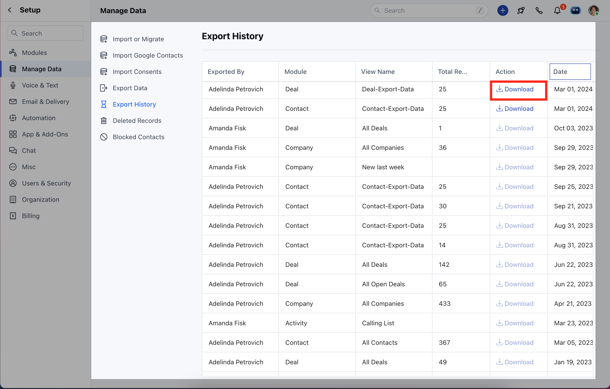

Exporting data from Salesmate is straightforward, and there are two ways to do this.

[Export from the List view](https://support.salesmate.io/hc/en-us/articles/115001104931-Exporting-data-from-Salesmate#h_01FQH4YEXQQX17X63QTA0K6KMA)[Export from Setup](https://support.salesmate.io/hc/en-us/articles/115001104931-Exporting-data-from-Salesmate#B.)

A list view is an ideal way when you want to export what you see. You can combine fields from different modules ( Company, Contact, Deals, Activities) to pull out what you need. Whereas, exporting from Setup allows you to export all records from each module separately.**Note:**You will need Export [permissions](https://support.salesmate.io/hc/en-us/articles/115000655109) to export the data.

### [Export from the List View](https://support.salesmate.io/hc/en-us/articles/115001104931-Exporting-data-from-Salesmate#h_01FQH4YEXQQX17X63QTA0K6KMA)

If you only want to export selected records or filtered data you can use List View.

Navigate to the Preferred ModuleSelect the Records you want to export. You can also add columns of other modules for exporting it by clicking on the**View Settings option**>> Select the fields.

Once the Records are selected click on the Export option

### [Export from Setup](https://support.salesmate.io/hc/en-us/articles/115001104931-Exporting-data-from-Salesmate#h_01FQH4ZMYBZN54KAVZ45S006W7)

Follow the below steps, to Export data:

Navigate to the**Profile Icon**on the top right cornerClick on**Set Up**Head over to the**Manage  Data**Click on**Export Data**

Choose the Module for which you want to export the records. Select what you'd like to export -**Deals, Activities, Companies, Contacts, and Custom Modules**

Select what you'd like to export, and choose the view and fields you want to export.Click on the**Export**button.**

**You will be routed to the "Export Confirmation" screen

Once the Export is completed, you will receive a desktop as well as an email notification as your Export is ready.

You can Export Data is Available underClick on Export historyClick on the**Download**button and hence your data is exported from Salesmate.

**Note:**The link to download the file will be available for 30 days max. After that exported file will be deleted from the Salesmate server, and the download link will get disabled. Anyone with export rights can see export history, but the file can be downloaded by the person who initiated the export or the person who is in the higher hierarchy of that person.Only records of those people under you in the hierarchy will be available to you for export. Thus an Admin can export records for everyone in the organization.We will send a notification and an email with a download link.
