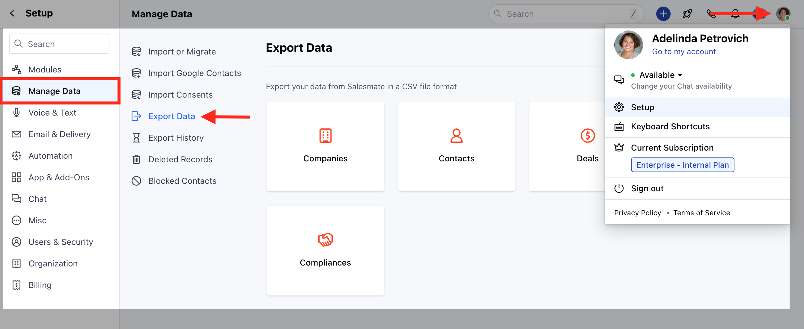
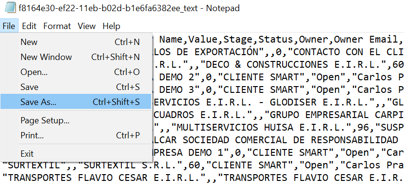
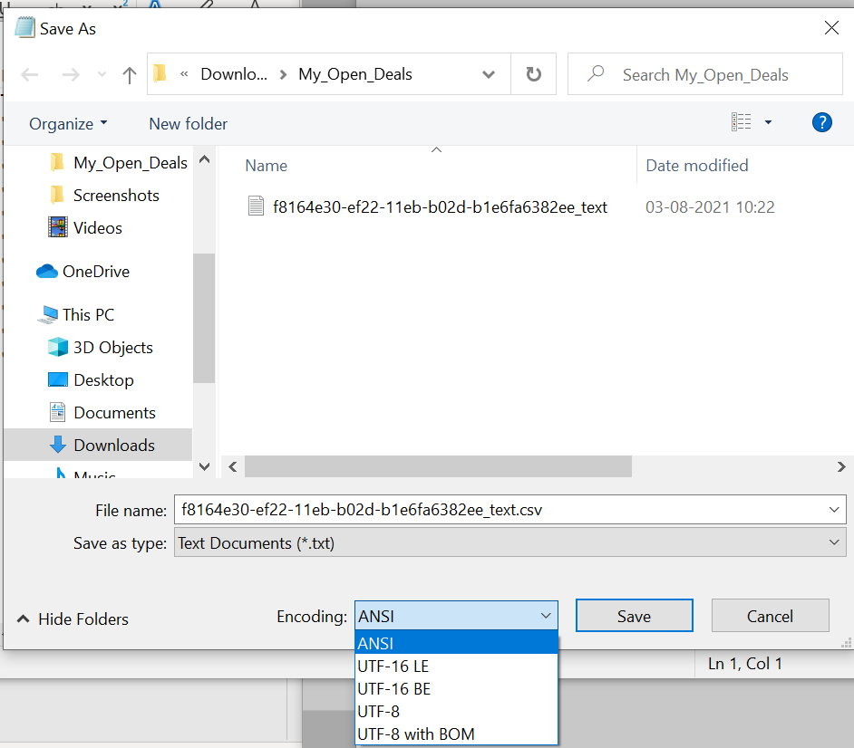
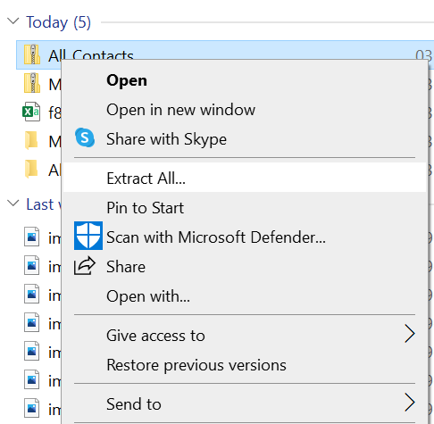
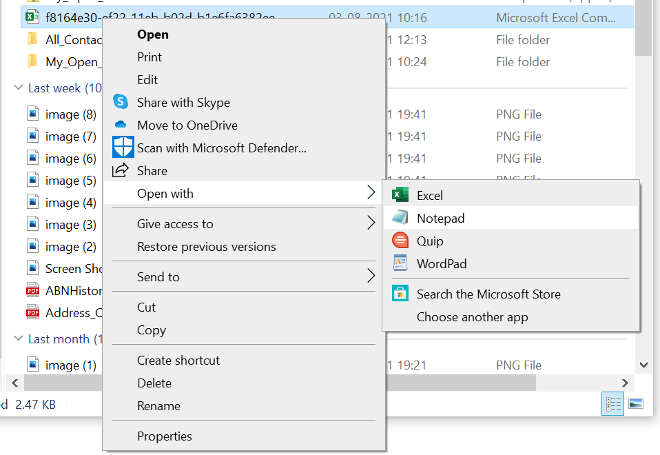

[Exporting Records from Skara CRM](#exporting-records-from-salesmate-crmhttpssupportsalesmateiohcen-usarticles115001104931)

To export the records from Salesmate, please follow the below steps:

- Navigate tothe **Profile Icon** on the top right corner
- Click on the **Set-Up**
-  Head over to the **Manage Data** category
- Click on **Export Data**

- Download the exported Zip Folder \>\> Go to the download folder, Right Click and click on **Extract All**.

- Now right-click on the excel file, click on **Open With**, and select  **Notepad**.

- In Notepad, click on **File** on the top left \>\>**Save As**.

- In the File name, add a .csv extension and select **UTF-8** in encoding.

- Save the file, Now go to the same file in the folder and open it with **Excel**.