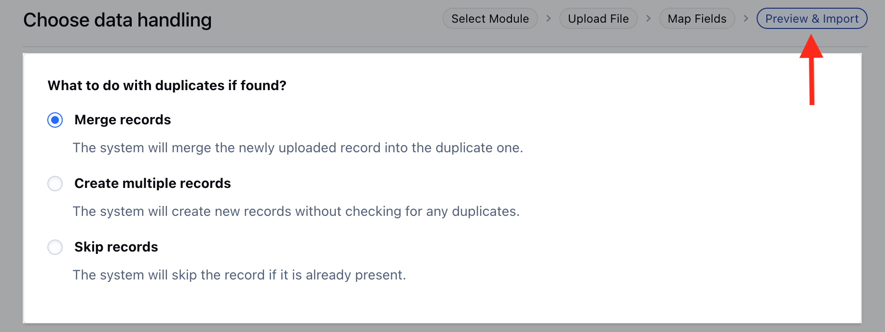
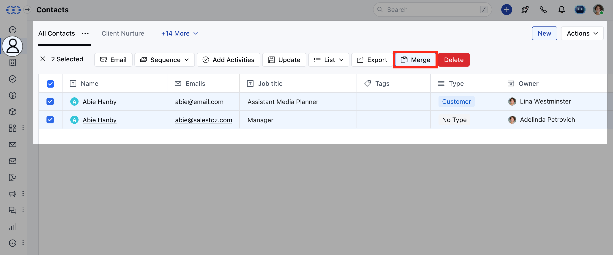
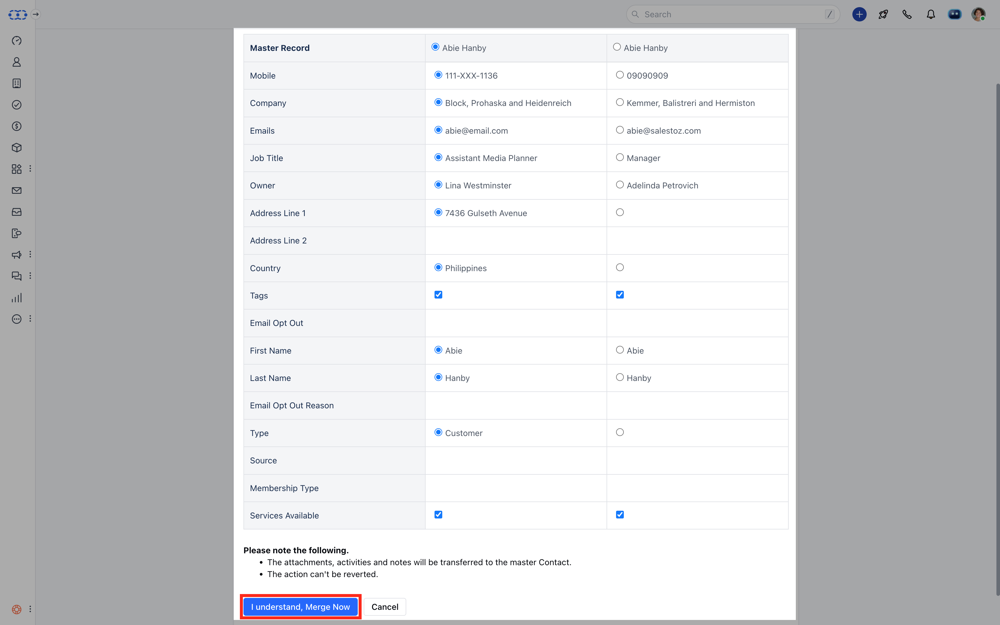

When [importing records](https://support.salesmate.io/hc/en-us/articles/360050448652-Learn-more-about-import-using-a-file) you will be asked to select the option to avoid duplicates.

###  **Topics covered:**

- [How to avoid duplicates](#how-to-avoid-duplicates)
- [How to merge records](/setup/data-administration/how-to-avoid-duplicates-and-merge-records)

###  How to avoid duplicates:

The options are:**Merge **Records**: It updates an existing entry with the new fields if any and wipes off fields that are left blank. In case you do not wish to update a specific field you can skip it while in the mapping for import.

- **Create **multiple records **: This will not check for duplicates and create a new record.

- ** Skip records **: It will ignore the data fetched from the sheet and keep your record as it is.

###  Merging Duplicate Records

To merge the duplicate records,

Navigate to the preferred **Module** from the left menubar **(Contacts, Companies & Custom Modules)** Search for the contacts that you wish to merge. You can merge a maximum of 3 records at a time. Click on **Merge**.
[Learn More](https://support.salesmate.io/hc/en-us/articles/360003565031-Merging-Duplicate-Records)

Select the fields you want to keep in your master record.Click on **I understand, Merge Now** to combine the records.

**Note:**Max of three records can be combined into one master record.All your conversations ( notes, emails, activities, deals ) with all the records, will be merged into one master record.
