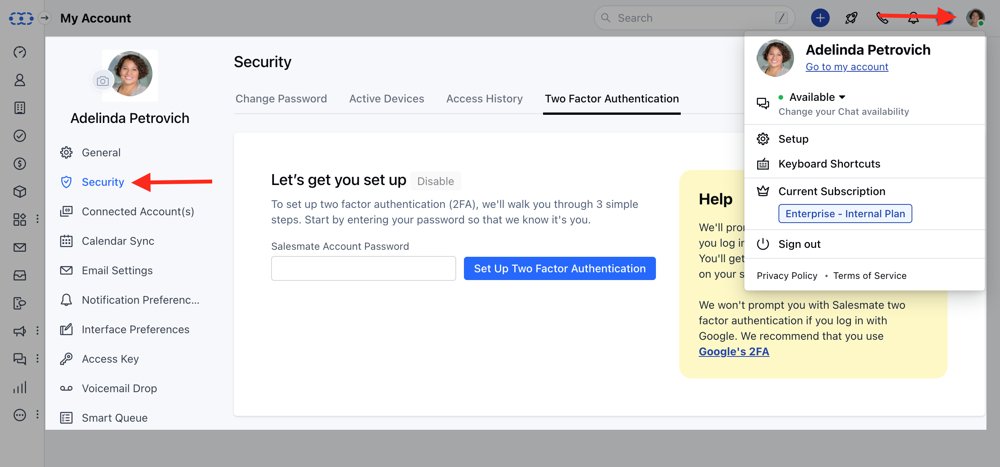
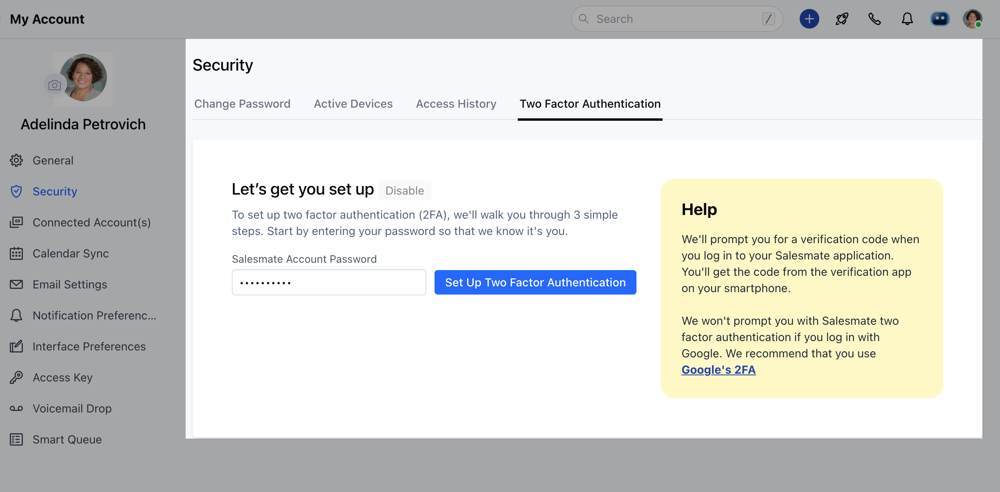
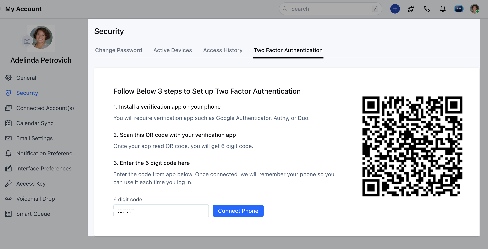
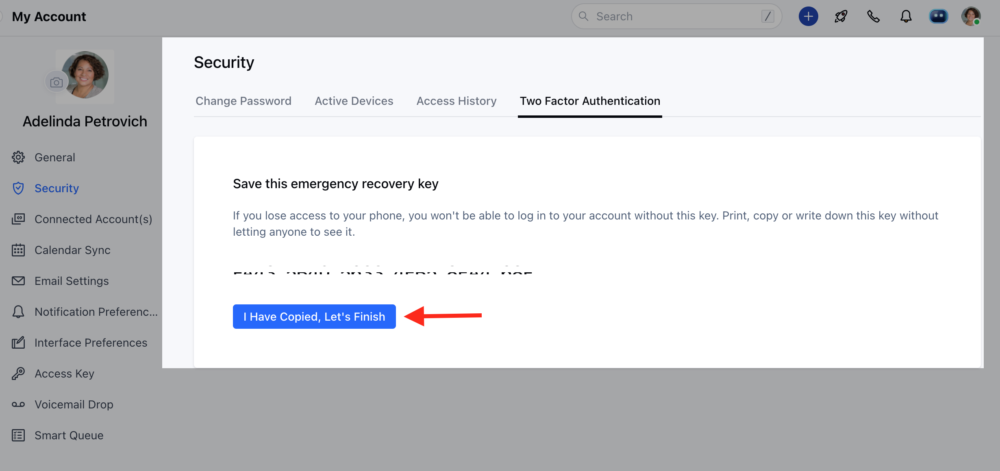
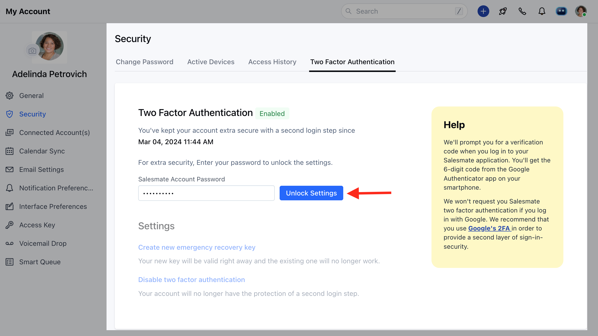
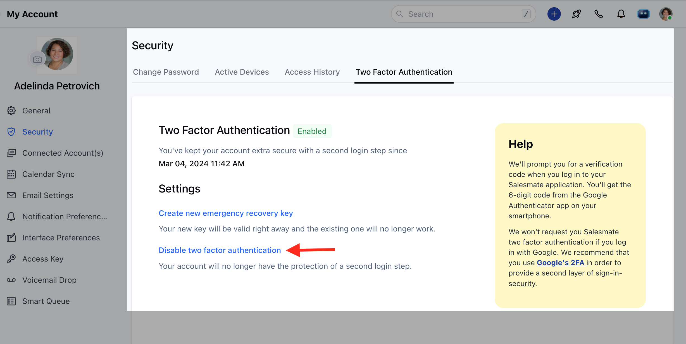
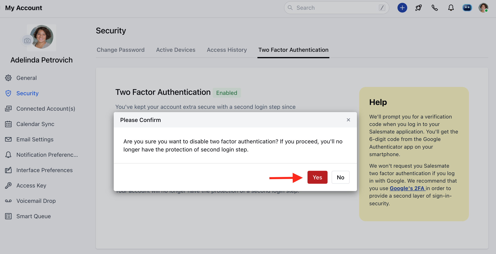

**Two-factor authentication (2FA),**sometimes referred to as two-step verification or dual-factor authentication is an extra layer of security used to make sure that people trying to gain access to an online account are who they say they are.2FA requires you to enter an extra code when you log in. The code is generated from an application on your computer or mobile phone.

### How to set and enable two-factor authentication for your Salesmate account

Navigate to the**Profile Icon**in the top right corner.Click on**"Go to My Account"**Head over to the**"Security"**option in the sidebarClick on the**"Two Factor Authentication**" section

Enter your Salesmate account password and click the**"Set Up Two Factor Authentication"**button

On successful validation, you need to follow the below 3 steps to complete the process.**Install a verification app on your phone**You will require a verification app -**Google Authenticator, Authy, or Duo.****Scan this QR code with your verification app**Once your app reads the QR code, you will get a 6-digit code.**Enter the 6-digit code here**Enter the code from the app below. Once connected, we will remember your phone so you can use it each time you log in.

Once connected it gives you an emergency recovery keyCopy it to a safe place to recover your account at any point in time later if you happen to lose your phone or change the deviceOnce copied/printed, click**"I Have Copied, Let's Finish"**

There you are. All set! with extra security to your account.

###**How to disable two-factor authentication for your Salesmate account**Navigate to the**Profile Icon**in the top right corner.Click on**"Go to My Account"**Head over to the**"Security"**option in the sidebarClick on the**"Two Factor Authentication**" sectionEnter the**Salesmate Account Password**and click on**Unlock Settings**

Click on the "**Disable two-factor authentication**" link

###

Click on**Yes****

**
