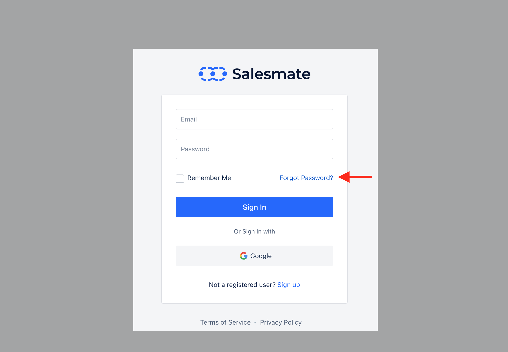
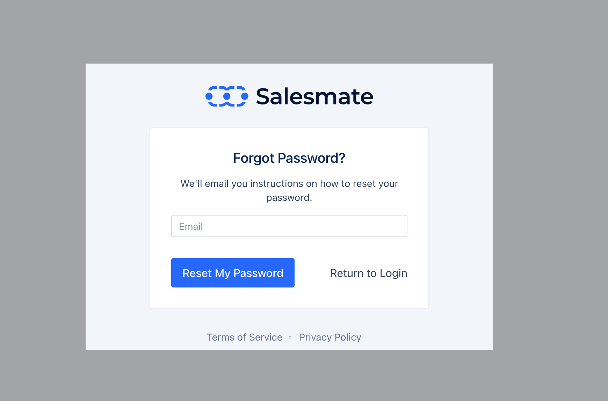
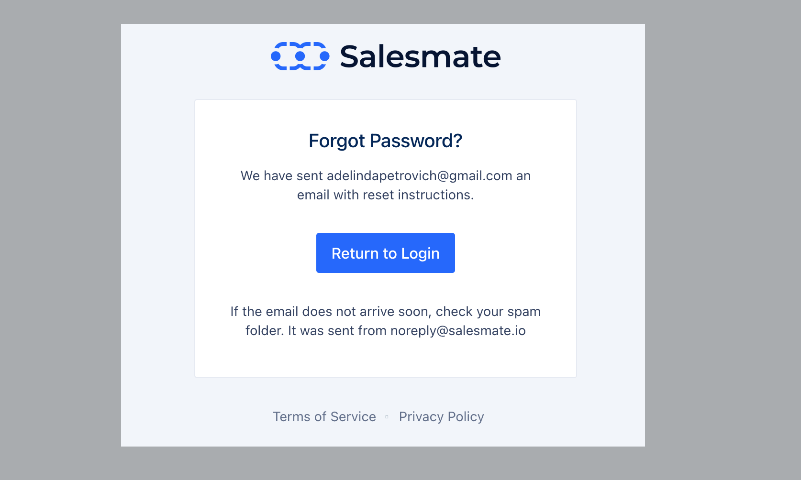
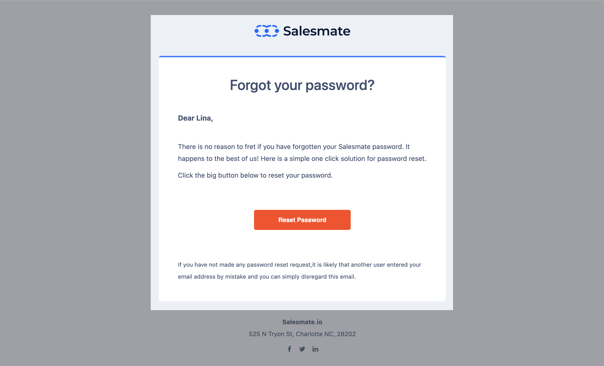
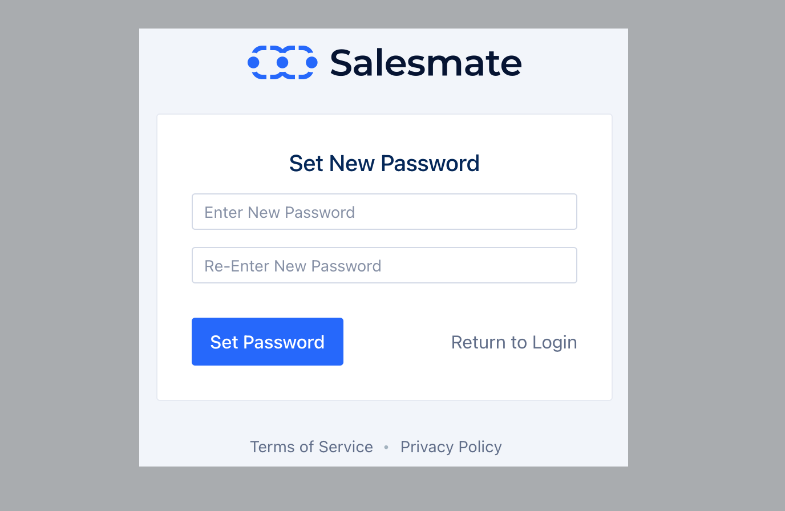
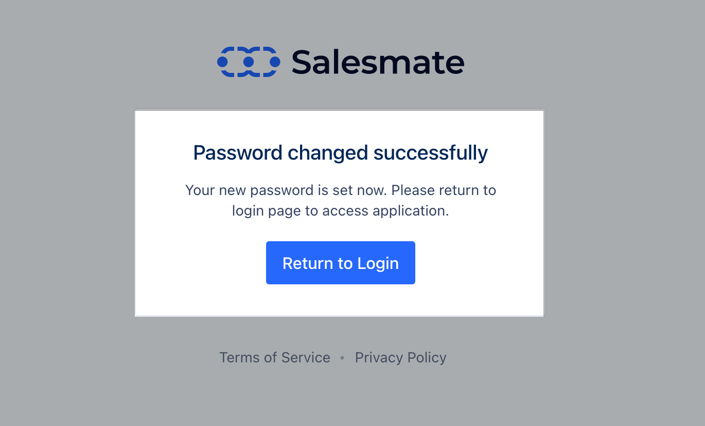

You can reset your Salesmate password by following the below-mentioned steps :

On the login screen, click the "**Forgot Password**" option.

Enter the **email** that you signed up with / use to log in to Salesmate

Reset ** Email **Notification **, confirmation is displayed (Email sent from - [noreply@salesmate.io)](<mailto:noreply@salesmate.io)>)

Click **Reset Password**, this will send you an email to the registered email

Hit the "**Reset Password**" button in your email

In the new screen enter your **New password** and confirm by clicking on the Set **Password option.**This will reset your password.

Use the email address and the new password to log in to your Salesmate account.
