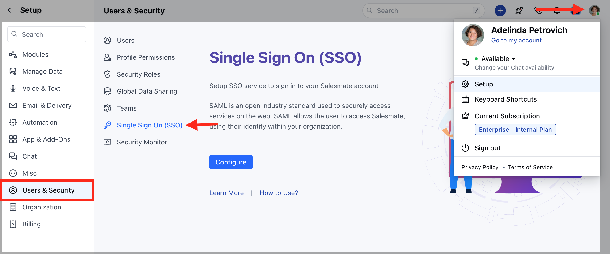
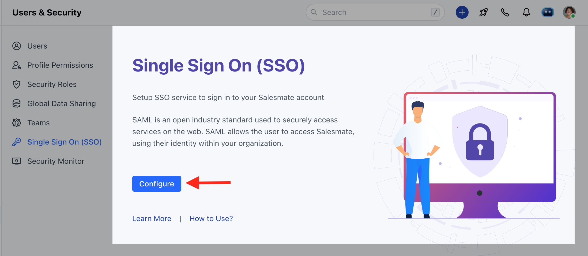
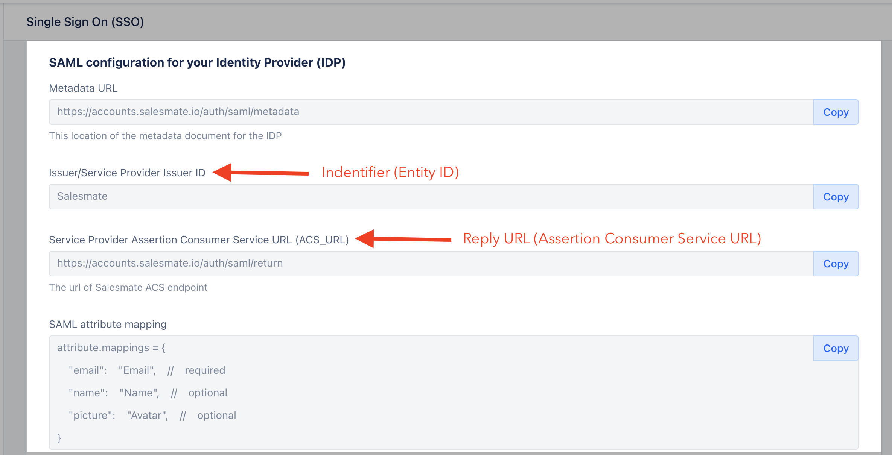
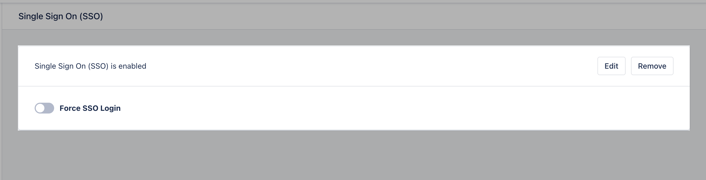
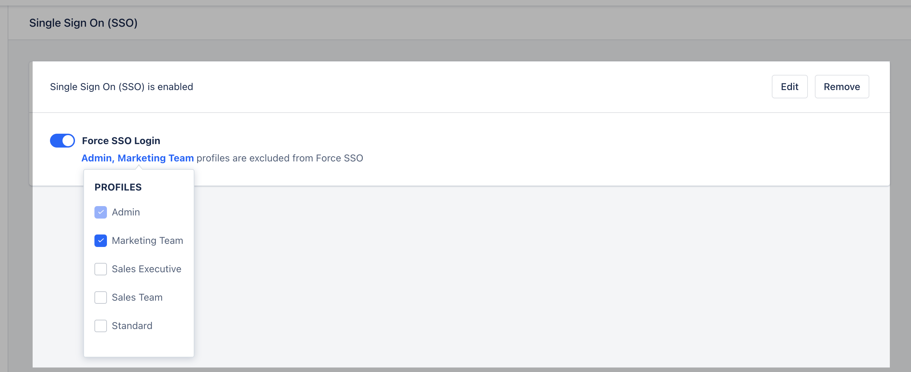

Single sign-on (SSO) is an authentication method that enables users to securely authenticate with multiple applications and websites by using just one set of credentials.

If you have a Salesmate _Enterprise_ account and have SSO set up for your business, you can require users to log in to Salesmate using their SSO credentials.

**Note:** Available in Pro and above Plans (For Legacy Accounts: Growth and above Plans).

This setup process should be done by an IT administrator with experience creating applications in your identity provider account.

---
###  Enable SSO inside Salesmate

1. Navigate to the **Profile Icon** on the top right corner.
2. Click on **Setup**.
3. Head over to **Users & Security**.
4. Click on **Single Sign On (SSO)**.

5. Click on the **Configure** option.

6. Find the **SAML configuration values** on the screen and paste them into your identity provider account where required.
7. Copy the **Identifier or Issuer URL**, the **Single Sign-On URL**, and the **Certificate** from your identity provider and paste them into the Salesmate panel.
8. Click on **Test**.
9. Once the test is successful, you can come back to the SSO screen and **enable** it for your workspace.

---
###  Force SSO Login (Optional)

If you want every user to log in via SSO only, follow these steps:

1. Navigate to the **Profile Icon** on the top right corner.
2. Click on **Setup**.
3. Head over to **Users & Security**.
4. Click on **Single Sign On (SSO)**.

5. Enable the **"Force SSO login"** option.
6. Click **Save**.

Once the SSO is enabled, you can add the profiles that you want to exclude from SSO.

---
###  What happens when you enable SSO login?

- If **Forced SSO Login** is enabled, users can log in **only via your identity provider**.
- If **Forced SSO Login** is enabled, login via **password, 2FA, or Google** will **not work**.
- If **SSO is enabled but not forced**, users can still log in via **password, 2FA, and Google**.

---
###  Configure SSO in Azure Active Directory

1. Log in to your **Azure Active Directory**.
2. Go to **Enterprise Applications** in the left sidebar.
3. Click on **+ Create your application**.
4. Type **Salesmate** in the "What’s the name of your app?" text box.
5. Select the option:**Integrate any other application you don't find in the gallery (Non-gallery)**.

Once added, it will show the **Application Name**, **ID**, and **Object ID**.
Additionally, it provides options to:

- Assign users and groups
- Set up single sign-on
- Provision user accounts
- Enable self-service

---
###  Assign Users and Groups

Under **Assign users and groups**, you can specify which users or groups will have access to this application.

---
###  Set up Single Sign-On (SAML)

1. Under **Set up single sign-on**, select **SAML**.
2. Under **Set up Single Sign-on with SAML**, configure the following:

###  Basic SAML Configuration

- Click **Edit** and copy the information from the Salesmate SSO page.
- Copy the **Identifier ID (Issuer / Service Provider Issuer ID)**and **Reply URL (Assertion Consumer Service URL / ACS URL)**.

###  User Attributes & Claims

- Click **Edit** and **Add new claim**.
- - **Name:** Email

- **Source attribute:** user.mail

**Note:** `email` is the only required claim. Other claims are optional and can be added to provide more information in case of connection failures.

---
###  SAML Signing Certificate

1. Download the **Federation Metadata XML**.
2. Open it in **Notepad**.
3. Search for `<X509Certificate>`.
4. Copy the key value between the tags `<X509Certificate>` and `</X509Certificate>`.
5. Paste it into the **Security Certificate Fingerprint** field on the SSO page in Salesmate.

> 💡 Tip: To avoid MDX parsing issues, do not remove the backticks around tags.

---
###  Set up Salesmate

1. Copy the **Login URL** to the **SAML Login URL** field on the SSO page in Salesmate.
2. Copy the **Logout URL** to the **Logout URL** field on the SSO page in Salesmate.
3. Once completed, click **Save & Verify** on the SSO page in Salesmate to verify the setup.
4. You can also test this by clicking on the **Test** button from Azure’s Single Sign-on page under **Test single sign-on with Salesmate**.

---
###  Known Errors & Solutions

- **Error:** _Malformed request detected!!!_
- **Solution:** Check if the **Certificate key** is correctly entered.

- - -**Error:** _Cannot find a user with the same email address_

- **Solution:** Ensure that the correct claim with the name **email** is mapped to the source attribute **user.mail**.

---
If you are still facing any issues, feel free to reach out to our support team via chat or email us at [support@salesmate.io](#enable-sso-inside-salesmate).
