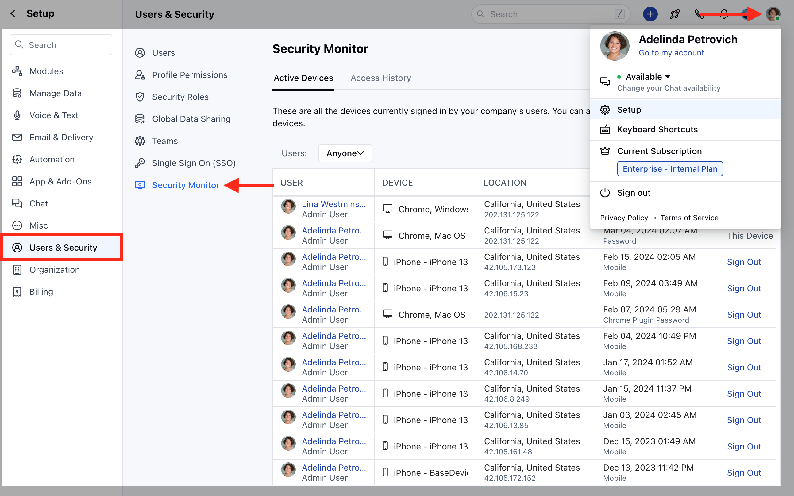
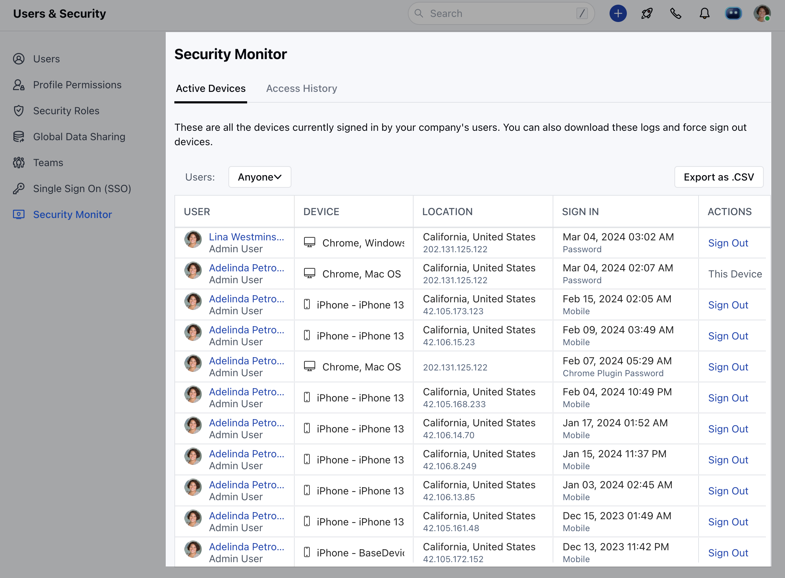
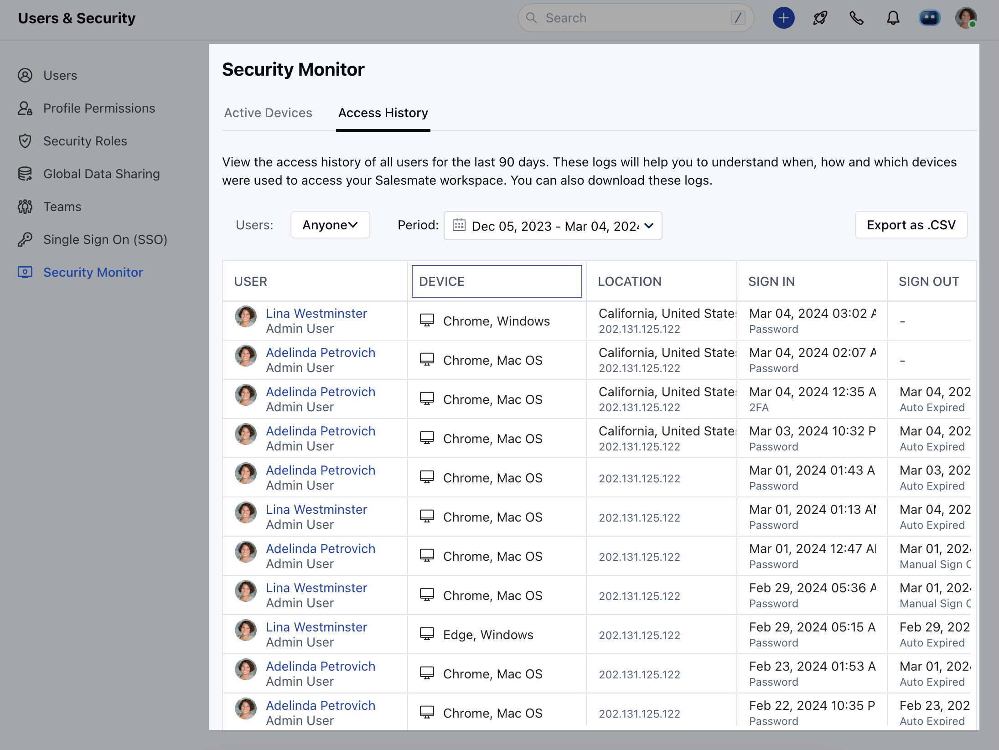

- *Security** is a very important part of any software and thus it's important to keep track of all **your devices** and the **access history** to monitor for any suspicious activity and change the security settings accordingly.Topics Covered:

- [Active Devices](#active-devices)
- [Access History](#access-history)

### Active Devices

To monitor the currently **active devices**,

Navigate to the **Profile Icon** on the top right cornerClick on **Setup** Head over to **Users and Security** Click on **Security Monitor**

Click on **Active Devices**

### Access History

Additionally, In case you wish to check for the **Access History** or logs for the last 90 days, you can do so by clicking on the access history just beside the active devices tab.

Using the security monitor the user will now be able to keep track of the following
Device usedThe location from where the user accessed the platformSign in / Sign out HistoryLog out from specific devices that are unused.

- **Note:**Only the Admin profile would be able to have access to the security monitor feature.
