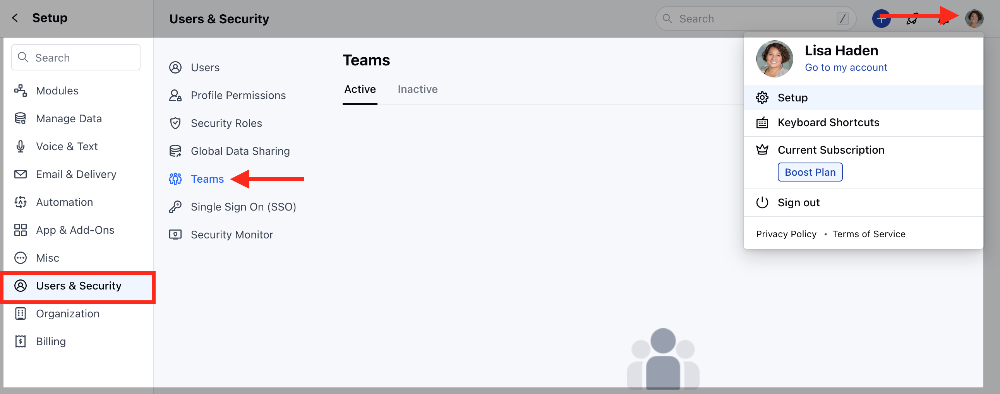
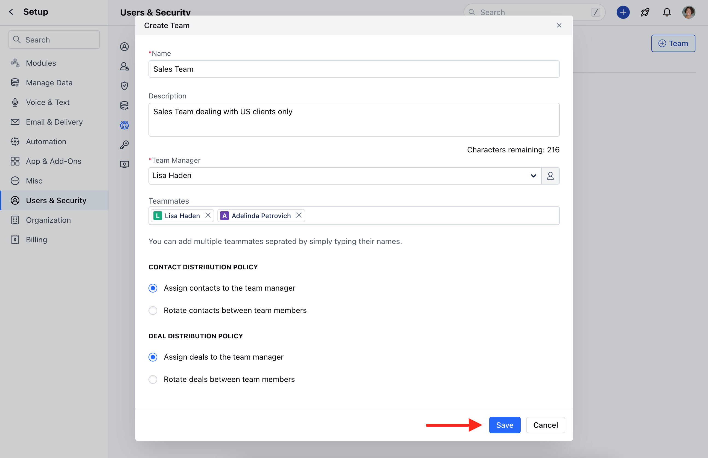
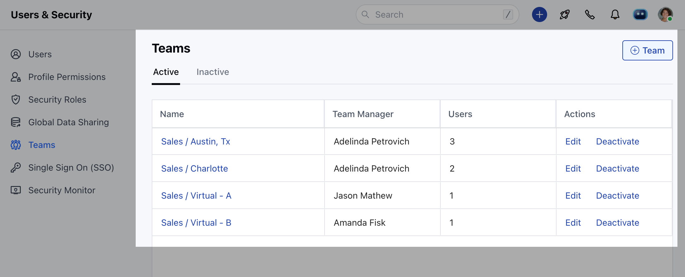
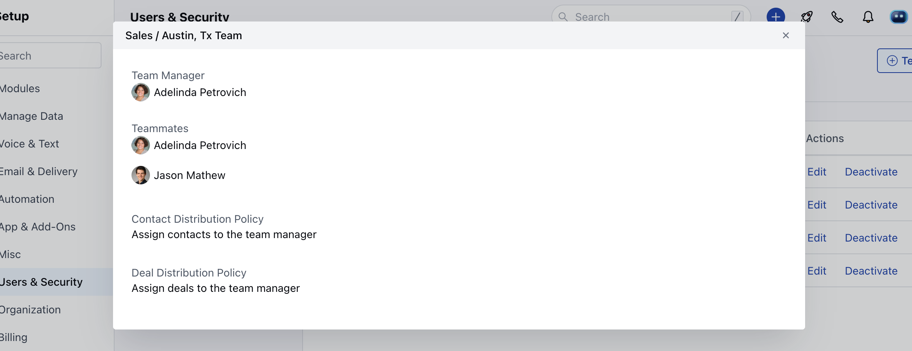

A team is a group of users that work together to achieve some common goals. Skara allows you to organize your users into teams for reporting and maintaining organization structure for some quick actions

 **Note**: Available in Boost and above plans. Only a user with an "Admin" role can perform this action.

### To create a team :

- Navigate to the **Profile icon** on the top right corner
- Click on **Setup** 
- Head over to **Users and Security** 
- Click on **Teams**

- Click on the **"Create Your First Team"** button to create your team.

- Fill in the following details 
- **Name of the team**[ Example: Sales, Customer Success, Projects Management, etc ]
- **Description of the team**[ Helps you identify what this team is for ] 
- Select a **Team Manager**[ An active Salesmate user of your account who gets the right to add other members to the team ]
- **Add Teammates**[ Select the list of users or at least one user who will be part of this team. ]
- Select **"Contact Distribution Policy"** and **"Deal Distribution Policy"**.
-  Click on **Save**

- Once the team is created it will be listed in the **Active** tab. Also, in this way, you can create multiple teams.

- You can click on the **Team Name** to view its details over a pop-up.

