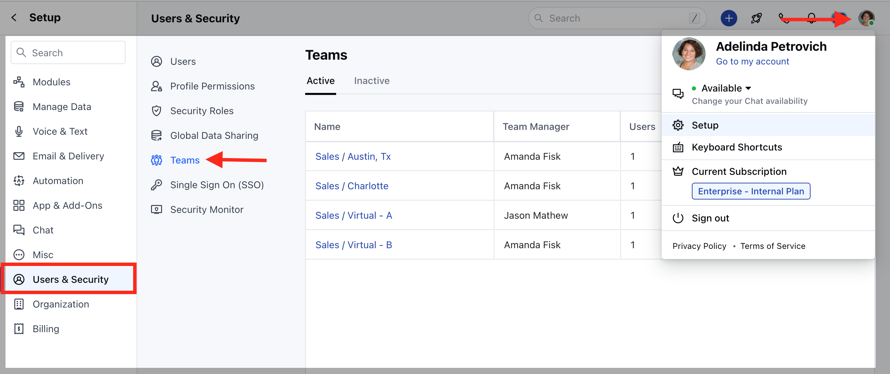
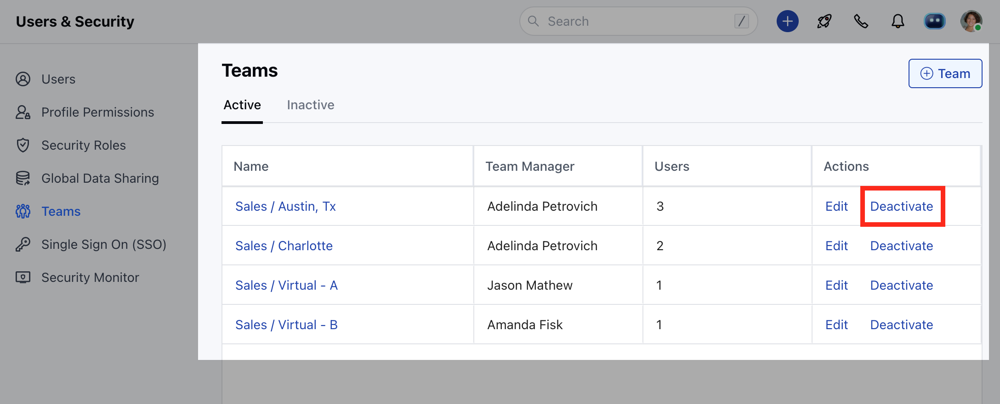
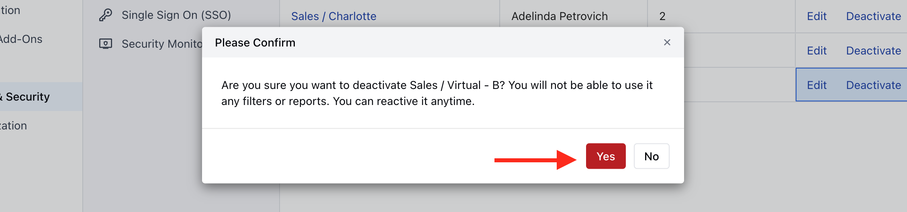
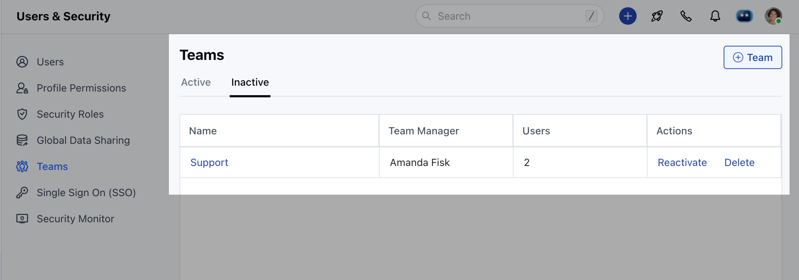

**Note**: Only users with an "Admin" role can perform this action.

### To Deactivate a Team :

Navigate to the**Profile icon**on the top right cornerClick on**Setup**Head over to**Users and Security**Click on**Teams**

You will find a list of already created teams(if created in prior).Click on**Deactivate**to deactivate a team.

Confirm**Yes**to**"Deactivate".**

Once deactivated the team will appear in the list of**"Inactive"**teams.

Please Note :

Deactivated teams can be "reactivated" again if required.They will not appear for Team mentions.
