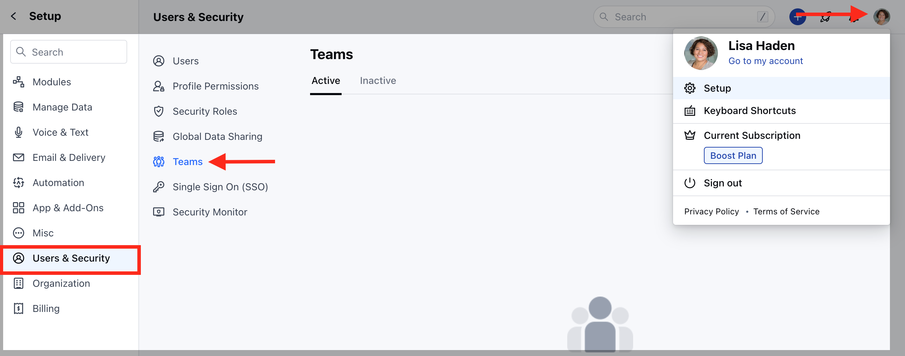
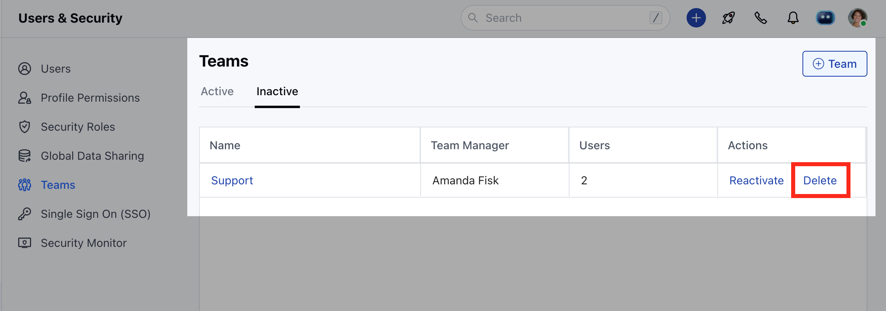
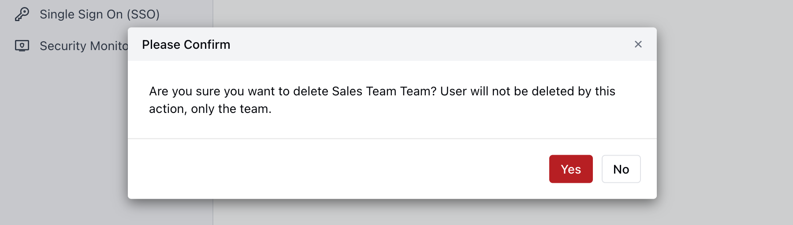

**Note**: Only users with an "Admin" role can perform this action.

### To Delete a Team :

Navigate to the**Profile icon**on the top right cornerClick on**Setup**Head over to**Users and Security**Click on**Teams**

Click on the**Inactive**tab to view a list of "Inactivated" teamsClick on**Delete**to delete a team.

Confirm**"Yes"**to delete a team.

If a view has been created using this team it will first ask the user to change or delete such view before deleting the team.

Note :

A deleted team cannot be recovered. It will no longer appear in filters.It will not appear for Team mentions.
