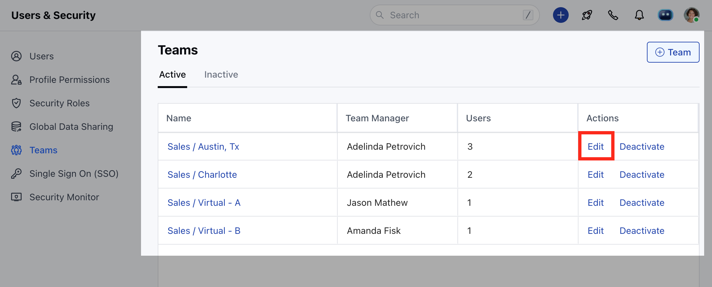
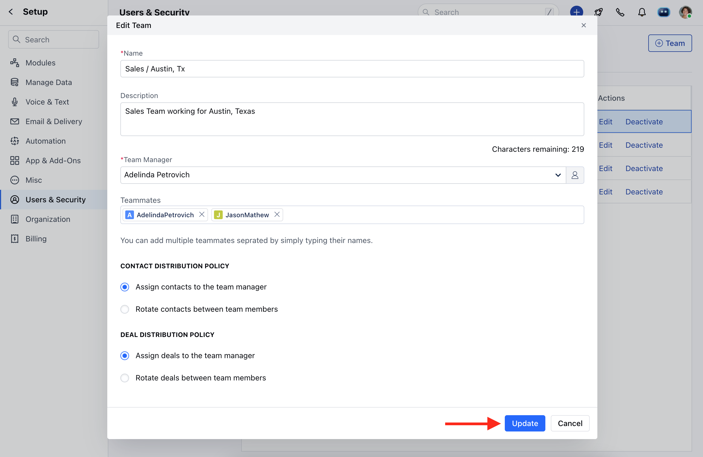

- 

  <Note>
    - **Note** : Only users with an "Admin" role can perform this action.
  </Note>

### To Edit a Team :

- Navigate to the **Profile icon** on the top right corner
- Click on **Setup**
- Head over to **Users and Security**
- Click on **Teams**

- You will find a list of already-created teams
- Click on **Edit** to change/update the field values.

- You can update the fields as shown below.
- Click on **Update** to save the changes.

