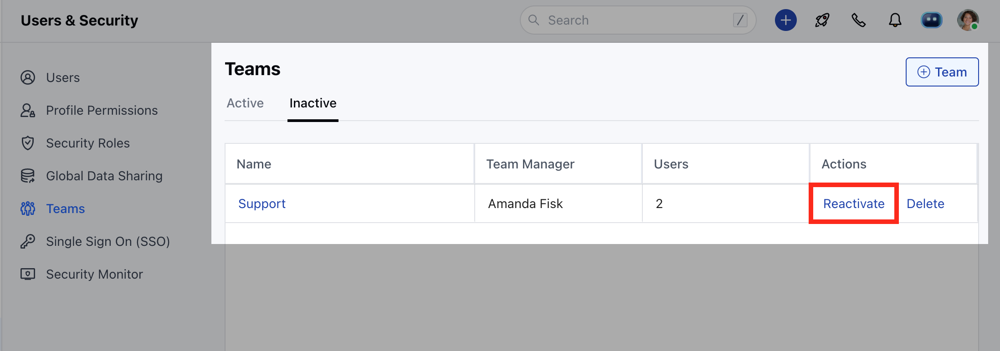
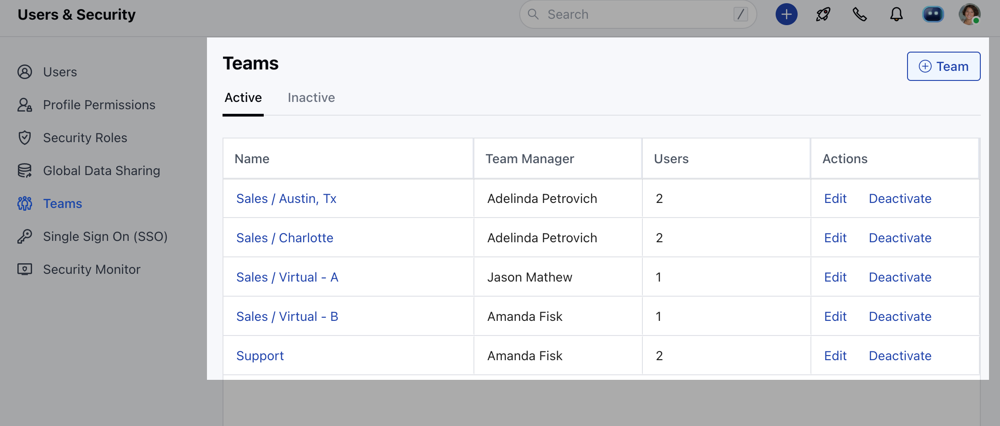

<Note>
  **Note**: Only users with an "Admin" role can perform this action.
</Note>

### To Reactivate a Team :

- Navigate to the **Profile icon** on the top right corner
- Click on **Setup**
- Head over to **Users and Security**
- Click on **Teams**

- You will find a list of already inactive teams under the **"Inactive"** tab
- Click on **"Reactivate"** to activate the team.

- Once reactivated the team will appear in the list of **"Active"** tab.

