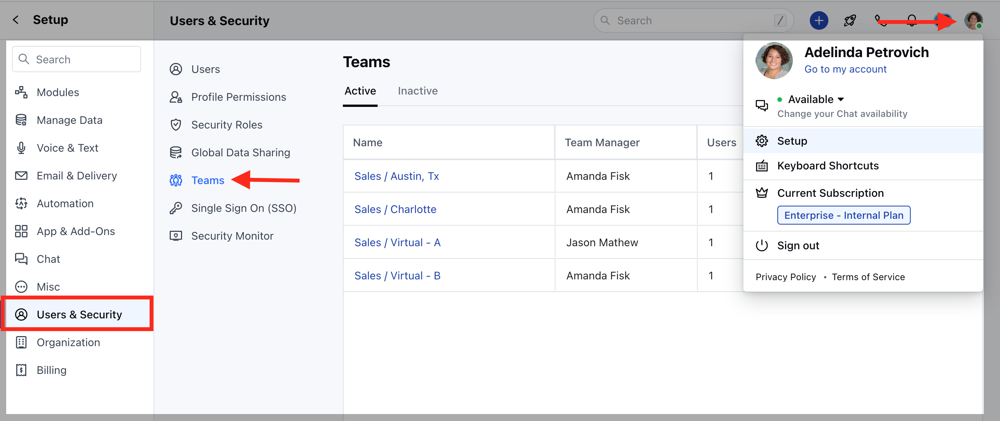

A team is a group of users that work together to achieve some common goals. Salesmate allows you to organize your users into teams for reporting and maintaining organization structure for some quick actions. For setting up your team, please follow the below path :**Note:**Available in Pro and above Plans (For Legacy Accounts: Boost and above Plans)

Navigate to the**Profile icon**on the top right cornerClick on**Setup**Head over to**Users and Security**Click on**Teams**

With Team Management, you can:

Filter your contacts, companies, deals, or activities.Mention teams to quickly notify and promptly initiate a discussion with the team.
Inside timeline notesOn Team Inbox notes**Future enhancements:**To assign emails inside the Team Inbox.To assign Salesmate voice & text numbers to Teams.To track Team Goals.To create better reports and dashboards around Teams.

To know more on how to manage Teams in Salesmate [click here](https://support.salesmate.io/hc/en-us/sections/360009289011-Teams)
