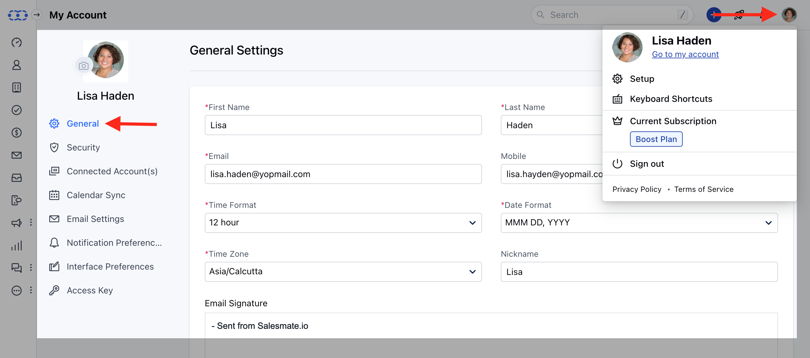
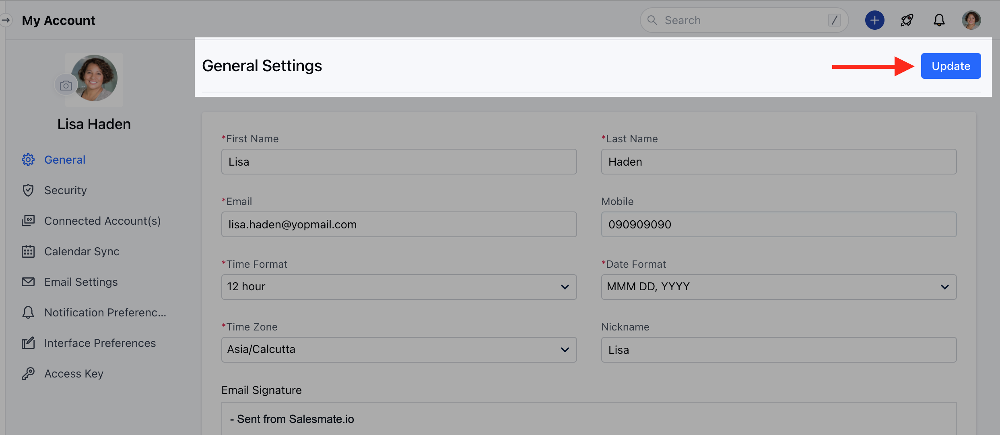
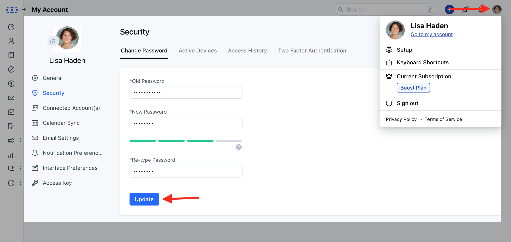
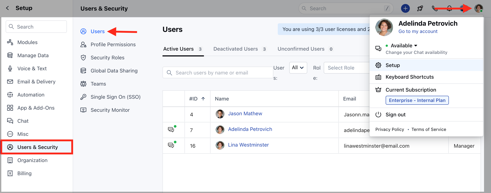
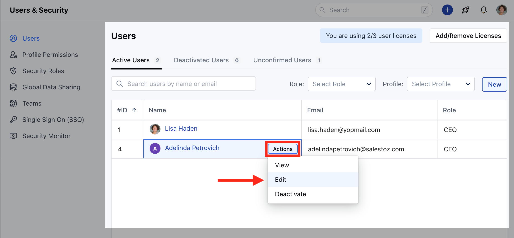
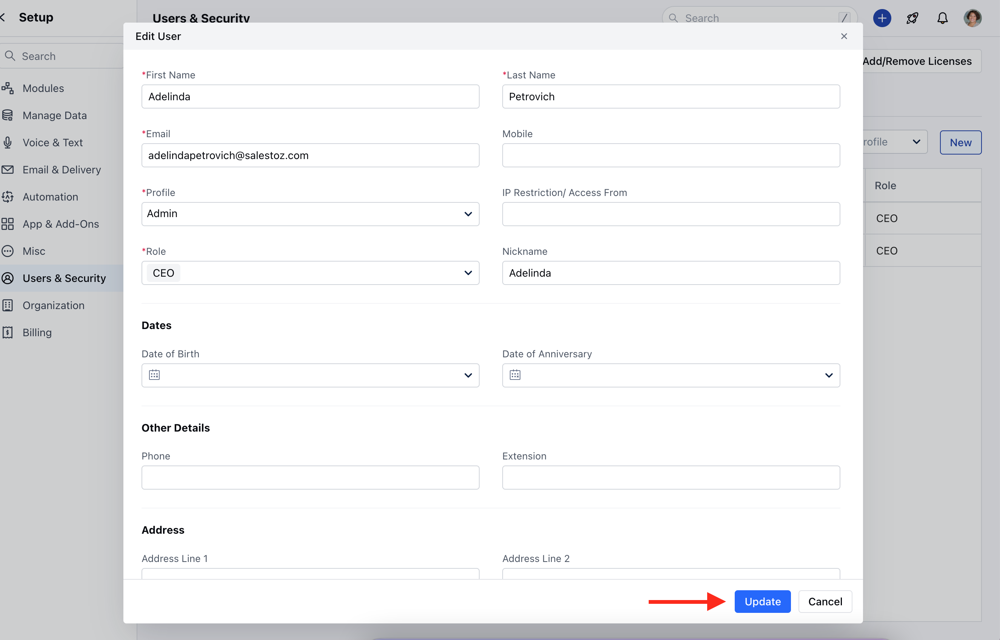

Salesmate allows you to change the credentials if required**Topics Covered:**[Changing your login email address](https://support.salesmate.io/hc/en-us/articles/115000655089-How-to-change-or-update-your-login-credentials#h_01FJ1WW4H3TV5BCM1DPNHYHSHH)[Changing your login password](https://support.salesmate.io/hc/en-us/articles/115000655089-How-to-change-or-update-your-login-credentials#h_01FJ1WWFGH0T0X395SXR9ZCBXQ)[Change of user login email address by an admin](https://support.salesmate.io/hc/en-us/articles/115000655089-How-to-change-or-update-your-login-credentials#h_01FJ1WWSDWDR5YEM3JSZXMB5R7)

### Changing your login email address

Navigate to the**Profile icon**from the top right Click on**Go to my accounts.**Under**General**Setting change your**email address**

Click on**Update**

**Note:**This change will come into effect on your next login. Use your new email address to log in to your account.

### Changing your login password

Navigate to the**Profile icon**from the top right Click on**Go to my accounts.**Click on**Security.**Type your existing password in the**Old Password**section.Create a**New Password**in combination with alphabets, numbers, and special characters.Retype the new password Click on**Update**to change it to the new password.

### Change of user login email address by an admin

Navigate to your**Profile Icon**on the top right cornerClick on**Set-Up**Head over to the**Users & Security**categorySelect**Users**

Click on the user for which you want to change the email addressClick on**View**which displays by hovering over the user's name.

Change the**Email address**of the user.Click on**Update**

