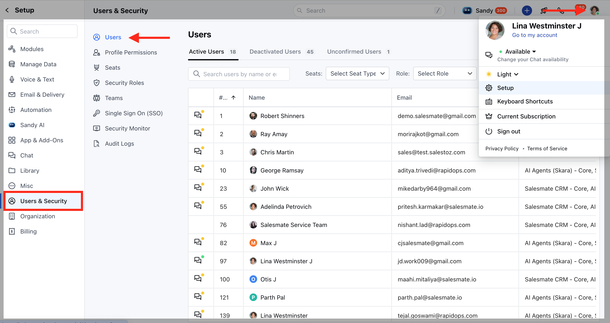
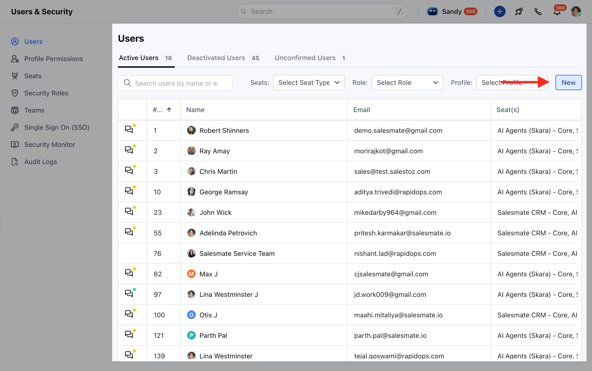
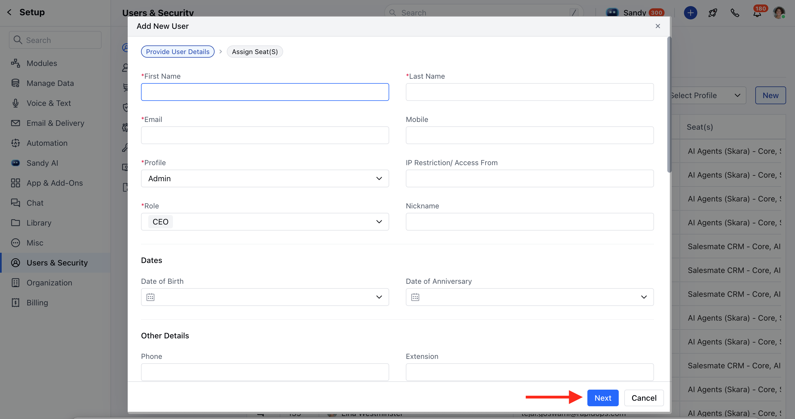
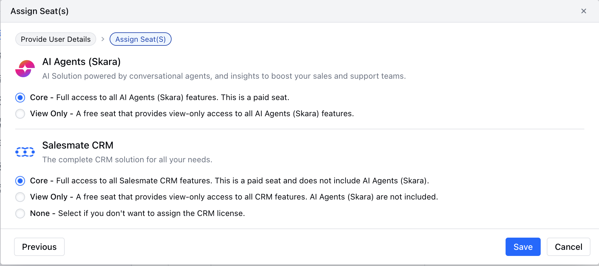
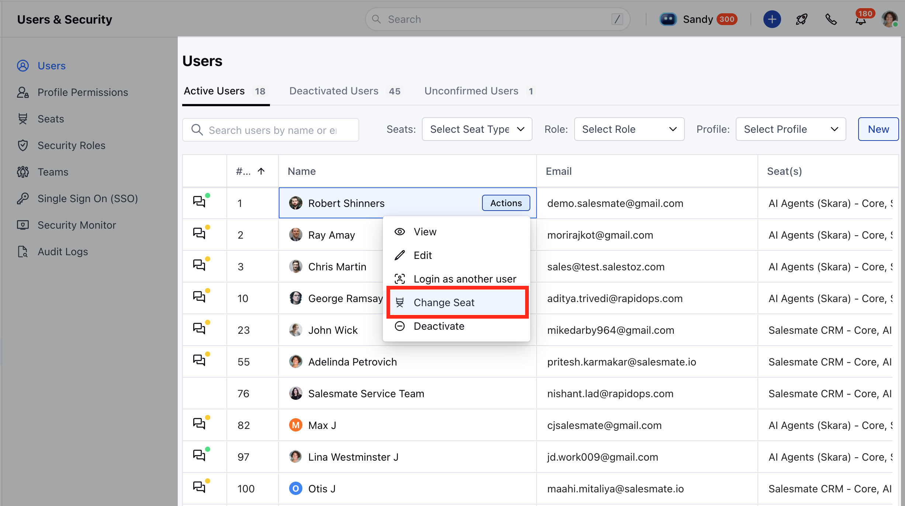
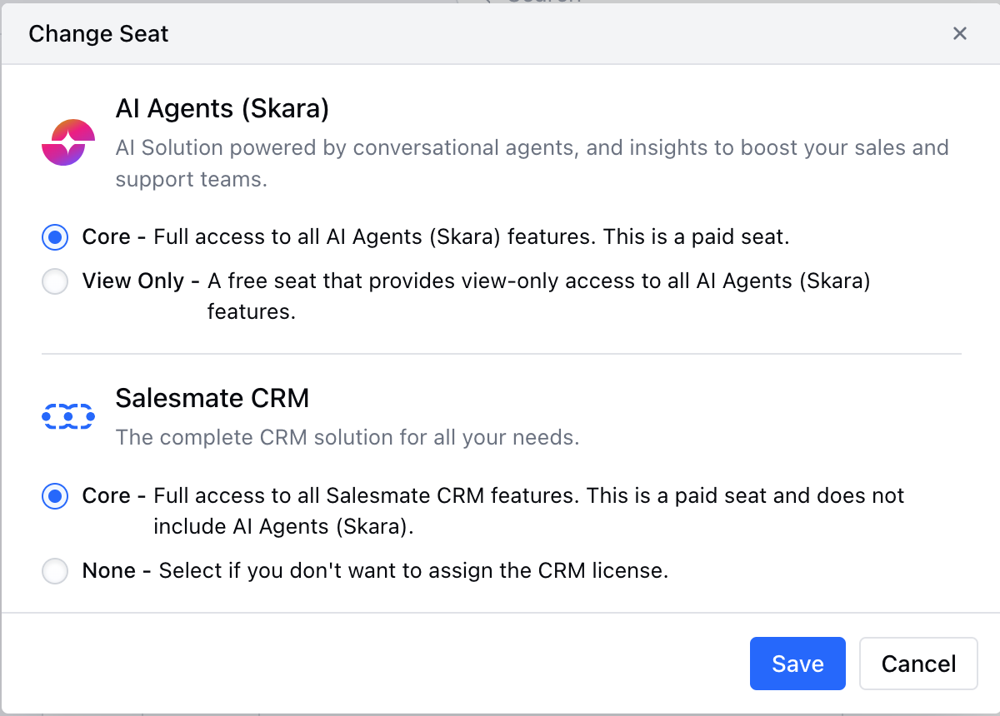

A **Seat** refers to the type of user license assigned to a person in your account. Each active user in your account is assigned a seat, and the type of seat determines what access that user has.

You can assign a seat while adding a new user or changing the seat for an existing user.

### **Topics covered:**

- [Add a New User and Assign a Seat](#add-a-new-user-and-assign-a-seat)
- [Change Seat for an Existing User](#change-seat-for-an-existing-user)

### Add a New User and Assign a Seat

- Navigate to your **Profile Icon** on the top right corner.
- Click on **Setup.**
- Head over to the **Users & Security** category.
- Select**Users.** 
- Click on the **New** button.

- Enter the required information for the user and click on **Next**.

- Choose the type of seat you want to assign:
  - **AI Agents (Skara)**: AI solution powered by conversational agents and insights to boost your sales and support teams.
    - **Core**: Full access to all AI Agents (Skara) features. This is a paid seat.
    - **View Only**: A free seat that provides view-only access to all AI Agents (Skara) features.
  - **Skara CRM**: The complete CRM solution for all your business needs.
    - **Core**: Full access to all **Skara **CRM features. This is a paid seat and does not include AI Agents (Skara).
    - **View Only**: A free seat that provides view-only access to all CRM features and does not include AI Agents (Skara).
    - **None**: Choose this option if you do not want to assign the CRM license.

- Click **Save** to create the user.

  ### **Change Seat for an Existing User**
  - Navigate to your **Profile Icon** on the top right corner.
  - Click on **Setup.**
  - Head over to the **Users & Security** category.
  - Select **Users** or **Seats.**
  - From the actions menu, click on **Change** **Seat**.

- Select the seat you want to **assign** or **update**.

- Click Update to **save** the changes.