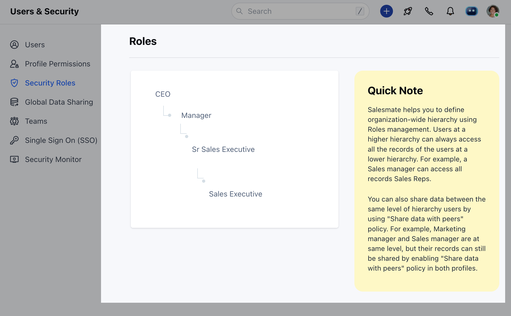

This helps you to set up an organization-wide role hierarchy and share rules between them. A security role defines how different users, can access different types of records.Topics Covered:

- [**Adding Roles**](#adding-roles)
- [**Assigning Roles**](#assigning-roles)

### Adding Roles

To add a new Role:

- Navigate to your **Profile Icon** on the top right corner.
- Go to **Set Up**.
- Head over to **Users & Security**
- Click on the **Security Roles**
- Here, you will be presented with the List of Roles.

- **Hover** over a **Role **(under which you want to add a Role)
- Click on (**\+**) **Add Role**

- Enter the Role**Name** 
- Choose the**Reporting**  **role**
- Describe the**Role** 
- Set the**Data sharing with peers**  (Selection of this option allows data to be shared with users on the same Role)

### Assigning Roles

Since the Roles of users evolve within the organization. It may require that you may need to update the **Roles** and **Profile** **Permissions** of users. Here are steps to update Roles and Profile Permissions :

- Navigate to your **Profile Icon** on the top right corner.
- Go to **Set Up**.
- Head over to **Users** **& Security**.
- Click on**Users** 

- Here you get the list of all **Users**.
- Hover over to the **User Name,** **Actions** button will appear next to the name.
- Click on the **Actions** Button and select **Edit**

- Go to **Roles** Field to update the information
- Hit **Update** to save the changes.

