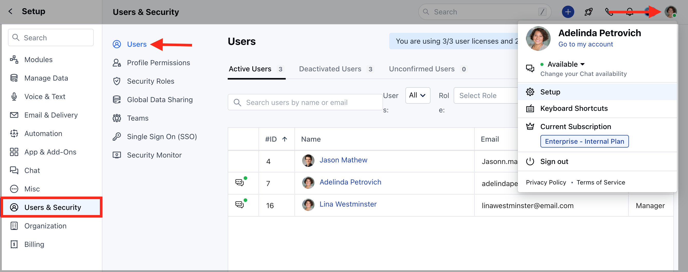

This helps you to set up an organization-wide role hierarchy and share rules between them. A security role defines how different users, can access different types of records.Topics Covered:

[**Adding Roles**](https://support.salesmate.io/hc/en-us/articles/19328651153689-Managing-Security-Roles-in-Salesmate#h_01H2AKVAYS9NEC4PDRD9V3JNG5)[**Assigning Roles**](https://support.salesmate.io/hc/en-us/articles/19328651153689-Managing-Security-Roles-in-Salesmate#h_01H2AKVNAHMDA4X2P0G5EFVPJ0)

### Adding Roles

To add a new Role:

Navigate to your**Profile Icon**on the top right corner.Go to**Set Up**. Head over to**Users & Security**Click on the**Security Roles**

Here, you will be presented with the List of Roles.

**Hover**over a**Role**(under which you want to add a Role)Click on (**+**)**Add Role**

Enter the Role**Name**Choose the**Reporting****role**Describe the**Role**Set the**Data sharing with peers**(Selection of this option allows data to be shared with users on the same Role)

### Assigning Roles

Since the Roles of users evolve within the organization. It may require that you may need to update the**Roles**and**Profile****Permissions**of users. Here are steps to update Roles and Profile Permissions :

Navigate to your**Profile Icon**on the top right corner.Go to**Set Up**. Head over to**Users****& Security**. Click on**Users**

Here you get the list of all**Users**. Hover over to the**User Name,****Actions**button will appear next to the name.Click on the**Actions**Button and select**Edit**

Go to**Roles**Field to update the informationHit**Update**to save the changes.

