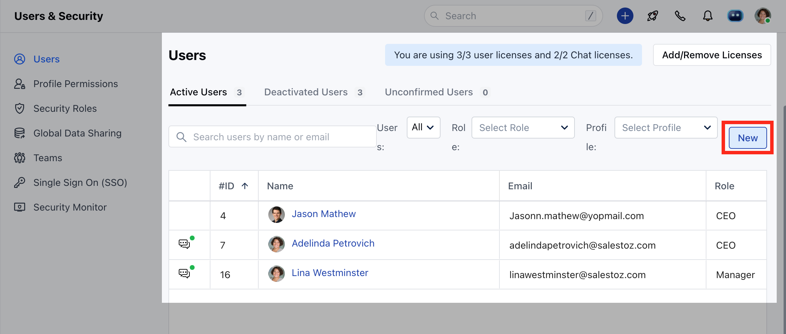

A **User** is the one who manages records within the organization, whether their own or those shared by other _users_.

In addition to accessing the CRM data, some of the users have to perform administrative functions for the smooth running of the CRM account.

Topics Covered:

- [How to Add a User?](#how-to-add-a-user)
- [User Fields](#user-fields)
- [How to Edit the User details?](#how-to-edit-the-user-details)
- [How to Deactivate the User?](#how-to-deactivate-the-user)

### How to Add a User?

To create a User,

- Navigate to your **Profile Icon** on the top right corner
- Click on **Set-Up**
- Head over to the **Users & Security** category
- Select**Users** 

- Click on **New**

- Add the User details and click on **Save**

#### **User Fields:**

- **First Name (Required):** The user's first name
- **Last Name (Required):** The user's last name
- **Email (Required):** The user's work email address used for login and notifications
- **Mobile:** The user's mobile phone number
- **Profile (Required):** Determines the permission level or access control set for the user (e.g., "Admin").
- Role (Required): The functional role or designation in the organization (e.g., "CEO").
- **IP Restriction / Access From:** This field for restricting access to specific IP addresses. 
  - If kept **blank** or **\*** is specified then the users will be able to access it from anywhere. 
  - If a specific IP or a set of IPS separated by commas are mentioned then users will be able to access the system from those specific IP addresses only. 
- **Date fields:**
  - **Date of Birth:** The user's birthday
  - **Date of Anniversary:** The user's anniversary (if applicable)
- **Other fields:**
  - **Phone:** Additional phone field
  - **Extension:** Phone extension number (if applicable)
- **Address fields**: The users address, could be residence or an alternate address that you would like to capture in the system.
  - Address Line 1, Address Line 2, Area, City, State, Country, Zip Code. 
- **Deal Capacity:** The number of deals that can be assigned to this user.
- **Email Signature: **User's email signature. Useful to the admin while creating the user to maintain branding across all email communications. 

<Note>
  **Note:** You can add the user depending on the number of user licenses as per the purchased plans.

  - [Click here to learn more](https://support.salesmate.io/hc/en-us/articles/115000325745-Increasing-Decreasing-Users)
</Note>

### How to Edit the User Details?

To Edit the details,

- Navigate to your **Profile Icon** on the top right corner
- Click on **Set-Up**
- Head over to the **Users & Security** category
- Select**Users** 

- Hover over to the **User Name,** **Actions** button will appear next to the name.
- Click on the **Actions** Button and select **Edit**

- Here you can Edit any details and click on Update.

### How to Deactivate the User?

To Deactivate the User,

- Navigate to your **Profile Icon** on the top right corner
- Click on **Set-Up**
- Head over to the **Users & Security** category
- Select**Users** 

- Click on**the Actions**  button next to the **User Name**.
- Select **Deactivate**

- The User deactivation can be done with two options,
  - **Deactivate this User and release the license**
  - **Deactivate this User and invite a new user using the same license**

- You can also assign **Contact, Company, Activities, or Deal** records to any other Users.
- Click on **Yes** to confirm the **User Deactivation**.

