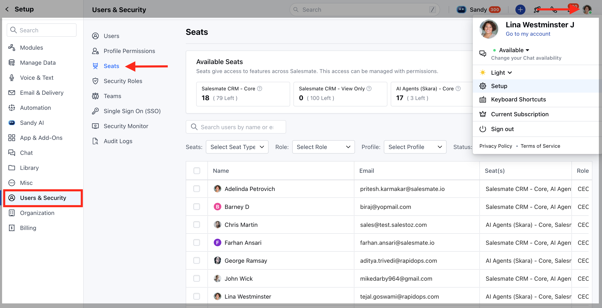

Controlling what you can see is an important aspect of CRM. You can set your records to public view or can set more privacy settings easily inside Skara.\
With Skara's **Users & Security,** you can manage:

- [**Users**](#users)
- [**Profile Permissions**](#profile-permissions)
- [**Security Roles**](#security-roles)
- [**Global Data Sharing Policies**](#global-data-sharing-policies)
- [**Teams**](#teams)
- [**Single Sign On (SSO)**](https://support.salesmate.io/hc/en-us/articles/19290670698905-Overview-of-User-s-Security#h_01H281S26NZVZK4TWP0071DEXW)
- [**Security Monitor**](#security-monitor-security-is-a-very-important-part-of-any-software-and-thus-its-important-to-keep-track-of-all-your-devices-and-the-access-history-to-monitor-for-any-suspicious-activity-and-change-the-security-settings-accordingly-click-here-to-learn-morehttpssupportsalesmateiohcen-usarticles4675827528217-security-monitor)

To proceed to **Users & Security,**

- Navigate to your **Profile Icon** on the top right corner.
- Click on the **Set-Up** 
- Head over to the **User's & Security**

### Users

- In Skara CRM, a user manages records, their own or those shared by other users, within the organization.
- In addition to accessing the CRM data, some of the users have to perform administrative functions for the smooth running of the CRM account. [Click here to learn more](#security-monitor-security-is-a-very-important-part-of-any-software-and-thus-its-important-to-keep-track-of-all-your-devices-and-the-access-history-to-monitor-for-any-suspicious-activity-and-change-the-security-settings-accordingly-click-here-to-learn-morehttpssupportsalesmateiohcen-usarticles4675827528217-security-monitor)

### Profile Permissions

- Profile Permissions helps you define permissions for a set of Users.
- For instance, the permissions required for a person from the Sales team might differ from the permissions required by a person in the Marketing team.
- You can define the permissions for each profile as needed and specify the profile when adding a user. [Click here to learn more](#security-monitor-security-is-a-very-important-part-of-any-software-and-thus-its-important-to-keep-track-of-all-your-devices-and-the-access-history-to-monitor-for-any-suspicious-activity-and-change-the-security-settings-accordingly-click-here-to-learn-morehttpssupportsalesmateiohcen-usarticles4675827528217-security-monitor)

### Security Roles

- A security role defines how different users, can access different types of records.
- To control access to data, you can modify existing security roles, create new security roles, or change which security roles are assigned to each user.
- Each user can have multiple security roles. [Click here to learn more](#security-monitor-security-is-a-very-important-part-of-any-software-and-thus-its-important-to-keep-track-of-all-your-devices-and-the-access-history-to-monitor-for-any-suspicious-activity-and-change-the-security-settings-accordingly-click-here-to-learn-morehttpssupportsalesmateiohcen-usarticles4675827528217-security-monitor)

### Global Data Sharing Policies

Inside Skara you can set the accessibility to allow or restrict access of the Users over different modules.

- Private: Only the record owner and his/her superior can view the record.
- Public Read only: Everyone can view all records but can't modify or delete them.
- Public Read/Write: Everyone can view all records with the ability to modify and delete them. [Click here to learn more](#security-monitor-security-is-a-very-important-part-of-any-software-and-thus-its-important-to-keep-track-of-all-your-devices-and-the-access-history-to-monitor-for-any-suspicious-activity-and-change-the-security-settings-accordingly-click-here-to-learn-morehttpssupportsalesmateiohcen-usarticles4675827528217-security-monitor)

### Teams

- A team is a group of users that work together to achieve some common goals.
- Skara allows you to organize your users into teams for reporting and maintaining organization structure for some quick actions [Click here to learn more.](#security-monitor-security-is-a-very-important-part-of-any-software-and-thus-its-important-to-keep-track-of-all-your-devices-and-the-access-history-to-monitor-for-any-suspicious-activity-and-change-the-security-settings-accordingly-click-here-to-learn-morehttpssupportsalesmateiohcen-usarticles4675827528217-security-monitor)

### Single Sign On

- Single sign-on (SSO) is an authentication method that enables users to securely authenticate with multiple applications and websites by using just one set of credentials. [Click here to learn more.](#security-monitor-security-is-a-very-important-part-of-any-software-and-thus-its-important-to-keep-track-of-all-your-devices-and-the-access-history-to-monitor-for-any-suspicious-activity-and-change-the-security-settings-accordingly-click-here-to-learn-morehttpssupportsalesmateiohcen-usarticles4675827528217-security-monitor)

### **Security Monitor**

- **Security** is a very important part of any software and thus it's important to keep track of all **your devices** and the **access history** to monitor for any suspicious activity and change the security settings accordingly. [Click here to learn more.](#security-monitor-security-is-a-very-important-part-of-any-software-and-thus-its-important-to-keep-track-of-all-your-devices-and-the-access-history-to-monitor-for-any-suspicious-activity-and-change-the-security-settings-accordingly-click-here-to-learn-morehttpssupportsalesmateiohcen-usarticles4675827528217-security-monitor)