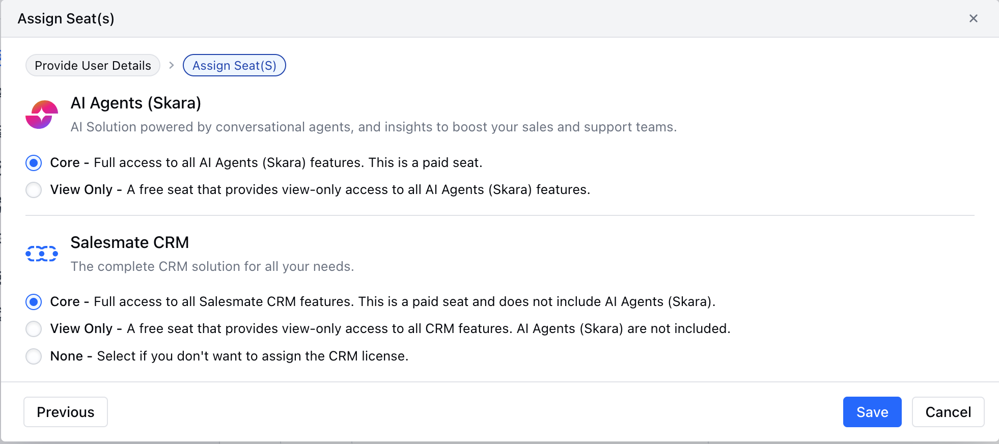

Skara Seats give you the flexibility to manage different types of users in your account without unnecessary costs.

With two seat types: Core and View-Only. You can provide full access to active users, share read-only visibility with stakeholders at no extra charge, and allow partners to support your workspace seamlessly.

### Types of Seats 

### **Core Seat:** The Core Seat is the standard Skara license.

- A **paid seat**, counted towards billing.
- Gives full access to all Skara features and operations.
- Assigned by default whenever a new user is created. This seat is perfect for your sales reps, marketers, and admins who need to work actively in Skara every day.

**View-Only Seat:**The View-Only Seat is for people who need visibility but don’t need to take action in the system. Think of consultants, advisors, or management users who want to see reports and dashboards without editing anything.

- A **free seat**, not counted towards billing.
- Limited strictly to viewing data and reports.
- Cannot create, edit, or delete records; manage dashboards; compose emails; or access setup.
- Can only view smart flows and campaign details. This is the ideal way to keep stakeholders in the loop—without adding extra cost to your subscription.

### Skara Seats can be used for:

- Giving Core Seats to team members who need full access to Skara to manage the core features like records, Reports and automations.
- Sharing View-Only Seats with managers, consultants, or stakeholders who just need to see reports and dashboards without making changes.
- Saving costs by paying only for active users while still giving visibility to others. Making sure every user gets the right access based on their role.

### How Many Free Seats Do I Get?

| Plans           | Basic | Pro | Business | Enterprise |
| --------------- | ----- | --- | -------- | ---------- |
| View-only Seats | NA    | 1   | 3        | Custom     |