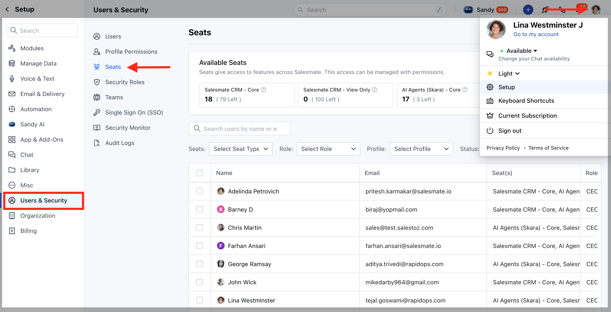

Seats represent the type of license assigned to each user and define the level of access they receive. As an admin, you can track the total number of seats available in your account and see how these seats are distributed among users. This helps you monitor usage, manage licenses effectively, and ensure every user has the right level of access.

###  **Topics covered:**

- [View Available Seats](#view-available-seats)
- [View Assigned Seats](#view-assigned-seats)

### **View Available Seats** 
- Navigate to your **Profile Icon** on the top right corner.Click on **Setup.

- **Head over to the **Users & Security** category.Select ** Seats.***

- *At the top, under** Available Seats **, you can see the count of all seats in your account.
Salesmate CRM – Core: Total purchased seats and how many are left.Salesmate CRM – View Only: consumed seats and how many are left.AI Agents (Skara) – Core: Paid seats and availability.AI Agents (Skara) – View Only: consumed seats and how many are left.

This section helps you understand how many seats are in use and how many are left for new users.

### **View Assigned Seats** 
- Navigate to your **Profile Icon** on the top right corner.Click on **Setup.

- **Head over to the **Users & Security** category.Select **Seats.

- **In the same Seats section, scroll down to see the list of users.Each row displays:** User Name & Email **Seat(s)**(e.g., Salesmate CRM – Core, AI Agents – View Only)**Role**(Manager, CEO, etc.)**Profile**(Admin, Standard, etc.)**Status**(Active, Deactivated, Unconfirmed)**Last Login** You can search users by **name** or ** email** to check the seat

You can also filter users by Seat **Type, Role, Profile,**or **Status** using the dropdown filters above the list.
