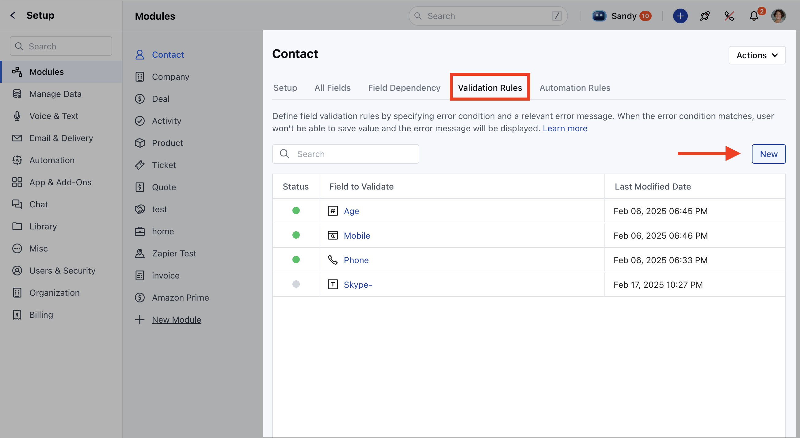
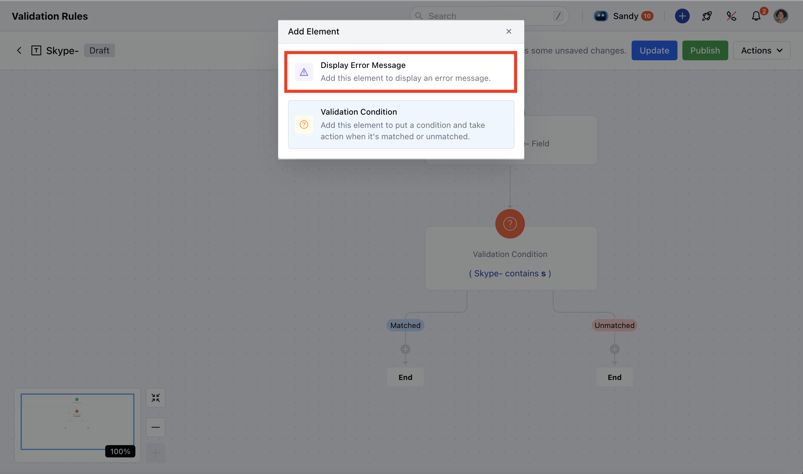
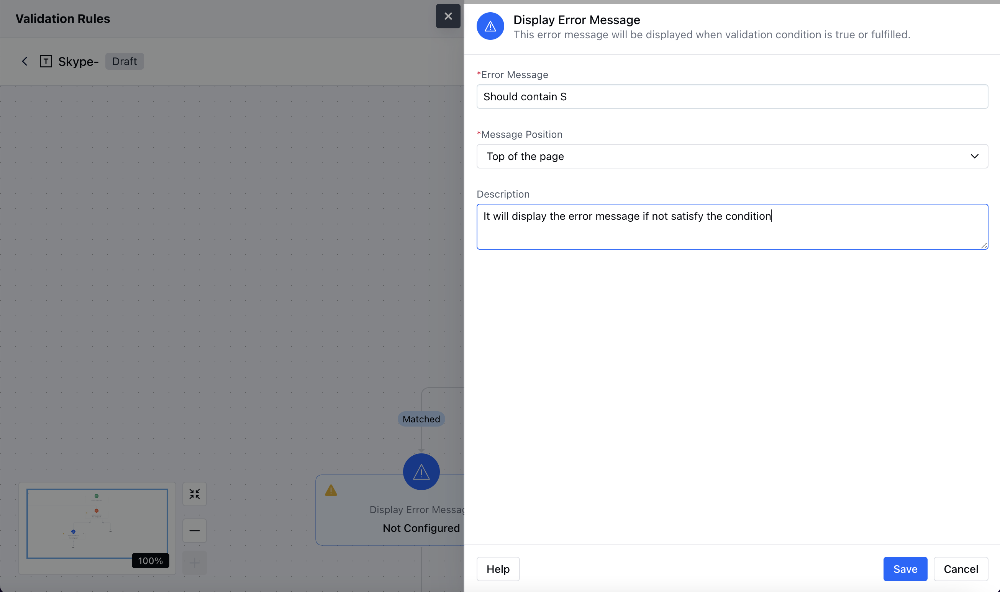
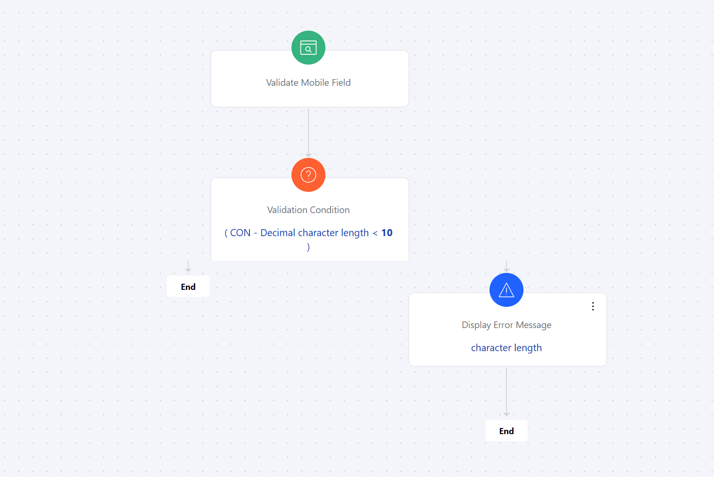

- **Display Error Message** Action will allow you to show the error message when a validation rule is true and fulfilled **Topics covered:**

[How to configure the Display Error Message Action](#how-to-configure-display-error-message-action)

- [Practical Example](#practical-example)

###  How to Configure Display Error Message Action

Navigate to the **Profile Icon** at the top right corner.Click on **Setup**. Go to the **Modules** section.Select the Module on which you wish to create a Validation RuleHere, click on the ** Validation Rules ***

- *When setting up the validation rule select** Display Error Message ** Action to configure the error message as per your requirement

To configure the **Display Error Message** Action, you'll need to provide the following details:**Error Message**: Mention the error message that you need to display when the validation condition is matched **Message Position**: There are two options for the message position you would need to choose one of them as per your requirement
Top of the pageBelow the field **Description**: Offer a brief explanation of the action’s function.

###  Practical Example

We want to add a validation rule for the mobile field in a contact.On the screen, we need to set up a validation condition.The condition should specify that the mobile number must be at least 10 digits long.Once the condition is added, we will configure an action to display an error message.If the entered number has fewer than 10 digits, the system will show a message like **"Character length is not supported."**

