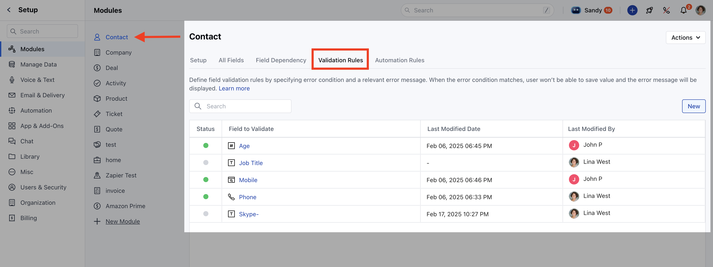
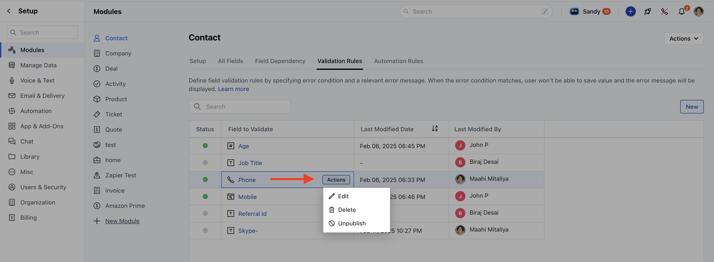
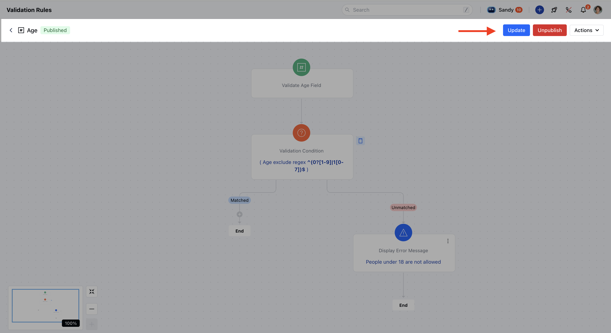

You can easily edit the Validation Rule to ensure you achieve the desired outcome. In this article, we’ll show you how easy it is to edit the Validation Rule so you can keep them updated and relevant to your needs.You can refer to the article on creating a validation rule [here](https://support.salesmate.io/hc/en-us/articles/42923331176601).

### How to Edit a Validation Rule

Navigate to the**Profile Icon.**Click on**Setup**. Click on**Modules**and choose the module where you want to modify the validation rule.

Click on the**Validation Rules**tab.Hover over the rule you want to update, click on the**Action**option, and select**Edit**.

You will redirected to**Canvas View**where you can make the changes.Click**Update**to apply the changes.

If the rule is in**Unpublish mode**, you will be able to view following options:
Click**Update**to save changes while keeping the rule in draft mode.Click**Publish**to activate the rule.**Note:**You need**Manage Modules**permission to access these settings.
