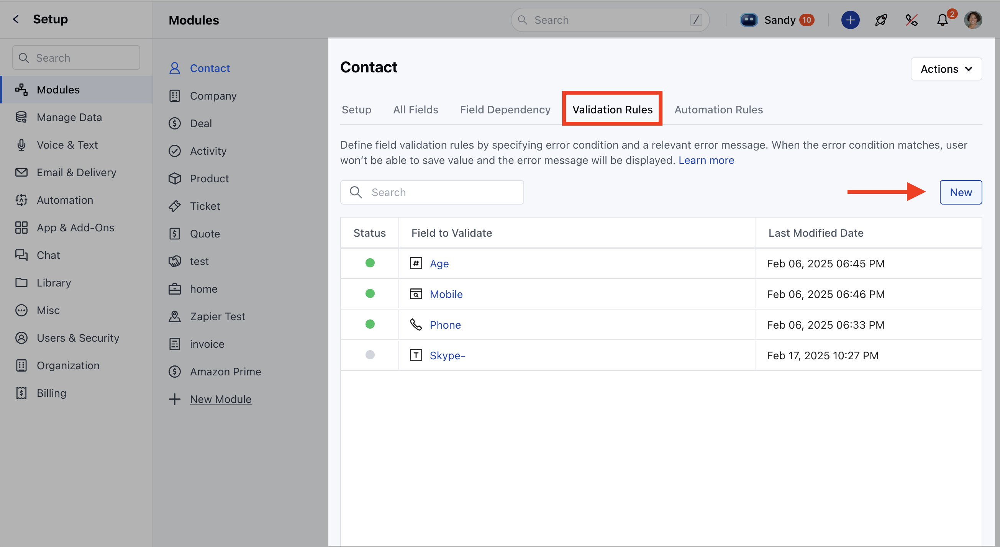
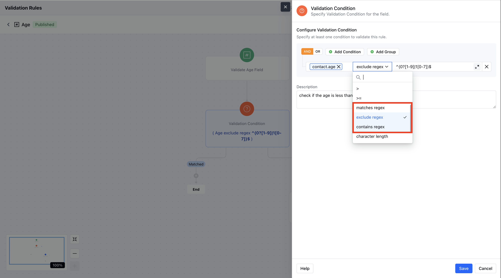
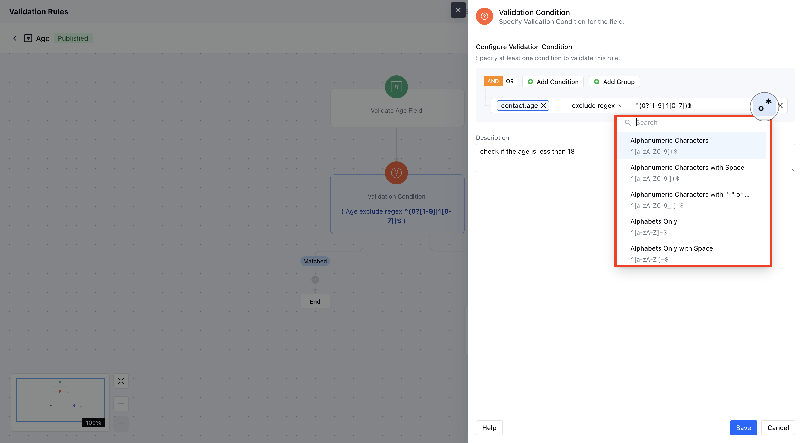

Regular expressions (regex) help ensure that the data entered by users matches specific formats. You can use regex conditions in your validation rules to check any fields such as emails, phone numbers, or usernames.You can refer to the article on creating a validation rule [here](https://support.salesmate.io/hc/en-us/articles/42923331176601).**Topics Covered**[How to use Regex Conditions](https://support.salesmate.io/hc/en-us/articles/43049567250969-Validation-Condition-using-Regular-Expression-regex#h_01JKDTBCSCQXT777ATCNMM68NS) [Pre-defined Regex Patterns](https://support.salesmate.io/hc/en-us/articles/43049567250969-Validation-Condition-using-Regular-Expression-regex#h_01JKDTBCSCXFX7FVN0Q95BVYV6)

### How to use Regex Conditions

Navigate to the**Profile Icon**at the top right corner.Click on**Setup**. Go to the**Modules**section.Select the Module on which you wish to create a Validation RuleHere, click on the**Validation Rules****

**In the Condition, select any field (e.g., “Email”).Choose one of the conditions (e.g., “Excludes Regex”) from the operator list.There are 3 Regex Conditions you can choose from:**Matches Regex:**Check if the input**Exactly**matches the regex pattern.**Excludes Regex:**Ensures the input does**Not**contain the regex pattern anywhere.**Contains Regex:**Checks if any part of the input**Contains**a substring that matches the regex pattern.

You can insert your**own Regex**or you can also select the**Predefined Regex**from the list.Click**Save**to apply the rule.

### Predefined Regex Patterns

Here are all the pre-defined Regex patterns you can use.**Alphanumeric Characters****Description:**Validates strings that contain only letters and numbers._Example:_ `abc123`**Alphanumeric with Space****Description:**Allows letters, digits, and spaces._Example:_ `hello 123`**Alphanumeric with "-" or "\_"****Description:**Permits letters, digits, hyphens, and underscores._Example:_ `user_name`**Alphabets Only****Description:**Accepts only letters._Example:_ `username`**Numbers Only****Description:**Ensures the input consists solely of digits._Example:_ `123456`**Email ID****Description:**Validates that the input follows a standard email format._Example:_ `user@example.com`**Indian Phone Number (+91)****Description:**Validates a 10-digit Indian mobile number with the +91 prefix._Example:_ `+919876543210`**US Phone Number****Description:**Validates U.S. phone numbers starting with +1 and following standard formats._Example:_ `+1 123-456-7890`**UUID****Description:**Validates a universally unique identifier (UUID)._Example:_ `123e4567-e89b-12d3-a456-426614174000`**IP Address (IPv4)****Description:**Checks that the input is a valid IPv4 address._Example:_ `192.168.1.1`**MAC Address****Description:**Verifies the common MAC address format._Example:_ `00:1A:2B:3C:4D:5E`**Social Security Number****Description:**Validates the Social Security number format (xxx-xx-xxxx)._Example:_ `123-45-6789`**Credit Card****Description:**Validates a 16-digit credit card number._Example:_ `1234567890123456`**Street Address****Description:**Checks for a basic street address format._Example:_ `123 Main St`**Canadian Postal Code****Description:**Validates the format of Canadian postal codes._Example:_ `K1A 0B1`**U.S. Postal Code****Description:**Validates the common 5-digit U.S. postal code format (with optional extended digits)._Example:_ `12345`
