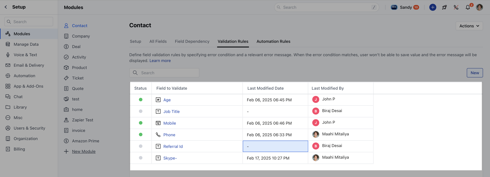
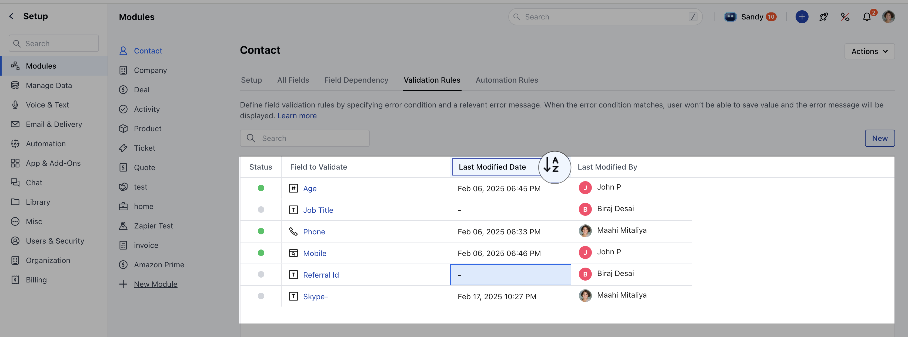
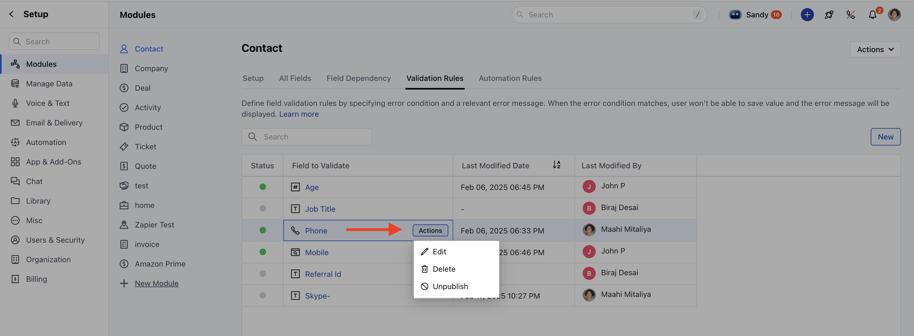

Once you have created [validation rules](https://support.salesmate.io/hc/en-us/articles/42923331176601), the listing grid will display the following columns:**Status**: Indicates the current state of the rule, such as Published or Draft.**Field to Validate**: Specifies the field on which the validation rule is applied.**Last Modified Date**: Shows the most recent date when the rule was modified.**Last Modified By**: Displays the name of the user who last modified the rule.

### Sorting & Searching

Sorting can be applied to the**Last Modified Date**column.The default sorting is**ascending**based on the**Field to Validate**column.Users can search for rules by entering field names in the search bar.

### Actions

Users can perform the following actions on validation rules:**Edit**: Modify the rule as needed. [Learn More](https://support.salesmate.io/hc/en-us/articles/42923425408153-How-to-Edit-Validation-Rule)**Unpublish**: Available only if the rule is currently published.**Delete**: Remove the rule permanently. [Learn More](https://support.salesmate.io/hc/en-us/articles/42923460271513-How-to-Delete-Validation-Rule)

This listing grid helps in managing validation rules efficiently, providing a clear overview and quick access to modifications.
