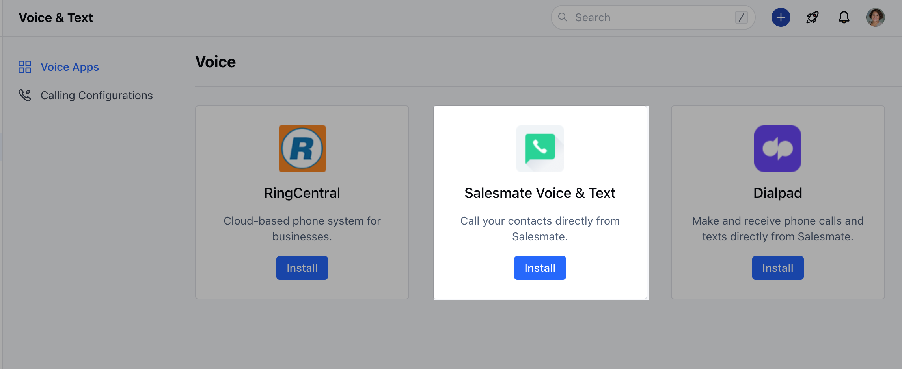

Salesmate provides multiple options for communication with your leads and customers. One of the main communication modes is Calling and texting.With Salesmate you have the freedom to select the in-app integrations for Calling & Texting.Here is the list integration that we provide for the Calling and Texting feature in Salesmate.**Topics Covered:**[Navigation](https://support.salesmate.io/hc/en-us/articles/11343546338201-Calling-Integrations-with-Salesmate#h_01GF0D3RCYJQA8MKJMCN6FQYEA)[Salesmate Voice & Text (Native Calling Feature](https://support.salesmate.io/hc/en-us/articles/11343546338201-Calling-Integrations-with-Salesmate#h_01GF0D41GA0GJTZ46EDYY5K2AT))[RingCentral](https://support.salesmate.io/hc/en-us/articles/11343546338201-Calling-Integrations-with-Salesmate#h_01GF0EVQWCGD7KZGDD61EGKE7P)[Dialpad](https://support.salesmate.io/hc/en-us/articles/11343546338201-Calling-Integrations-with-Salesmate#h_01GF0GJEV1M4WFKWQJEGWPAKH4)[JustCall (VOIP)](https://support.salesmate.io/hc/en-us/articles/11343546338201-Calling-Integrations-with-Salesmate#h_01GF0GJTVNQNZD2GZM4433REA6)

### Below are the steps to help you with navigation to setup:

Navigate to the**Profile Icon**on the top right cornerClick on**Setup**Head over to the**Voice & Text**categoryClick on**Voice Apps**

Select**Salesmate Voice & Text**

### Salesmate Voice & Text (Native Calling Feature)

Salesmate CRM’s built-in VoIP-based phone system enables you to call your clients from anywhere with our mobile and web apps.Get toll-free and virtual phone numbers in over 80 countries with a specific area code for everyone on your team.Utilize the top-class calling and texting features of Salesmate CRM without any setup charges or hidden costs, and it takes less than 5 minutes to start calling.

[How to activate Salesmate Voice & Text](https://support.salesmate.io/hc/en-us/articles/360004733011-How-do-you-enable-the-calling-app-)**

**### RingCentral

Available in the Pro Plan and above.

[RingCentral’s](https://www.ringcentral.com/) cloud phone system brings VoIP-based calling capabilities to Salesmate CRM. With the native RingCentral integration, you can make and receive calls directly from Salesmate with a click of a button. All incoming and outgoing calls can be logged and recorded\* effortlessly. Sales teams can save hours per week by dialing calls and logging the conversations by leveraging this powerful integration. Recorded calls are a great way to monitor and improve sales pitches and client conversations. Salesmate will automatically capture all incoming calls received when you were away and allow you to quickly log them later.[How to activate RingCentral](https://support.salesmate.io/hc/en-us/articles/115003447185-Built-in-Calling-using-RingCentral-Integration)

### Dialpad

Available in the Pro Plan and above.

[Dialpad](https://www.dialpad.com/) is the most modern business communications platform. Taking into account every form of communication that you rely on and unifying it into one app. Calling a client? Meeting with your team? Texting a colleague? It’s all here, on all your devices.[How to activate DialPad](https://support.salesmate.io/hc/en-us/articles/6421925275929-Built-in-Calling-Texting-using-Dialpad-Integration)

### JustCall

JustCall’s cloud phone system brings VoIP-based calling capabilities to Salesmate CRM. With the Click-To-Call JustCall integration, you can make and receive calls directly from Salesmate with a click of a button. All incoming and outgoing calls can be logged and recorded effortlessly.[How to integrate JustCall.](https://support.salesmate.io/hc/en-us/articles/360046979231-JustCall-Calling-Texting-VoIP-Integration)
