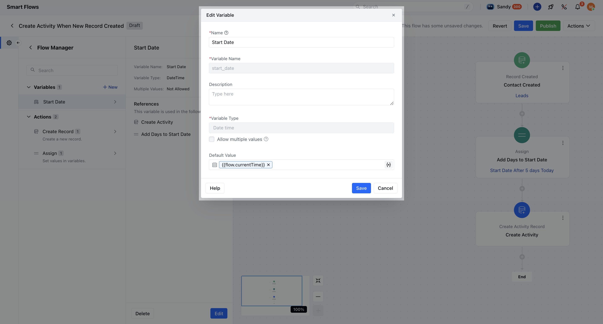
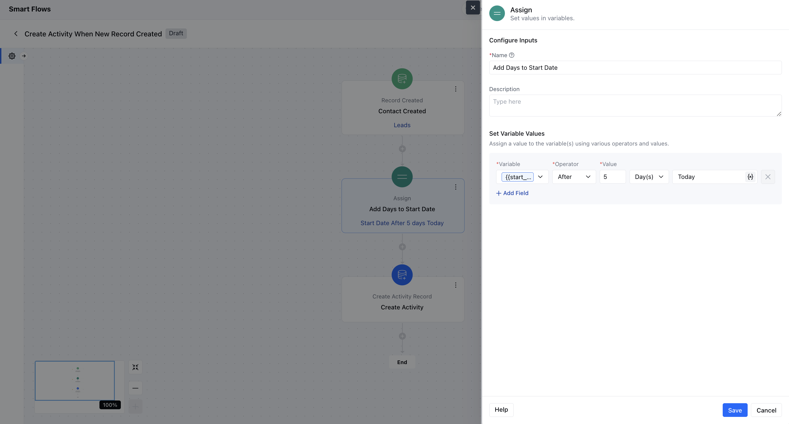
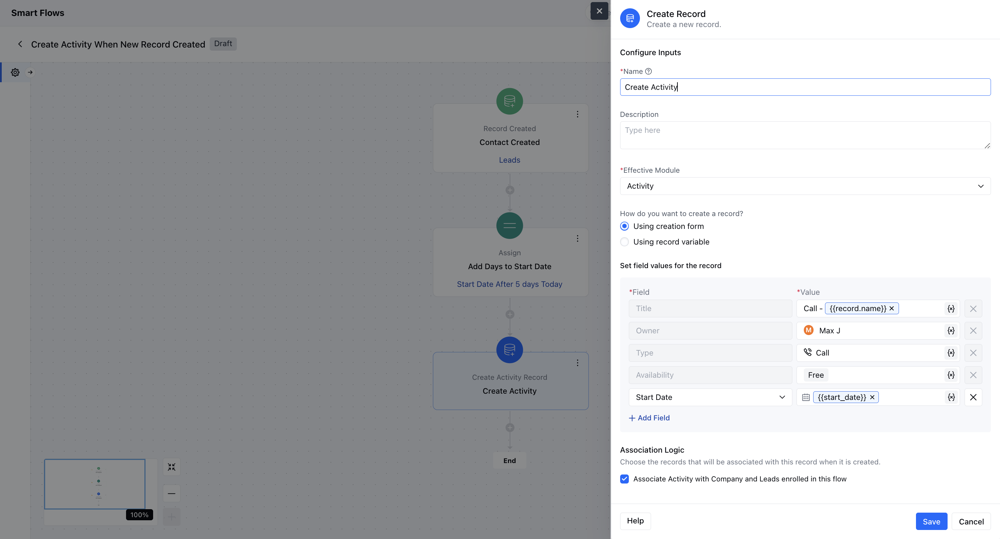
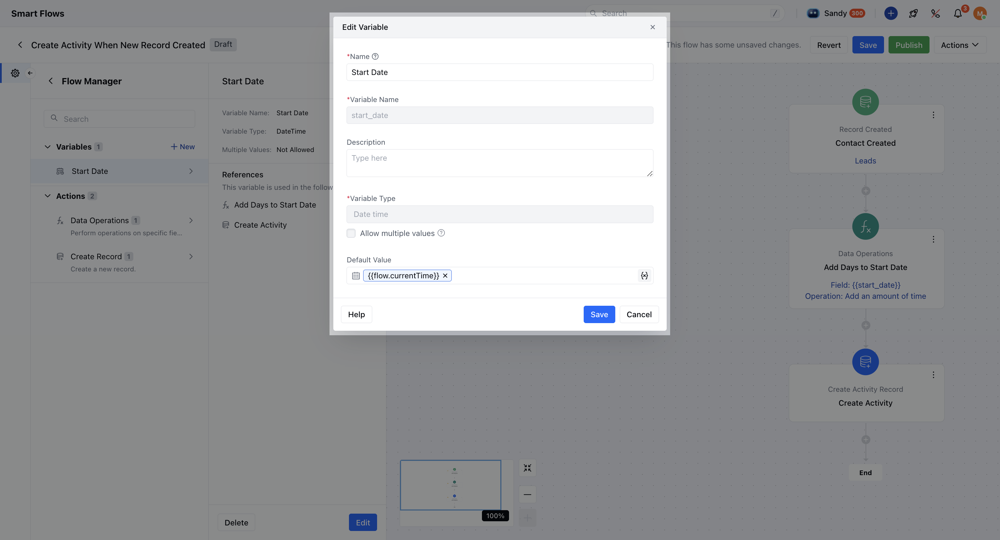
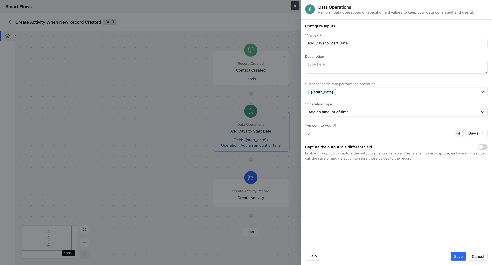
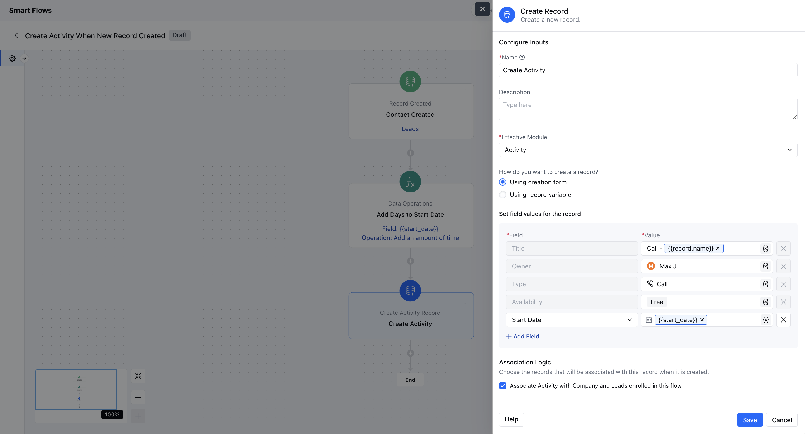

####**How to Set the Start Date of an Activity in Smart Flow** You can customize the **Start Date** of an activity using either the **Assign interaction** or the **Data Operation interaction** in Smart Flow. Below are the detailed steps for both methods:**Method 1: Using the Assign Interaction **Select a Trigger** Choose a trigger based on your requirement.Example: Trigger the Smart Flow when a new contact is created in Salesmate.

- **Create a Variable** Create a variable of type** Date & Time **. Refer to this for guidance on [creating variables](https://support.salesmate.io/hc/en-us/articles/36669777739417).Since the Start Date field is of type Date & Time, this variable will be used for calculations.

- *Add the Assign Interaction** Insert an **Assign interaction** into your flow.Assign the Date & Time variable and add the desired number of days.Example: Set it to “5 days from the flow trigger date” or “5 days from the activity creation date.”

- *Create the Activity Record** Add a **Create Record action** to generate the activity.For the **Start Date** field, select **Attribute** and choose the variable you created earlier.

- * Using the Data Operation Interaction ***Follow Steps 1 & 2 Above** Create a trigger and a** Date & Time variable ** with a default value (e.g., Flow Start Date & Time or Current Date & Time).

- *Add the Data Operation Interaction** Insert a **Data Operation interaction** instead of Assign.Select your Date & Time variable in the field **“Choose the field to perform the operation.”** Set the **operation type** to **Add an amount of time**. Specify the number of days (e.g., 5 days).

- *Create the Activity Record** Use the **Create Record action**. For the **Start Date**, choose **Attribute** and select the updated variable.

