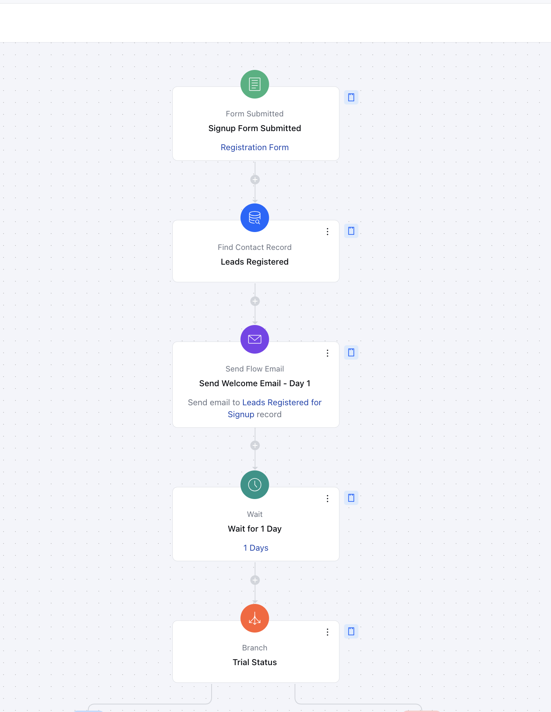
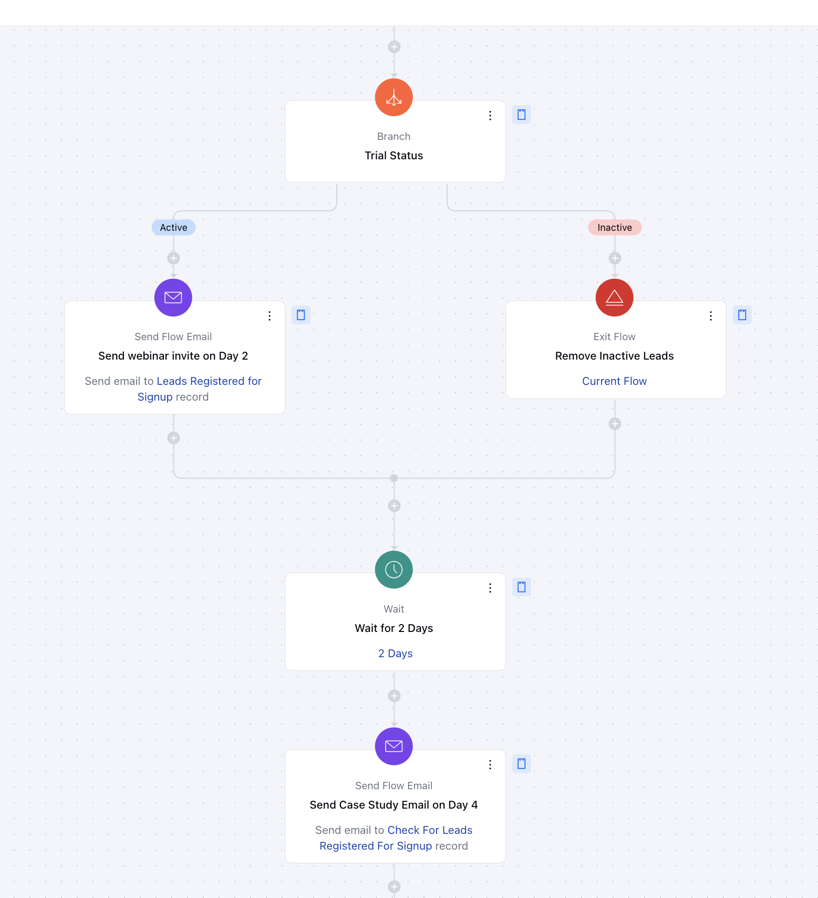
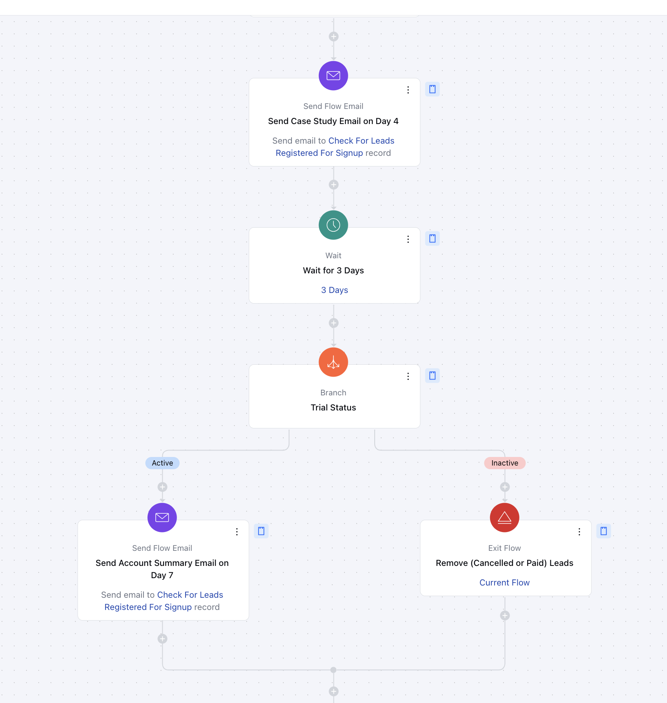
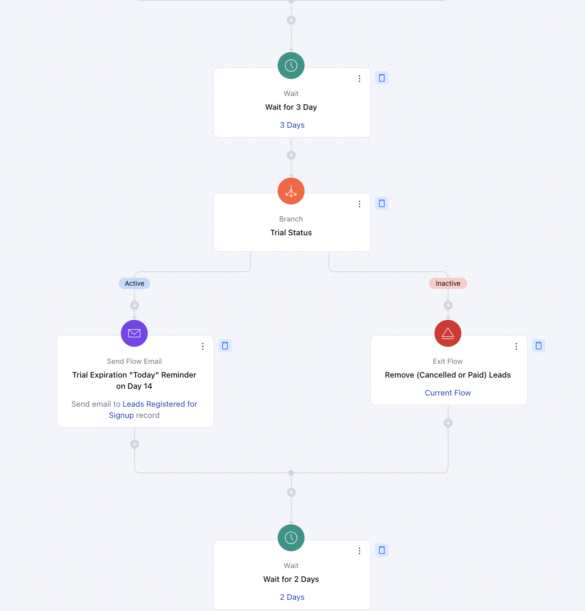
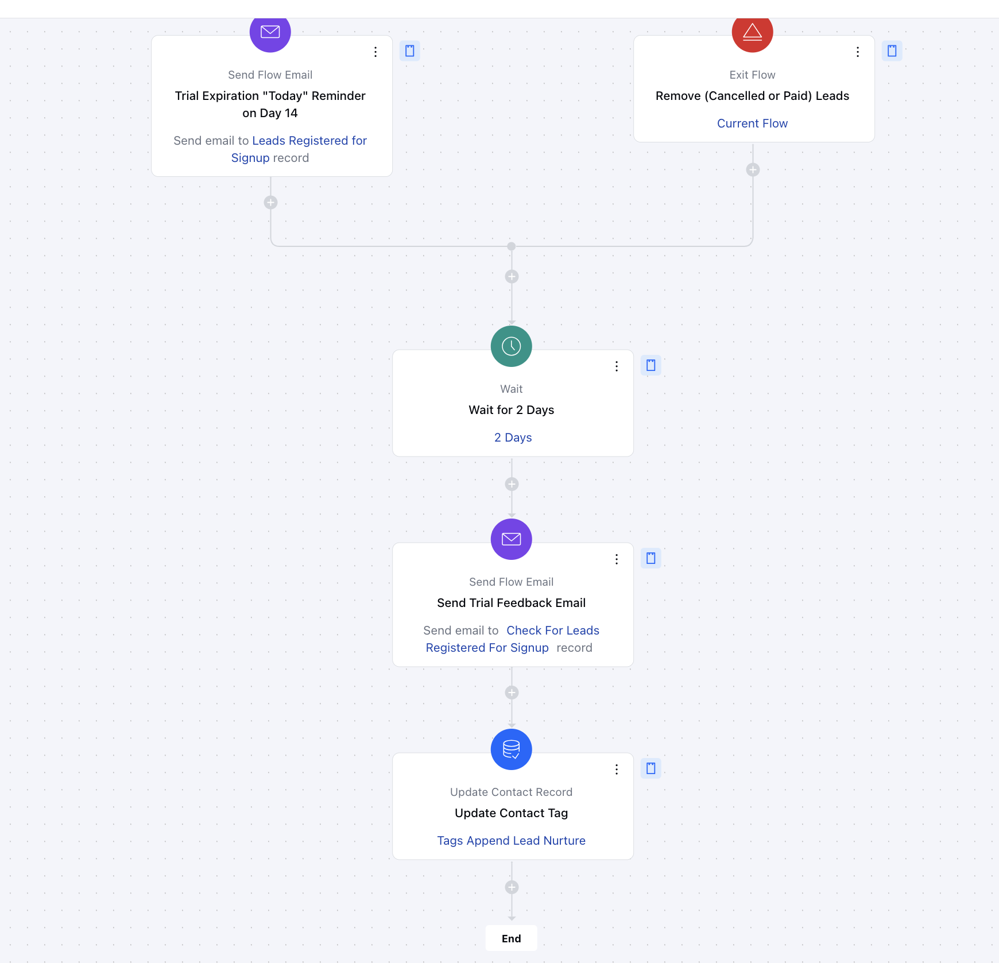

This flow converts trial users into paying customers through tailored email nurturing and display retargeting, sending up to nine (9) personalized emails based on their activity level to drive higher conversions.

###  **Topics covered:**

- [Business Type](https://support.salesmate.io/hc/en-us/articles/42342694768537-14-Days-Saas-Trial#h_01JHQPBHYYVN8NB5EYPY1WV1DS)

- [Template Type](https://support.salesmate.io/hc/en-us/articles/42342694768537-14-Days-Saas-Trial#h_01JHQPBP7P9TZ9BCWDHFJAZEDC)

- [Use Case](https://support.salesmate.io/hc/en-us/articles/42342694768537-14-Days-Saas-Trial#h_01JHQPBSQGKAN62285MR90EMRQ)

- [Key Features of the Flow](https://support.salesmate.io/hc/en-us/articles/42342694768537-14-Days-Saas-Trial#h_01JHQPBXRS2DW2BY2M4PBMED2B)

- [Steps to create the flow](https://support.salesmate.io/hc/en-us/articles/42342694768537-14-Days-Saas-Trial#h_01JHQPC31BNJK2NB05GWKFZP12)

- [Breakup of the items used in the flow](https://support.salesmate.io/hc/en-us/articles/42342694768537-14-Days-Saas-Trial#h_01JHQPC7WN3ACAXA91188ZFVCD)
- [Benefits](https://support.salesmate.io/hc/en-us/articles/42342694768537-14-Days-Saas-Trial#h_01JHQPCDV7TX9KQ0KX7RK8NNY7)

### **Business Type** 
This flow is ideal for SaaS businesses looking to enhance their customer onboarding experience and streamline lead management processes.

### **Template Type** 
Perfect for SaaS, Marketing, and Onboarding teams to effectively manage new leads and provide a seamless user experience during the trial phase.

### **Use Case** 
A SaaS company offering a 14-day trial can use this flow to:**Track User Activity**: Monitor engagement levels.

- **Send Personalized Emails**: Share tips, feature highlights, or offers based on behavior.

- **Boost Conversions**: Convert trial users to paying customers with tailored messaging.

This flow simplifies onboarding and drives trial-to-paid conversions effectively.

### **Key Features of the Flow** 
Automated Nurturing Sequence: Up to 9 personalized emails sent during the trial period.
Ensures consistent communication to keep users engaged.Behavior-Based Messaging: Emails are triggered based on user activity levels.Retargeting strategies adjust to customer interaction patterns.Conversion Optimization: Designed to maximize trial-to-paid conversions.Strategic follow-ups based on engagement metrics.

### ** Steps to create the flow:**Form Submitted (Trigger)**:
[Form Submitted](https://support.salesmate.io/hc/en-us/articles/37775479211289-Form-Submitted)
Description: The flow begins automatically when a lead submits a sign-up form, indicating their interest in your product or service.Practical Usage: This trigger ensures that the process starts immediately after a lead shows interest, allowing timely and relevant communication to be sent.

- **Initial Welcome Email **Action **:
- [Send Flow Email](https://support.salesmate.io/hc/en-us/articles/38138164432409-Send-Flow-Email)
Description: This action sends a personalized welcome email to the lead, highlighting the benefits of the trial and key features of the platform.Practical Usage: The welcome email sets the tone for the relationship, providing essential information and creating a positive first impression of your product or service. It encourages leads to get started and explore the platform's value.

- **Find Record:**
- [Find Record](https://support.salesmate.io/hc/en-us/articles/38138036610201-Find-Records)
Description: This action searches for relevant data submitted through the form, such as lead details, preferences, or other form responses, to personalize subsequent messages and actions in the flow.Practical Usage: After a lead submits a form, this action retrieves details like name, company, and preferences, enabling tailored future communications.

- **Wait Period:**
- [Wait](https://support.salesmate.io/hc/en-us/articles/38138356545433-Wait)
 Description: A pause (e.g., 3 days) is added to the flow to allow time for the lead to explore the platform and engage with the trial before receiving further communication.Practical Usage: This waiting period ensures the lead isn't overwhelmed with messages right after signing up. It gives them time to interact with the platform.

- **Trial Status Check Condition**:
- [Branch](https://support.salesmate.io/hc/en-us/articles/37780627045657-Branch)
 Description: This condition checks the user's trial status, such as whether their trial is Active or Inactive, to determine the next step in the flow.Practical Usage: The flow branches based on trial status to deliver relevant communications. Active users receive advanced tips, while inactive users get reminders to explore features. This keeps users engaged according to their activity level.

- **Tailored Follow-Up Email Action:**
- [Send Flow Email](https://support.salesmate.io/hc/en-us/articles/38138164432409-Send-Flow-Email)
 Description: This action sends a tailored follow-up email based on trial status and activity. Highly active users get webinar invites with advanced tips, while inactive leads are removed using the Exit Action.Practical Usage: This step personalizes the experience for users depending on how actively they are engaging with the trial. For Highly Active Users, the flow sends emails with expert-level tips, features, or use cases to deepen their engagement. For Low Activity Users, it removes them from the flow.

- **Send Case Study Email Action**:
- [Send Flow Email](https://support.salesmate.io/hc/en-us/articles/38138164432409-Send-Flow-Email)
 Description: This action sends a Case study email which showcases a relevant case study that demonstrates how other users or businesses have successfully used the product to achieve their goals.Practical Usage: By reaching out sometime after the trial starts, this email helps users see the value they’ve gained so far, provides a relevant case study that will help them use the product according to their requirements, and nudges them towards considering the benefits of a paid plan.

- *Mid-Trial Check Status and Send Account Summary Action**:
Description: First Check the trial status using the branch condition and send email to the active leads.Practical Usage: By reaching out at the mid-point of the trial, this email helps users see the value they’ve gained so far, provides a quick summary of their usage, and nudges them towards considering the benefits of a paid plan.

- * Pre-Trial Expiry Email (Day 14)***Action **:
Description: This action sends an urgency email 2 days before the trial ends (on day 12), reminding users of their trial expiration and offering them upgrade options.Practical Usage: As the trial period nears its end, this reminder encourages users to take action and upgrade before losing access to the platform.

- *Update Contact Tag (Post-Trial Expiry) - **
- [Record Updated](https://support.salesmate.io/hc/en-us/articles/36764018047385-Record-Updated)
Description: This action updates the contact's tag to reflect their status in the post-nurturing phase.Practical Usage: It helps categorize contacts who have moved beyond the initial nurturing stage, enabling targeted follow-up communications and personalized engagement strategies to maintain and strengthen the relationship.

### ** Breakup of the items used in the flow:**

- Trigger **Form Submitted-**Signup Form Submitted: Starts the flow when the Signup form is submitted by a Lead.

- **Branching **Trial Status Check:** Splits the flow into two paths based on the Trial status
Active - Send the next day's email based on the lead's engagement.Inactive - Remove inactive leads from the flow.

- **Actions **Send Flow Email (7)**: Personalized emails sent at key points during the trial, such as a welcome email, trial progress updates, and reminders about trial expiration.

- ** Wait (6)**: Pauses added to manage the communication pace (e.g., wait 3 days before the next action).

- ** Update Record (1)**: Updates user records based on trial completion or conversion status.

- ** Find Records (1)**: Searches for trial-related or existing records for better personalization.

- ** Add to List (1)**: Add the contact to a nurturing list for segmentation.

- ** End **Exit Flow (4)**: The flow ends after sending a final follow-up email or when the user successfully converts.

### **Benefits:**
- The 14-Day SaaS Trial Conversion Flow is a powerful automation designed to:

Increase conversion rates with strategic follow-ups.Engage users through personalized communication.Reduce manual work with fully automated nurturing.This structured sequence ensures trial users receive timely, relevant messaging, leading to a higher likelihood of converting into long-term customers.
