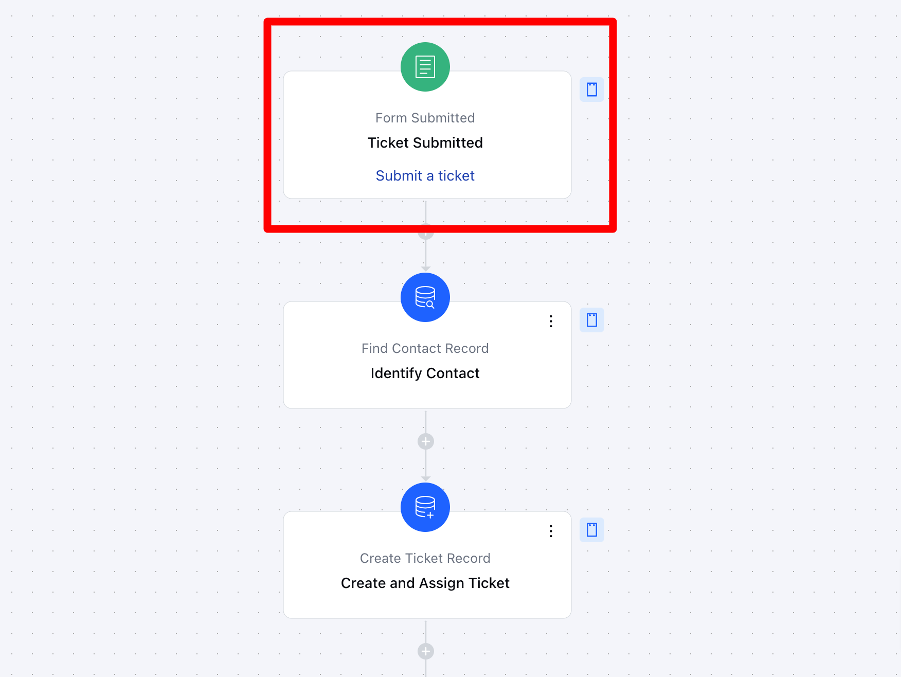
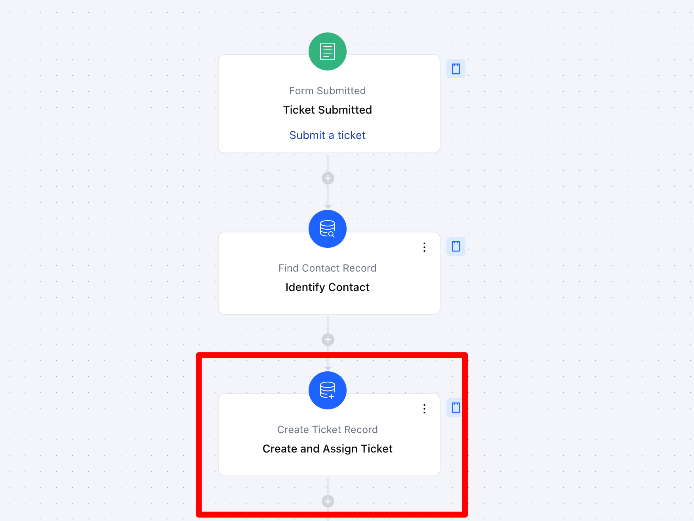
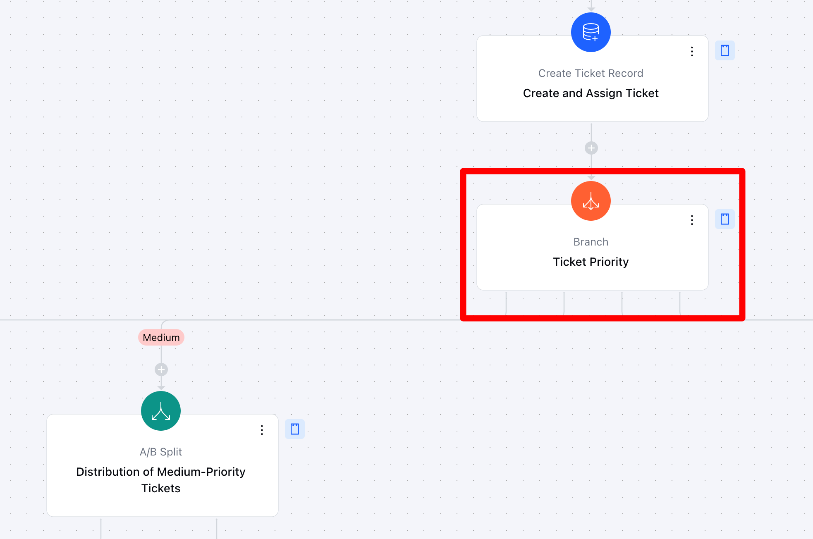
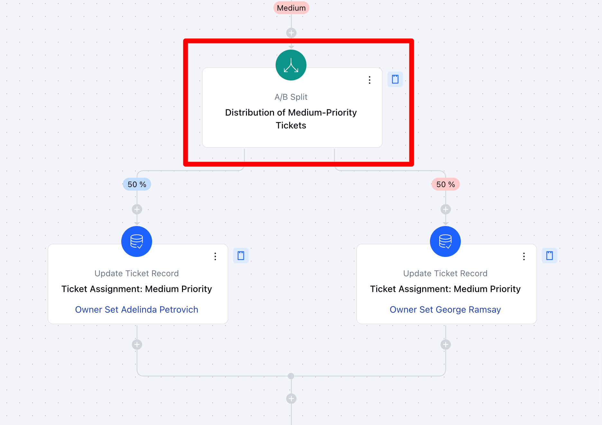
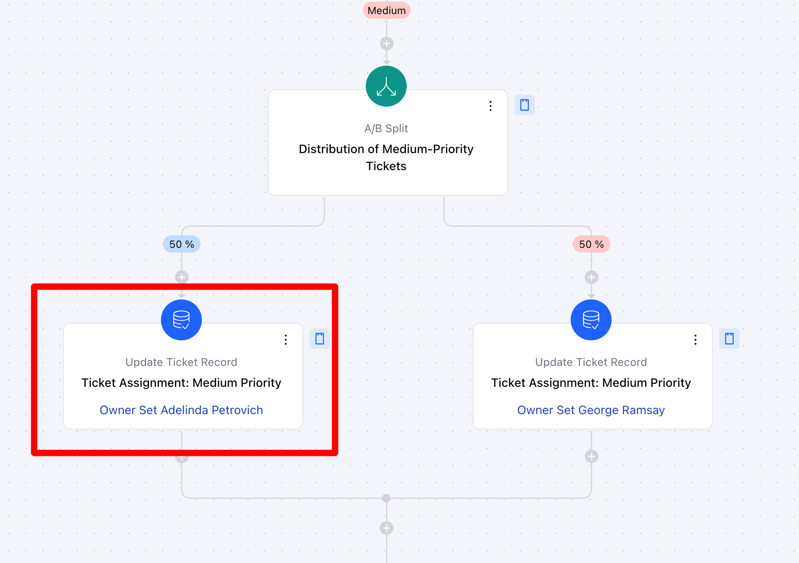
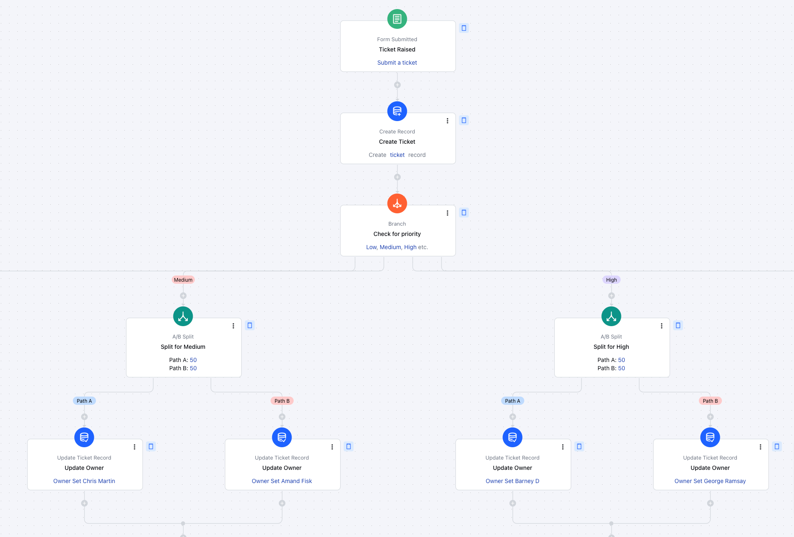

In this
[Smart Flow](#key-features-of-flow-automated-ticket-creation-instantly-generates-tickets-when-a-web-form-or-request-is-submitted)
, we’ll learn how to streamline
[Ticket Management](#key-features-of-flow-automated-ticket-creation-instantly-generates-tickets-when-a-web-form-or-request-is-submitted)
by automating key steps. From ticket creation triggered by form submissions to intelligent assignment based on priority or category, the flow ensures efficient updates, tracking, and ownership. Each step is designed to reduce manual effort and improve team response times.

###  **Topics covered:**

- [Business Type](#business-type)
- [Template Type](#template-type)
- [Use Case](#use-case)
- [Key Features of the Flow](#key-features-of-flow-automated-ticket-creation-instantly-generates-tickets-when-a-web-form-or-request-is-submitted)
- [Steps Used In Creating the Flow](#flow-process-breakdown-triggerform-submissionhttpssupportsalesmateiohcen-usarticles37775479211289-form-submitted-description-the-flow-is-triggered-when-a-form-is-submitted-indicating-the-creation-of-a-new-support-ticket-this-initial-step-captures-all-relevant-form-data-and-prepares-it-for-processing)
- [Break Up of Items Used in the Flow](#flow-process-breakdown-triggerform-submissionhttpssupportsalesmateiohcen-usarticles37775479211289-form-submitted-description-the-flow-is-triggered-when-a-form-is-submitted-indicating-the-creation-of-a-new-support-ticket-this-initial-step-captures-all-relevant-form-data-and-prepares-it-for-processing)
- [Benefits](#benefits)

###  Business Type

This flow is ideal for **SaaS, e-commerce, IT services, and customer support teams**, where managing inquiries, resolving issues quickly, and ensuring seamless workflows are critical.

###  Template Type

Ideal for support teams looking to streamline ticket management. This template automatically assigns incoming tickets to the right agents based on predefined rules such as priority, category, or workload, ensuring faster response times and improved customer support efficiency.

###  Use Case

The flow can be used by businesses like [SaaS](#key-features-of-flow-automated-ticket-creation-instantly-generates-tickets-when-a-web-form-or-request-is-submitted) to automate the ticketing process. It automatically generates tickets from incoming requests, assigns ownership based on predefined criteria, and updates ticket parameters like status and priority, ensuring efficient and timely responses.

###  Key Features of Flow **• Automated Ticket Creation:** Instantly generates tickets when a web form or request is submitted.

- **• Segmentation Based on Priority:** Categorizes tickets based on urgency or type for efficient handling.

- **• Automated Assignment:** Assigns tickets to the appropriate team or team member based on predefined conditions.

- **• Dynamic Ticket Updates:** Automatically updates key parameters like status, team assignments, and ticket types as the ticket progresses.

###  Flow Process Breakdown **Trigger**:**[Form Submission](#key-features-of-flow-automated-ticket-creation-instantly-generates-tickets-when-a-web-form-or-request-is-submitted)**- **Description:** The flow is triggered when a form is submitted, indicating the creation of a new support ticket. This initial step captures all relevant form data and prepares it for processing.

- **Practical Use Case:** For example, when a customer fills out a support form, the flow is initiated to process the information and create a ticket automatically.

- *Action 1: [Record Create](#key-features-of-flow-automated-ticket-creation-instantly-generates-tickets-when-a-web-form-or-request-is-submitted) (Ticket)**- **Description:** The flow creates a new ticket using the data from the submitted form. This ensures that a formal ticket record is created in the system for tracking and resolution.

- **Practical Use Case:** A customer submits a support form reporting a login issue. The workflow **automatically creates a ticket**, ensuring the issue is logged and assigned for resolution without manual intervention.

- * Condition: [Branch](#key-features-of-flow-automated-ticket-creation-instantly-generates-tickets-when-a-web-form-or-request-is-submitted) (Priority Categories)**Description:** The ticket is evaluated based on the data, such as priority or urgency, and is divided into one of three categories:**Low**,**Medium**, or **High** priority.

- **Practical Use Case:**For instance, urgent tickets related to critical system issues are categorized as **High**, while less time-sensitive inquiries are categorized as ** Low **.

- *Action 2: [A/B Split](#flow-process-breakdown-triggerform-submissionhttpssupportsalesmateiohcen-usarticles37775479211289-form-submitted-description-the-flow-is-triggered-when-a-form-is-submitted-indicating-the-creation-of-a-new-support-ticket-this-initial-step-captures-all-relevant-form-data-and-prepares-it-for-processing) (Team Assignment)**- **Description:** The flow divides the tickets into different teams based on their priority category. Each priority group (Low, Medium, High) is assigned to the appropriate team based on their workload or expertise.

- **Practical Use Case:** High-priority tickets might be assigned to senior agents or specialists, while low-priority tickets can be handled by general support staff.

- *Action 3: [Update Record](#key-features-of-flow-automated-ticket-creation-instantly-generates-tickets-when-a-web-form-or-request-is-submitted)**- **Description:** As the flow progresses, the system automatically updates the ticket’s ownership, status, priority, team assignments, and any other relevant fields.

- **Practical Use Case:** For example, once a ticket is assigned to a team, the **ownership** field is updated along with other parameters, ensuring the agent or team is responsible for resolving the issue.

###  Break Up of Items Used in The Flow **Trigger** When a contact submits a form that generates a ticket, they are automatically enrolled in the Smart Flow.

- **Action**### **Find Records**– This step identifies the specific contact who submitted the ticket, ensuring proper attribution. The system searches for a matching email address where **Email = Form Data Email**, retrieving only the first record found.

### **Create a Record**– A new ticket is generated based on the submitted form data. Predefined ticket attributes such as **Subject, Type, Stage, Priority, Contact, and Description** are assigned accordingly.

- **Branching** The flow diverges into multiple paths based on **ticket priority**, categorized as **High, Medium, Low, and Urgent**.

- ** Actions **A/B Split**– Tickets are distributed proportionally based on priority, following a 50/50 allocation within each priority category.

- **Update Record**– After the A/B split, the flow proceeds to update ticket ownership and assign relevant criteria based on the ticket's priority level.

- ** Flow Diagram:**

###  Benefits

The flow enables efficient ticket management by automating ticket creation, categorizing tickets based on priority, and ensuring even distribution among team members. This reduces manual effort, minimizes bottlenecks, and enhances response times. By automating updates and assignments, the flow improves consistency and allows for scalable handling of large ticket volumes. Additionally, it ensures that tickets are processed by the right team members based on their workload and expertise. Similar flows can be adapted for handling customer queries, support cases, sales leads, and marketing tasks, improving overall operational efficiency, resource allocation, and team coordination.
