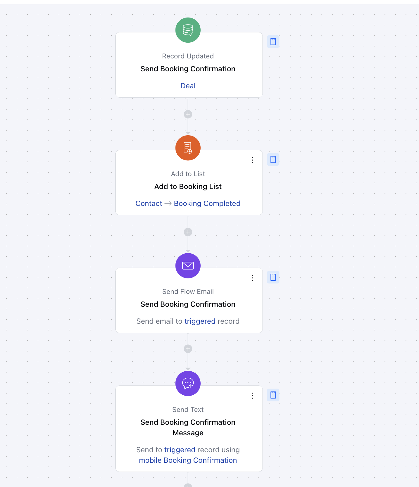
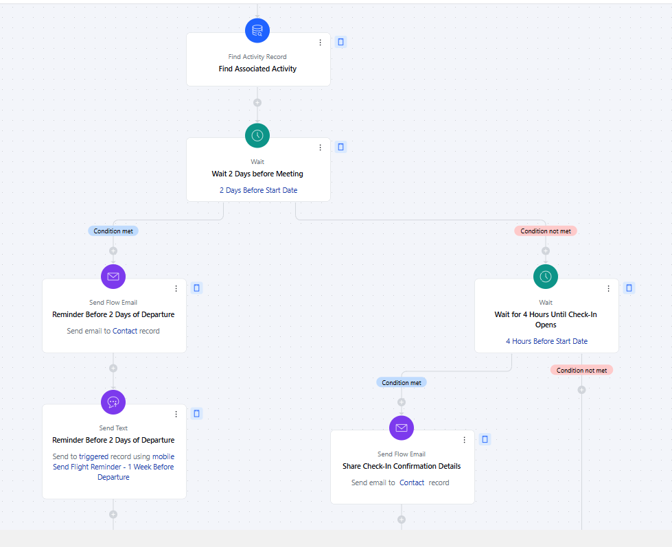
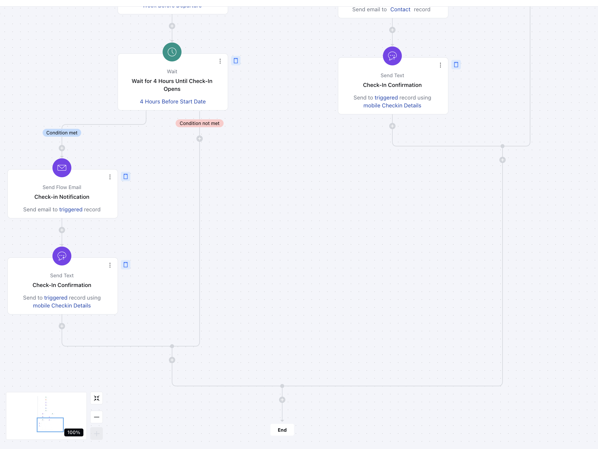

This flow is designed to simplify the entire booking process, ensuring a seamless,and personalized experience for customers from the moment they confirm a booking until after their appointment. The journey is structured into key stages to maximize customer satisfaction and business efficiency.

### **Topics covered:**

- [Business Type](https://support.salesmate.io/hc/en-us/articles/42342758767257-Booking-Confirmation#h_01JHQNE1DXW591Y6V7946RX2QC)

- [Template Type](https://support.salesmate.io/hc/en-us/articles/42342758767257-Booking-Confirmation#h_01JHQNE4NS7JZDE9FN1C67PXYZ)

- [Use case](https://support.salesmate.io/hc/en-us/articles/42342758767257-Booking-Confirmation#h_01JHQNE8M8RC8CWTZQJQNXQQ3N)

- [Key Features of the Flow](https://support.salesmate.io/hc/en-us/articles/42342758767257-Booking-Confirmation#h_01JHQNECY3BJ1SERVMNKBDMDDB)

- [Steps to create the flow](https://support.salesmate.io/hc/en-us/articles/42342758767257-Booking-Confirmation#h_01JHT3A7DD2QAMGRE1ZTY50HFQ)

- [Breakup of the items used in the flow](https://support.salesmate.io/hc/en-us/articles/42342758767257-Booking-Confirmation#h_01JHQNEHWCWWJ4TV1K00FY7A4F)
- [Benefits](https://support.salesmate.io/hc/en-us/articles/42342758767257-Booking-Confirmation#h_01JHQNEPPATTR0A92E3Y5VZXAK)####
- **Business Type:** This flow is ideal for Startups, Hospitality, SaaS, and Marketing businesses looking to optimize their entire booking process and maximize client satisfaction.

####

- **Template Type:** Perfect for Marketing and Sales teams to manage and elevate the customer booking journey effectively.

####

- **Use case:** This flow automates:**Booking Confirmations**: Sends instant confirmation emails.

- **Pre-Appointment Reminders**: Shares tailored reminders to prepare customers.

- **Post-Appointment Follow-Ups**: Sends thank-you emails with next steps or upsell options.

The flow streamlines the process, enhances communication, and improves customer satisfaction.

####- **Key Features of the Flow:** Comprehensive Booking Management: Automated emails and SMS notifications for key booking stages.Seamless tracking from booking confirmation to post-appointment.Timely Notifications: Reminders sent via both email and text message.Ensures customers stay informed and prepared.Personalized Engagement: Customized messages based on appointment details.Helps build rapport and trust with customers.

####

- **Steps to create the flow:** [Click here](https://support.salesmate.io/hc/en-us/articles/36752706603929-How-to-Create-New-Smart-Flow) to learn about how to create a new Smart Flow or access the Flow Templates.

- **Booking Confirmation Trigger - [Deal Status Match](https://support.salesmate.io/hc/en-us/articles/36768404490393)**Description: The flow is triggered when a booking is confirmed i.e. a deal is marked as WonPractical use case: For example, when a customer confirms a booking the associated deal is marked as Won this acts as the entry point for tracking the customer’s booking journey.

- **Add to List- [Add to List](https://support.salesmate.io/hc/en-us/articles/38138553100185-Add-to-List)**Description: Add leads to a dedicated list once they have successfully completed at least one booking with the agency. This list helps track converted leads and enables targeted communication for retention and upselling opportunities.Practical use case: By adding contacts to the "Confirmed Bookings" list, you can ensure they receive relevant, timely communications, such as booking reminders, check-in details, or exclusive offers, leading to a more personalized customer experience.

- **Send Booking Confirmation Email - [Send Flow Email](https://support.salesmate.io/hc/en-us/articles/38138164432409-Send-Flow-Email)**Description: An email is sent to the customer confirming their booking details, such as date, time, and location.Practical use case: After a booking is confirmed, the customer receives an immediate email with all the relevant details. This reduces no-shows and helps customers plan better by providing key information upfront.

- **Wait Period (Closer to Appointment Date) - [Wait](https://support.salesmate.io/hc/en-us/articles/38138356545433-Wait)**Description: The flow pauses until the appointment date is closer to avoid overwhelming the customer with early notifications.Practical Use Case: For instance, if the appointment is a week away, this wait ensures the next reminder is sent at a more appropriate time, such as three days before, keeping communications timely and relevant.

- *Appointment Reminder (2 Days Before) -
- [Send Flow Email](https://support.salesmate.io/hc/en-us/articles/38138164432409-Send-Flow-Email)
and
[Send Text](https://support.salesmate.io/hc/en-us/articles/38138168474905-Send-Text)
**Description: An email and a text message are sent three days before the appointment, reminding the customer of their upcoming booking.Practical use case: This step ensures that customers are well-prepared for their appointment. For example, a dentist's office could use this reminder to prompt patients to confirm or reschedule if necessary.

- *Pre-Appointment Check-In (1 Day Before)-
- [Send Flow Email](https://support.salesmate.io/hc/en-us/articles/38138164432409-Send-Flow-Email)
and
[Send Text](https://support.salesmate.io/hc/en-us/articles/38138168474905-Send-Text)
**Description: An additional email and text message are sent one day before the appointment to confirm the customer’s attendance.Practical use case: For example, a salon might use this step to confirm a customer’s attendance and provide any last-minute instructions, such as arriving early or bringing necessary items.

- **Same-Day Check-in Reminder (1 Hour Before)-
- [Send Flow Email](https://support.salesmate.io/hc/en-us/articles/38138164432409-Send-Flow-Email)
and
[Send Text](https://support.salesmate.io/hc/en-us/articles/38138168474905-Send-Text)
**Description: A final text message is sent as a last-minute reminder shortly before the appointment.Practical use case: This step is particularly useful for ensuring customers remember their appointments, especially for time-sensitive services like fitness classes or consultations

####** Breakup of the items used in the flow:**Trigger:**Record Updated-**The flow is triggered when a booking is confirmed i.e. a deal is marked as Won** Actions:**Add to List

- ** Add leads to a dedicated list once they have successfully completed at least one booking with the agency. This list helps track converted leads and enables targeted communication for retention and upselling opportunities.

- **Send Flow Email**- Sends email notifications for various stages, including Booking Confirmation, Reminder Email before 2 days of departure, and Check-in confirmation etc.

- **Send Text -**Sends SMS notifications for reminders and updates at key stages such as Sending Confirmation Text, Reminder Text before 2 days of departure, Check-in confirmation etc.

- **Find Records:**Searches for relevant booking-related data to personalize the messages sent during the flow.

- **Condition:**Wait -** The wait time is set for 2 days before the start date (departure date) and Same-day reminders are sent four hours before the start date (departure date). Depending upon your industry or use case, you can define the wait time as per your convenience.

####- **Benefits:** The Booking Confirmation Flow provides:

- **Increased Customer Satisfaction:** Timely reminders reduce missed appointments.

- **Improved Operational Efficiency:** Automates repetitive communication tasks.

- **Enhanced Personalization:** Ensures consistent engagement throughout the booking lifecycle.

This structured automation ensures a seamless, engaging, and professional experience for all customers from booking to follow-up.
