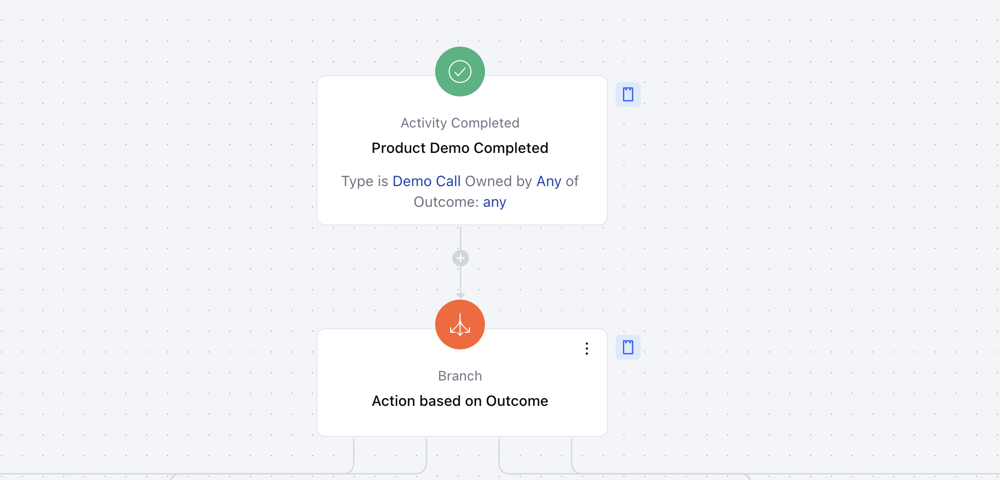
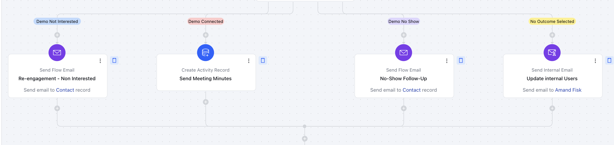

This Smart Flow template is designed to help businesses streamline post-demo interactions and improve customer engagement. By automating feedback collection and tailoring follow-ups based on customer responses, this template simplifies lead management, strengthens communication, and drives better decision-making. The "Collect the Feedback After the Demo" flow template helps businesses:

Re-engage leads after a demo.Organize personalized follow-ups.Improve collaboration with seamless integrations.

### **Topics covered:**

- [Business Type](https://support.salesmate.io/hc/en-us/articles/42347093122969-Collect-the-Feedback-After-the-Demo#h_01JHRFG2DTW7243REMMB6YFV9V)
- [Template Type](https://support.salesmate.io/hc/en-us/articles/42347093122969-Collect-the-Feedback-After-the-Demo#h_01JHRFETD4V3YKBF1RR7YSJPBB)
- [Use Case](https://support.salesmate.io/hc/en-us/articles/42347093122969-Collect-the-Feedback-After-the-Demo#h_01JHRFETD51ZNPDXGBKYDH8XVG)
- [Key Features of the Flow](https://support.salesmate.io/hc/en-us/articles/42347093122969-Collect-the-Feedback-After-the-Demo#h_01JHRFGVFSCDQ1A58T3MKEPX87)
- [Steps Used in Creating the Flow](https://support.salesmate.io/hc/en-us/articles/42347093122969-Collect-the-Feedback-After-the-Demo#h_01JK58EX9ZXDKTHNZHVEZSH0Q6)
- [Breakup of Items Used in the Flow](https://support.salesmate.io/hc/en-us/articles/42347093122969-Collect-the-Feedback-After-the-Demo#h_01JJ2P9EPHVFZ3BRGS8ZBYSMNY)
- [Benefits](https://support.salesmate.io/hc/en-us/articles/42347093122969-Collect-the-Feedback-After-the-Demo#h_01JJ2PAEWFX728B51WX355JKYT)

###**Business Type:** This flow works perfectly for **SaaS, Sales, and B2C** companies seeking to maintain consistent engagement with their customers.

###- **Template Type:** Ideal for sales and customer success teams to manage leads and boost conversions. It automatically sends the right follow-up based on how the demo went —whether the client is interested, not interested, or missed the meeting.

###

- **Use Case:** This template helps teams easily gather feedback and follow up after product demos, making customer engagement smoother and boosting sales opportunities.

###**Key Features of the Flow:**- **Automated Feedback Collection:** Triggers automatically after a demo is completed.

- **Streamlined Engagement:** Improves lead management and customer experience with timely follow-ups.

- **Custom Follow-Ups:** Personalized actions based on demo outcomes (Interested, Not
 Interested, No Show).

###**Steps Used in Creating the Flow** You can [click here](https://support.salesmate.io/hc/en-us/articles/36752706603929-How-to-Create-New-Smart-Flow) to learn how to create a new Smart Flow or access the Flow Templates.

- **Trigger: [Activity Completed](https://support.salesmate.io/hc/en-us/articles/36768417301401-Activity-Completed)**Description**: The flow starts when an Activity is marked as Completed **Practical Usecase:**Whenever an Activity is completed by the user in Salesmate and they select a specific Outcome while logging the activity, this flow will be triggered.

- **Branch the Flow Based on Activity Outcomes: [Branch Condition](https://support.salesmate.io/hc/en-us/articles/37780627045657):**- **Description:** After the flow is triggered, branch the pre-defined actions based on the Activity Outcome selected while completing the activity.

- **Practical Usecase:** Distribute the flow based on the Outcome selected by the user while completing the Activity in Salesmate

- * Actions Based on Outcome ***Description**: The flow will now perform various actions based on the outcome selected for the activity.
- [Send Email](https://support.salesmate.io/hc/en-us/articles/38138164432409)
,
[Create Task](https://support.salesmate.io/hc/en-us/articles/38098733305753)
, and
[Send Internal Email](https://support.salesmate.io/hc/en-us/articles/38138259670809)
actions will be performed here.

- ** Practical Usecase:**With these actions, Contact and Users will receive notifications for their Demo conducted with your user in Salesmate.

###** Breakup of Items Used in the Flow:**Trigger:**Activity Completed - Product Demo Completed:**Starts the flow demo activity marked as completed** Branching:**-**Actions Based on Outcome:** Splits the flow into different paths

- **Demo Not Interested:** Sends a re-engagement email

- **Demo Completed:** Creates a task for sending meeting minutes

- **Demo No Show:** Sends an email to reschedule the demo to the client

- **No Outcome Selected:** Sends an internal reminder email to update the demo status **Actions:**- **Send Email to Contact:** For re-engagement or rescheduling

- **Create Task:** For Proper follow-up after a successful demo

- **Send Internal Email:** Reminds the user to select the demo outcome

- **End:** The flow ends after appropriate follow-up action is completed

###

- **Benefits:** This flow makes it easy to stay connected with customers after a demo. It sends timely, personalized follow-ups based on their feedback, helping teams manage leads better and turn more prospects into customers. Automatic reminders keep everyone on the team in sync, and the feedback collected helps improve future demos. By handling routine tasks, this flow saves time so teams can focus on building relationships and closing deals.
