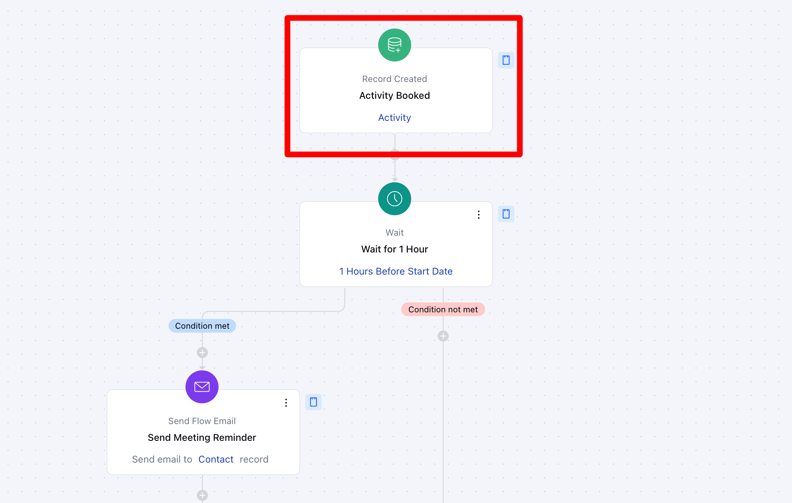
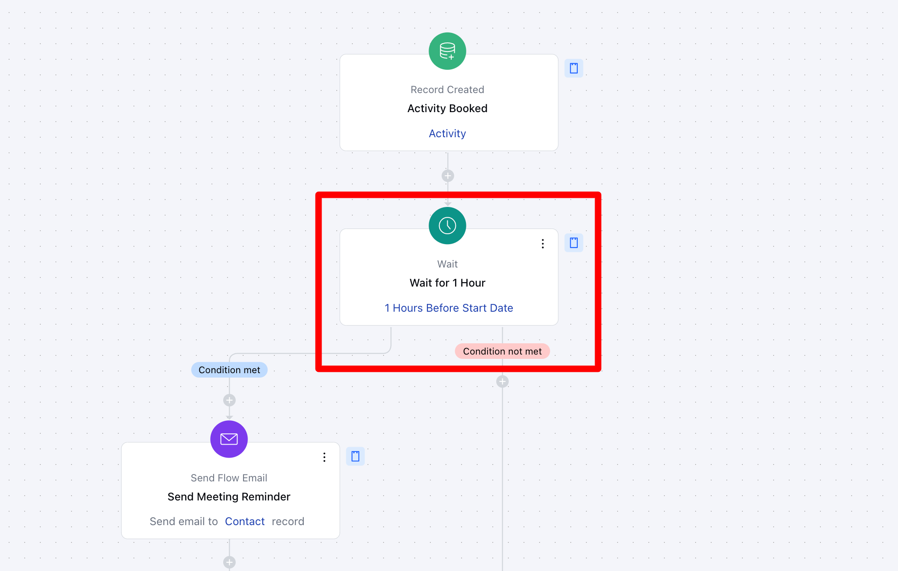
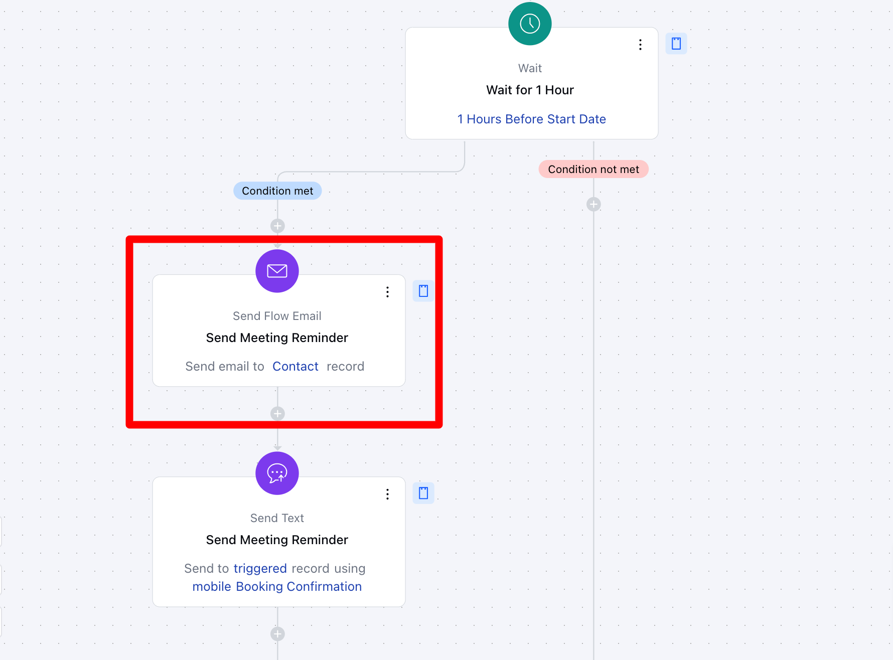
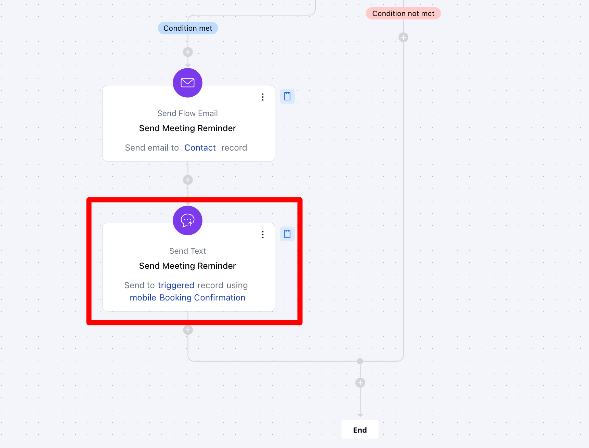
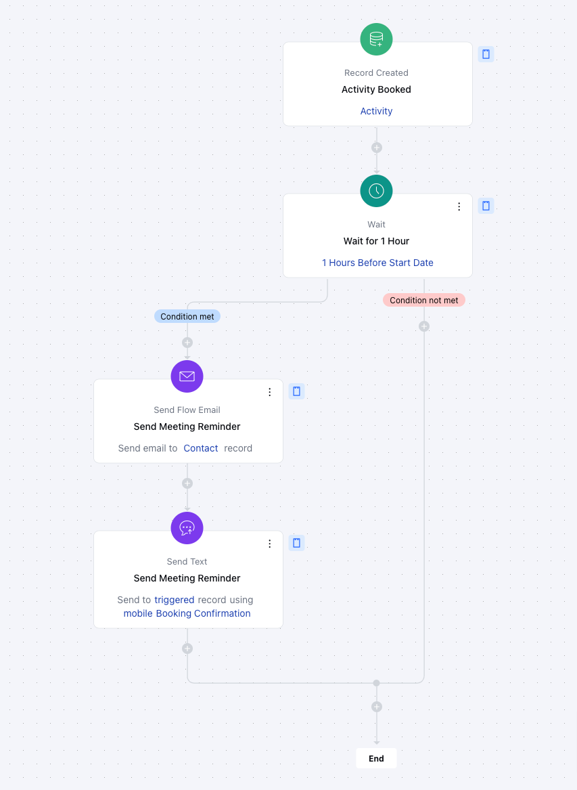

This
[Smart Flow](#key-features-of-the-flow-record-creation-automatically-triggers-the-flow-when-a-new-activity-record-is-created-ensuring-the-process-starts-at-the-right-moment)
ensures timely activity reminders via
[email](#key-features-of-the-flow-record-creation-automatically-triggers-the-flow-when-a-new-activity-record-is-created-ensuring-the-process-starts-at-the-right-moment)
and
[text](https://support.salesmate.io/hc/en-us/articles/38138168474905-Send-Text)
. With customizable timing, it sends reminders 1 hour before meetings to keep clients informed and engaged. By proactively notifying clients, it enhances preparation, increases attendance, and fosters better communication for seamless business operations.

###  **Topics covered:**

- [Business Type](#business-type)
- [Template Type](#template-type)
- [Use Case](#use-case)
- [Key Features of the Flow](#key-features-of-the-flow-record-creation-automatically-triggers-the-flow-when-a-new-activity-record-is-created-ensuring-the-process-starts-at-the-right-moment)
- [Steps Used in Creating the Flow](#break-up-of-items-used-in-the-flow-trigger-the-flow-is-initiated-when-a-meeting-is-booked-with-the-type-specifically-set-as-demo)
- [Break Up of Items Used In the Flow](#break-up-of-items-used-in-the-flow-trigger-the-flow-is-initiated-when-a-meeting-is-booked-with-the-type-specifically-set-as-demo)
- [Benefits](https://support.salesmate.io/hc/en-us/articles/42561192415385-Custom-Activity-Reminders-Using-Smart-Flow#h_01JJ1BEFJTKVYSY2DAZNDFRJ5F)

###  Business Type

This flow is ideal for businesses like **consulting firms, sales teams, healthcare providers, and event planners**. By sending automated reminders via email and text, it ensures clients are prepared and reduces no-shows. This proactive communication boosts client attendance and satisfaction.

###  Template Type

Ideal for teams looking to automate follow-ups and ensure timely completion of tasks. This template helps streamline activity reminders by triggering automated notifications based on due dates, status changes, or priority levels.

###  Use Case

A [consulting firm](https://www.salesmate.io/consulting-crm/) uses this flow to send automated reminders to clients about upcoming meetings. One hour before the meeting, the client receives a text and email reminder with meeting details. This ensures the client is prepared and reduces the chances of a no-show, improving overall efficiency and client satisfaction.

###  Key Features of the Flow **Record Creation**: Automatically triggers the flow when a new activity record is created, ensuring the process starts at the right moment.

- **Timely Reminders**: Sends both email and text reminders to the contact 1 hour before the scheduled activity to ensure they are prepared.

- **Automated Workflow**: The process runs automatically, reducing manual effort and ensuring reminders are sent at the correct time.

###  Flow Process Breakdown **Trigger: [Record Creation](#key-features-of-the-flow-record-creation-automatically-triggers-the-flow-when-a-new-activity-record-is-created-ensuring-the-process-starts-at-the-right-moment) (Activity)**- **Description:** The flow is triggered automatically when a new activity record is created, marking the start of the reminder process. This ensures that the flow begins only when an activity is scheduled.

- **Practical Use Case:** For instance, when a meeting or appointment is scheduled, this flow will initiate the reminder process.

- * Action 1: [Wait](#key-features-of-the-flow-record-creation-automatically-triggers-the-flow-when-a-new-activity-record-is-created-ensuring-the-process-starts-at-the-right-moment) (1 Hour)***Description**:
The flow waits for 1 hour before the activity start date, ensuring that the reminders are sent at the appropriate time, closer to the activity.

- ** Practical Use Case:**If a meeting is scheduled for 3 PM, the flow will wait until 2 PM before sending the reminders.

- * Action 2: [Send Email](https://support.salesmate.io/hc/en-us/articles/38138164432409-Send-Flow-Email) Reminder ***Description**:
Once the 1-hour wait period ends, the flow sends an email reminder to the contact, providing meeting details, instructions, or other relevant information.

- ** Practical Use Case:**The client receives an email an hour before the meeting, reminding them of the time, location, and agenda.

- * Action 3: [Send Text](https://support.salesmate.io/hc/en-us/articles/38138168474905-Send-Text) Reminder ***Description**:
The flow sends a text reminder to the contact’s phone number, ensuring they receive the notification via a more immediate communication channel.

- ** Practical Use Case:**The client receives a text reminder an hour before the meeting, ensuring the information is received on their phone for added convenience.

###  Break Up of Items Used in The Flow **Trigger** The flow is initiated when a meeting is booked with the type specifically set as "Demo."

### **Wait** Once the meeting is scheduled, the flow introduces a wait period, pausing until one hour before the meeting’s start time. This ensures that the following actions are executed at the right moment.

### ** Actions **Send Flow Email**– A reminder email is automatically sent to the customer, ensuring they are informed about their upcoming demo meeting.

- ** Send Text **– After the email is sent, a follow-up text message is delivered to reinforce the reminder. This step is executed only if the predefined conditions are met.

###  Flow Diagram

##

### **Benefits** By sending timely email and text reminders an hour before an activity, it ensures clients are well-prepared, reducing the chances of missed appointments. This automated approach enhances client engagement, boosts attendance rates, and provides a more professional experience. Additionally, the flow saves time by eliminating manual reminders and can be easily customized to fit various activities, ensuring consistency and efficiency in client communication.
