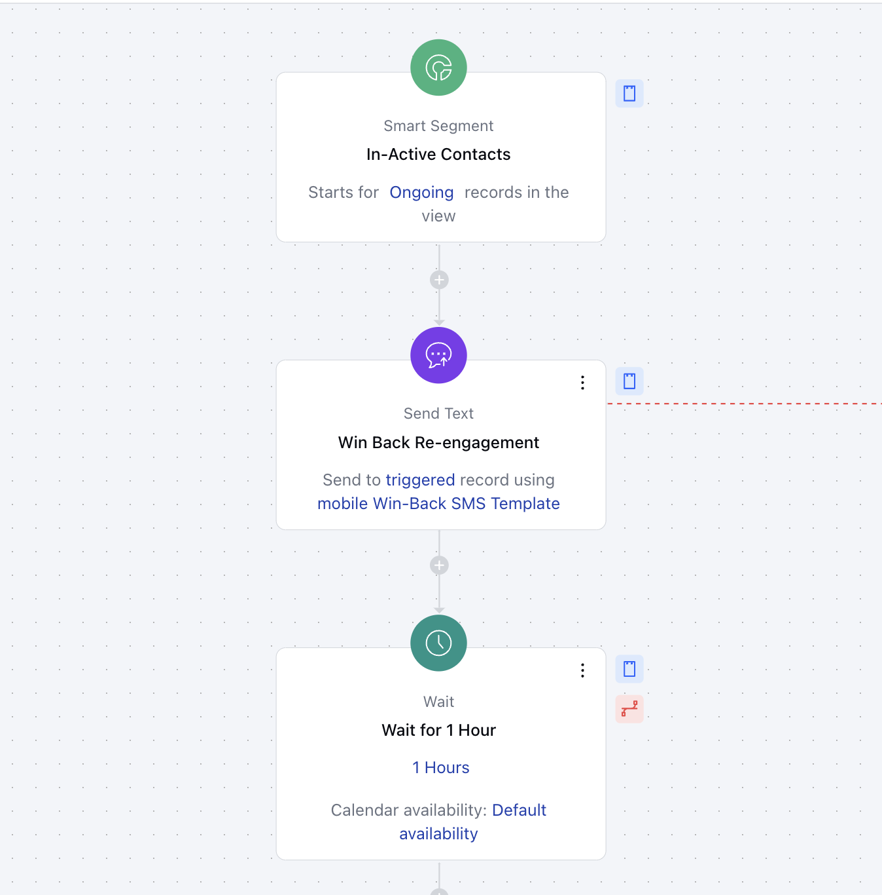
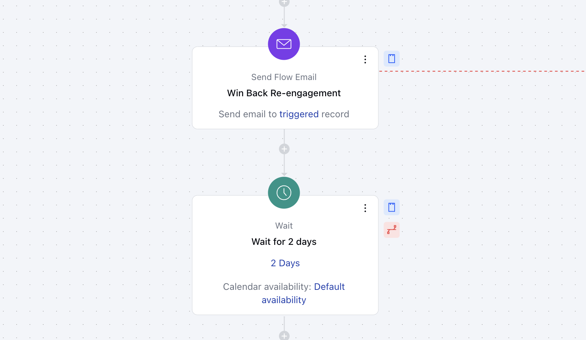
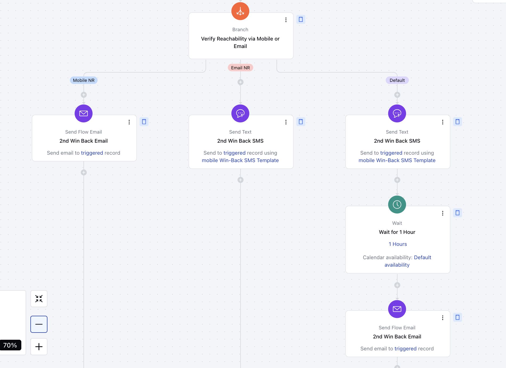
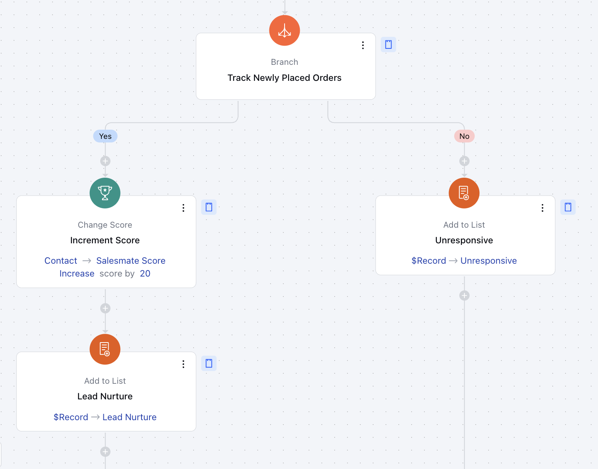

This flow re-engages inactive customers to revive their interest and strengthen long-term relationships. By leveraging targeted communication and automation, businesses can boost retention and improve lead management.

###**Topics Covered:**[Business Type](https://support.salesmate.io/hc/en-us/articles/42347082296857-Customer-Win-Back-Journey#h_01JK5PF9S49EFNS0PJQK6N95GV)[Template Type](https://support.salesmate.io/hc/en-us/articles/42347082296857-Customer-Win-Back-Journey#h_01JK5PFEQYEVRHZ4WXXX6EK6MZ)[Use Case](https://support.salesmate.io/hc/en-us/articles/42347082296857-Customer-Win-Back-Journey#h_01JK5PFHZCJTPQ9CGVDXT50FXF)[Key Features of the Flow](https://support.salesmate.io/hc/en-us/articles/42347082296857-Customer-Win-Back-Journey#h_01JHRJQ2ZQ6YPM73A7TS9DV7BG)[Steps Used in Creating the Flow](https://support.salesmate.io/hc/en-us/articles/42347082296857-Customer-Win-Back-Journey#h_01JHJFJDCZZFXY6N5Z49T9NYVP)[Breakup of Items Used in the Flow](https://support.salesmate.io/hc/en-us/articles/42347082296857-Customer-Win-Back-Journey#h_01JHRJRAETT239PDQYMQ7KHBBA)[Benefits](https://support.salesmate.io/hc/en-us/articles/42347082296857-Customer-Win-Back-Journey#h_01JHRJS5AZR7ZA33RB3GM1996B)

###**Business Type:**Ideal for**SaaS**,**Sales**, and**B2C**businesses to enhance customer engagement and retention.

###**Template Type:**Designed for marketing, sales, and customer success teams to re-engage dormant leads efficiently through a structured workflow.

###**Use Case:**This template provides a framework to re-engage inactive clients with personalized communication, monitor progress, and nurture reactivated leads. It reduces manual effort while optimizing the outreach strategy.

###**Key Features of the Flow:****Re-Engagement Trigger**: The flow starts when a contact is identified as inactive, using Smart-Segment filters to segment them effectively.**Targeted Communication**: Personalized text messages and emails are sent to capture the contact’s attention and prompt action.**Progress Tracking and Scoring**: Contact scores are updated based on their engagement activity, reflecting their likelihood of re-engagement.**Nurture Lists Integration**: Re-engaged contacts are added to nurture lists for ongoing follow-ups to maintain momentum.

###**Steps Used in Creating the Flow:**You can [click here](https://support.salesmate.io/hc/en-us/articles/36752706603929-How-to-Create-New-Smart-Flow) to learn how to create a new Smart Flow or access the Flow Templates.**Trigger: [Smart Segment](https://support.salesmate.io/hc/en-us/articles/37772408384665)****Description**: The flow starts by checking for the In-Active Contacts and reconnecting with them through personalized messages that inspire them to re-engage and make a purchase again.**Practical Usecase:**This trigger is used when you wish to perform an action to your existing records, new records or both when a specific condition is met. For instance, you wish to send out a Newsletter to your contacts with type as Customer, this trigger can be useful.**Action: [Send Text](https://support.salesmate.io/hc/en-us/articles/38138168474905)****Description:**This action will send a text to win back the customer by providing various information about the offers, products and services.**Practical Usecase:**Send text messages to your records, for instance, you wish to send them a activity reminder or remind them about the offers available.**Add Delay Action: [Wait](https://support.salesmate.io/hc/en-us/articles/38138356545433)****Description:**Wait for 1 hour before sending the email to the customer**Practical Usecase:**This action is useful when you wish to add an interval between 2 actions being performed. For instance, if you are sending a confirmation email and after 2 days you want to send a reminder email then this action is useful

**Action: [Send Flow Email](https://support.salesmate.io/hc/en-us/articles/38138164432409)****Description:**This action will send an email to the customer mentioning the offers and services.**Practical Usecase:**This action is useful for sending emails to your records to nurture then about your product and services or sending out newsletters or announcements.**Add Delay Action:****Description:**Wait for 2 days before verifying if reachability to the customer.

**Segment the Actions: [Branch Condition](https://support.salesmate.io/hc/en-us/articles/37780627045657)****Description:**Check if the contact can be reached through their mobile phone or email. This step ensures that the preferred communication channel is available and helps determine the next course of action based on the contact's reachability status.**Practical Usecase:**Distribute the flow based on the activity performed on the records completing the Activity in Salesmate**Perform Action-Based Condition Match:****Description:**Send Email or Text based on the Outcome matched from the above step and continue the process further

**Segment the Actions if Order Placed:****Description:**Once multiple Emails and Texts are sent to Winback the customer, now Branch the flow to check whether the customer has placed the order or not. Based on the status, the flow will diverge to execute specific actions tailored to the current state of the invoice.**Order Placed: [Change Score](https://support.salesmate.io/hc/en-us/articles/38138447714713)****Description:**This action increments the Salesmate Score of a contact by 20 points. This means the customer has placed the order and we have Winback the customer.**Practical Usecase:**This action is used to provide score to your records based on the actions they perform such as opening an email, replying to an email or clicking a link on the email.**Segment to Lists: [Add to list](https://support.salesmate.io/hc/en-us/articles/38138553100185)****Description:**Based on the Outcome of the branch whether the contact has placed the order or not, add them to a List for Nurture if order is placed and if no order is placed then add to the list Unresponsive**Practical Usecase:**This action is used to add a contact to a list that provides the information that this group of contacts is categorized for a specific purpose.

###**Breakup of Items Used in the Flow:****Trigger:****Identifying Inactive Contacts:**Initiates when a contact matches the Smart-Segment for inactivity.**Branching:****Branch Condition**:
Re-engaged: Adds the contact to nurture lists for continuous follow-ups.Non-responsive: Initiates a final attempt before exiting the flow.**Actions:****Send Text (3)**: Sends personalized SMS messages.**Wait (3)**: Pauses the flow to give contacts time to respond.**Send Flow Email (3)**: Engaging emails to recapture attention.**Update Record (2)**: Updates Records with activity details.**Change Score (1)**: Adjusts engagement score based on activity.**Add to List (2)**: Adds re-engaged contacts to nurture lists or unresponsive list.**End:**The flow concludes after re-engaged contacts are added to nurture lists or a final attempt is made for non-responsive leads.

###**Benefits:**This flow simplifies the re-engagement process by leveraging automation and targeted outreach:**Increased Customer Retention**: Personalized communication helps reconnect with dormant leads.**Enhanced Lead Management**: Automatically scores contacts and updates their status in the CRM.**Automation Efficiency**: Reduces the need for manual follow-ups and streamlines outreach strategies.
