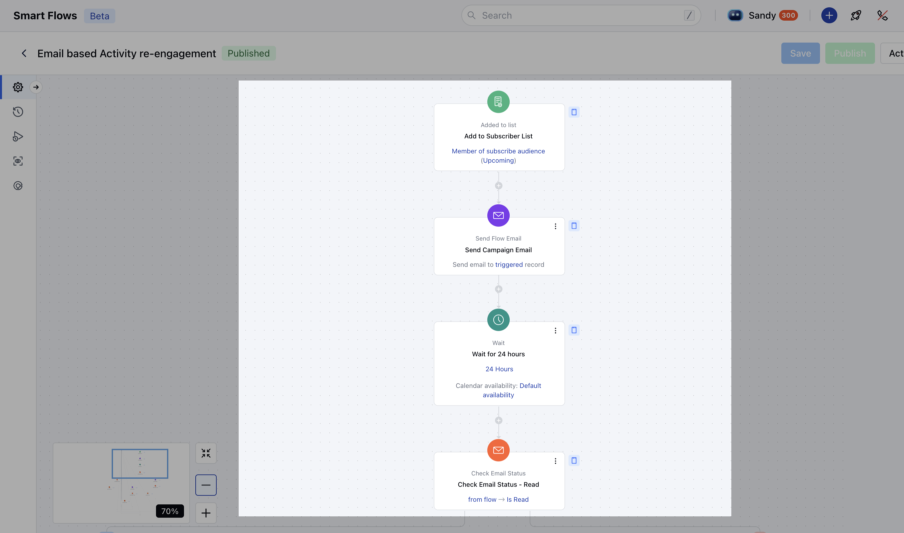
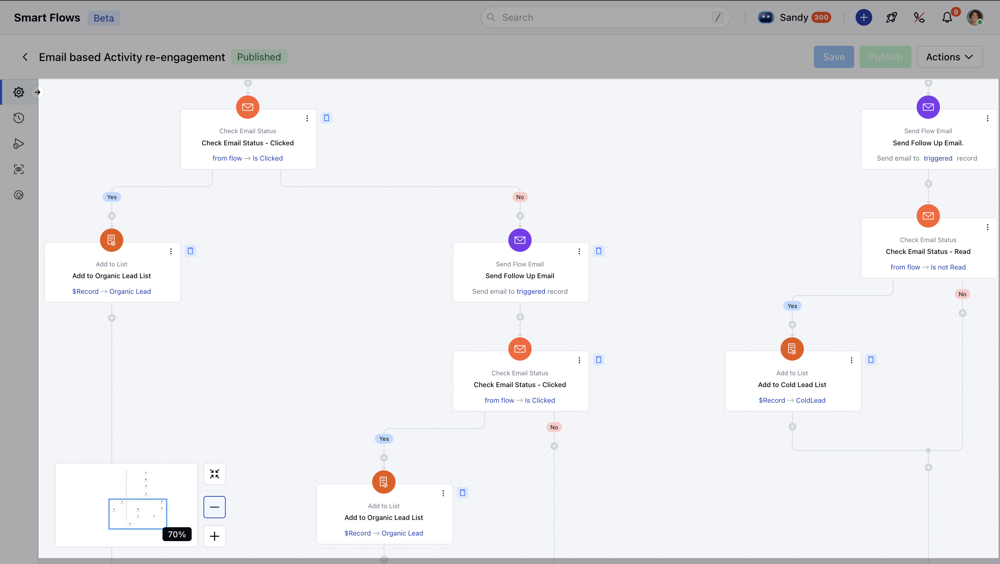

This **Smart Flow** helps you organize contacts by their email engagement levels, sorting them into targeted lists. This ensures you can effectively connect with your most promising leads.

###  **Topics covered:**

- [Business Type](#business-type)
- [Template Type](#template-type)
- [Use Case](#use-case)
- [Key Features of the Flow](#key-features-of-smart-flow-send-automated-emails-sending-automated-email-to-a-list-to-track-engagement-level-to-segment-your-contacts)
- [Steps used to Create the Flow](#steps-used-to-create-the-flow-add-to-list-triggeradded-to-listhttpssupportsalesmateiohcen-usarticles37770968037273-added-to-list-description-this-flow-triggers-when-a-customer-is-added-to-the-subscriber-audience-list-it-initiates-a-sequence-of-predefined-actions-such-as-sending-newsletters-tailored-to-the-contacts-engagement-level-ensuring-personalized-and-effective-communication)
- [Breakup of Items used in the Flow](#steps-used-to-create-the-flow-add-to-list-triggeradded-to-listhttpssupportsalesmateiohcen-usarticles37770968037273-added-to-list-description-this-flow-triggers-when-a-customer-is-added-to-the-subscriber-audience-list-it-initiates-a-sequence-of-predefined-actions-such-as-sending-newsletters-tailored-to-the-contacts-engagement-level-ensuring-personalized-and-effective-communication)
- [Benefits](#benefits)

###  Business Type

This flow can cover use cases for industry working in any field planning to segment their leads based on engagement level.

###  Template Type

This template is ideal to be used if you plan to segment your contacts basis on their engagement level with your E-mails.

###  Use Case

This flow helps you organize your contacts based on how they engage with your emails, making it easy to segment them into separate lists and target them more effectively for future campaigns.

###  Key Features of Smart Flow **Send Automated Emails:** Sending automated Email to a list to track engagement level to segment your contacts.

- **Tracking Email Interactions**: Monitors email engagement, such as opens and clicks, to determine the next steps.

- **Strategic Email Resending**: The flow resends emails to contacts who have not interacted with the initial email to confirm their engagement one more time **Segmentation and List Management**: Contacts who engage or do engage are segmented into specific lists for targeted follow-ups.

###  Steps used to Create the Flow **Add to List (Trigger)**[Added to list](#key-features-of-smart-flow-send-automated-emails-sending-automated-email-to-a-list-to-track-engagement-level-to-segment-your-contacts):- **Description:** This flow triggers when a customer is added to the Subscriber Audience list. It initiates a sequence of predefined actions, such as sending newsletters tailored to the contact's engagement level, ensuring personalized and effective communication.

- **Practical Use Case:** When you work with lists inside Salesmate and intend to take automated actions based on when a contact is added to a particular list, this trigger can be used. In this particular instance, we have used this trigger to further separate contacts in two separate lists based on their engagement with the E-mails.

- **Send Flow Email (Action)**[Send Flow Email](#key-features-of-smart-flow-send-automated-emails-sending-automated-email-to-a-list-to-track-engagement-level-to-segment-your-contacts):**Description:**This action will **Send the E-mail** to the contacts who gets added in the list in order to check their engagement level with the E-mail.

- **Practical use case**: In simple way, this is the only action where you can send E-mail to a contact in Smart Flows. In this particular case, we are using this action which sends E-mail to a contact whey they get added to a list.

- **Wait Period (Condition)**[Wait](#key-features-of-smart-flow-send-automated-emails-sending-automated-email-to-a-list-to-track-engagement-level-to-segment-your-contacts):- **Description:** The wait time is set for at least 24 hours before checking if a contact has engaged with the E-mail or not. Depending upon your industry or use case, you can define the the wait time as per your convenience

- **Practical Use case:** The wait condition can be used when you want to keep an interval between two actions or before the flow moves to it's next stage. In this flow, the wait time is set for 24 hours before **Check Email Status (Condition)**[Check Email Status](https://support.salesmate.io/hc/en-us/articles/37780742415769-Check-Email-Status)\-**Read**:- **Description:** After the initial E-mail is sent and waiting for 24 hours, this condition checks if the E-mail has been read.

- **Practical Use case:** This condition can be used when you intend to take different set of action if your E-mail is read to further with your audience. In this particular flow, we will further check if the E-mail has been clicked as well.

- *Check Email Status (Condition)**[Check E-mail Status](https://support.salesmate.io/hc/en-us/articles/37780742415769-Check-Email-Status)\-**Clicked**:- **Description:** After the flow has determined the E-mail is read, this condition checks if the E-mail has been clicked to further take the action.

- **Practical Use Case:** In this particular scenario, this condition is further used to confirm the engagement level of the contact if they have read, clicked the E-mail we will use this to complete one set of action of this flow.

- **Add to List (Action)**[Add to list](#key-features-of-smart-flow-send-automated-emails-sending-automated-email-to-a-list-to-track-engagement-level-to-segment-your-contacts):- **Description:** This action is used to separate the contact based on their engagement level with the E-mail action which was taken earlier in the flow.

- **Practical Use Case:** In this particular Flow, we have checked if a contact has read and clicked our E-mail, we use this action to Add them to a list titled as "Organic List". Further **Check E-mail Status (Condition)**[Check Email Status](https://support.salesmate.io/hc/en-us/articles/37780742415769-Check-Email-Status)\-**Not Clicked**:- **Description:** The condition checks the contact's engagement i.e. if not clicked the initial E-mail to take further action.

- **Practical Use Case:** In this particular flow, we are using this condition to send another follow up E-mail if the client has not clicked on the initial Email sent.

- **Send Flow Email (Action)**[Send Flow Email](#key-features-of-smart-flow-send-automated-emails-sending-automated-email-to-a-list-to-track-engagement-level-to-segment-your-contacts):- **Description:** This action sends another set of E-mail to further confirm client's engagement level.

- **Practical Use Case:** In this particular flow, we are using this action to send another E-mail to the contact who have read the E-mail but not clicked to confirm their engagement level one more time.

- **Add to List (Action)**[Add to list](#key-features-of-smart-flow-send-automated-emails-sending-automated-email-to-a-list-to-track-engagement-level-to-segment-your-contacts):- **Description:** This action is used to add the contact to the list on the basis of the engagement with the E-mail.

- **Practical use case:** After re-sending the E-mail to the contact who had initially read the E-mail but not clicked, this action is used to add the contacts to the list of Organic Leads who have now clicked the E-mail on second instance.

- **Check Email Status (Condition)**[Check E-mail Status](https://support.salesmate.io/hc/en-us/articles/37780742415769-Check-Email-Status)\-**Not Read:**- **Description:** This condition checks if a contact has not read the E-mail

- **Practical Use Case:** This step checks if the contact has read the E-mail which was sent as soon the contact was added to the list which triggered the flow.

- **Send Flow Email (Action)**[Send Flow Email](#key-features-of-smart-flow-send-automated-emails-sending-automated-email-to-a-list-to-track-engagement-level-to-segment-your-contacts):- **Description:** Send a follow-up email to contacts who did not open the previous email. It helps reattempt engagement by delivering the message again, encouraging recipients to interact with the content.

- **Practical Use Case:** In this flow, this action is used to resend the E-mail to contact who have not interacted with the E-mail to re-confirm their engagement to perform next step of action basis on their interaction.

- **Check Email Status (Condition)**[Check E-mail Status](https://support.salesmate.io/hc/en-us/articles/37780742415769-Check-Email-Status)\-**Not Read:**- **Description:** This step checks if the contact has read the E-mail after the set wait time.

- **Practical Use Case:** With this particular step, we re-confirm the engagement level of the contact after the first E-mail was sent. Once the second E-mail is sent and if the E-mail is still not read, this condition takes further action set in the flow.

- **Add to List (Action)**[Add to list](#key-features-of-smart-flow-send-automated-emails-sending-automated-email-to-a-list-to-track-engagement-level-to-segment-your-contacts):- **Description:** This step adds the contacts to a list who have not engaged with the E-mail at all

- **Practical Use Case:** Add contacts to the Cold Lead List if they have not engaged with recent emails. It helps segment inactive leads for potential re-engagement strategies or exclusion from active campaigns.

- **End** The flow concludes once the appropriate follow-up action has been completed.

###  Breakup of Items used in Flow ** Trigger **Add to List:** This triggers the flow when a contact is added to a specific list.

- **Condition**- **Wait:** This condition waits for 24 hours before moving further in the flow

- **Check Email Status- Read:** This condition checks if the E-mail sent via flow is read by a contact

- **Check E-mail Status-Not Read:** This condition checks if the E-mail sent via flow is not read by a contact

- **Check E-mail Status- Clicked:** This condition checks if the E-mail sent via flow is clicked by a contact

- **Check E-mail Status- Not Clicked:** This conditions checks if the E-mail sent via flow is not clicked by a contact **Action**- **Send Flow Email:** This action is used at various stages of the flow where the E-mail is sent after the flow triggers i.e. added to list. Furthermore, depending upon the engagement level of the contact i.e. read/click, it is used again to re-confirm their engagement level.

- **Add to List:** Depending upon the engagement level of the E-mail sent using this flow, this action segments the contact in two separate lists i.e. if a contact reads/clicks the E-mail they get added to Organic Leads List whilst if they do not then they get added to Cold Lead List.

###  Benefits:

This **Flow** helps you filter contacts based on how they engage with your emails, giving you the ability to take a more targeted approach with those who are actively interacting with this **Flow's Email**. It also provides an opportunity to craft a strategy to re-engage those who haven’t been engaging, ensuring you don’t miss out on potential opportunities.
