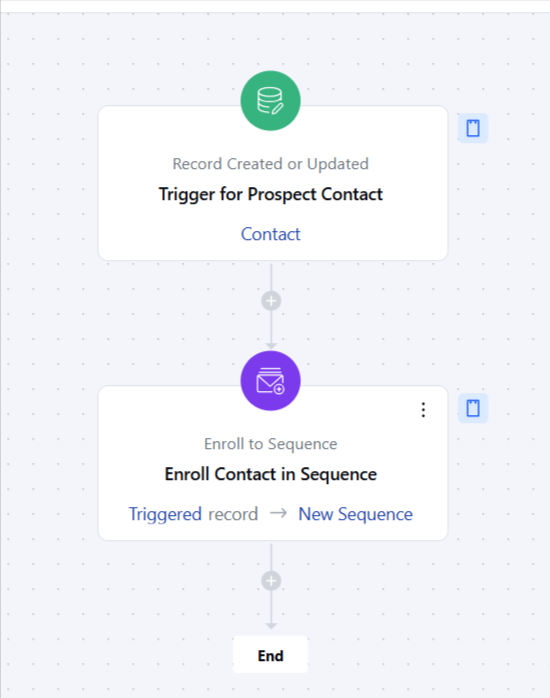

The “Enroll Prospects to Sequence” flow automates engagement by enrolling contacts into a personalized email sequence when their status changes to “Prospect.” It ensures consistent communication, reduces manual effort, and boosts conversion chances by nurturing prospects through the sales funnel.

###  **Topics covered:**

- [Business Type](#business-type)
- [Template Type](#template-type)
- [Use Case](#use-case)
- [Key Features of the Flow](#key-features-of-the-flow-automatic-trigger-activates-when-a-contacts-type-updates-to-prospectemail-sequence-enrollment-automatically-adds-the-contact-to-a-pre-designed-email-sequence-tailored-to-nurture-prospects)
- [Breakup of Items Used in the Flow](#breakup-of-items-used-in-the-flow-trigger-contact-status-updated-prospect-initiates-the-flow-when-a-contacts-status-changes-to-prospectactions-enroll-to-sequence-automatically-adds-the-contact-to-a-designated-email-sequence-tailored-for-prospect-nurturing)
- [Benefits](#benefits)

###  Business Type

Perfect for B2B, B2C, Startups, Sales, Marketing, e-commerce, and SaaS businesses looking to enhance lead management and increase conversions.

###  Template Type

Ideal for sales and marketing teams focused on automating lead nurturing and maintaining consistent engagement with prospects. This template simplifies follow-ups and helps drive prospects through the sales pipeline effectively.

###  Use Case

This template helps businesses automate the process of engaging new prospects by enrolling them in a targeted email sequence. When a contact’s status changes to “Prospect,” the flow ensures they receive timely, personalized communication designed to nurture them towards conversion.

###  Key Features of the Flow **Automatic Trigger**: Activates when a contact's type updates to "Prospect."**Email Sequence Enrollment**: Automatically adds the contact to a pre-designed email sequence tailored to nurture prospects.

- **Consistent Engagement**: Delivers timely and personalized emails, ensuring prospects stay engaged and informed.

###  Breakup of Items Used in the Flow ** Trigger **Contact Status Updated - Prospect**: Initiates the flow when a contact’s status changes to “Prospect.”**Actions **Enroll to Sequence **: Automatically adds the contact to a designated email sequence tailored for prospect nurturing.

- ** End** The flow ends after the contact is enrolled in the sequence and email engagement tracking is initiated.

###  Benefits

Streamlined Lead Management reduces the need for manual follow-ups, saving time and resources. Enhanced Consistency ensures every prospect receives regular, personalized communication. Improved Conversions increase the likelihood of turning prospects into customers through targeted email sequences.
