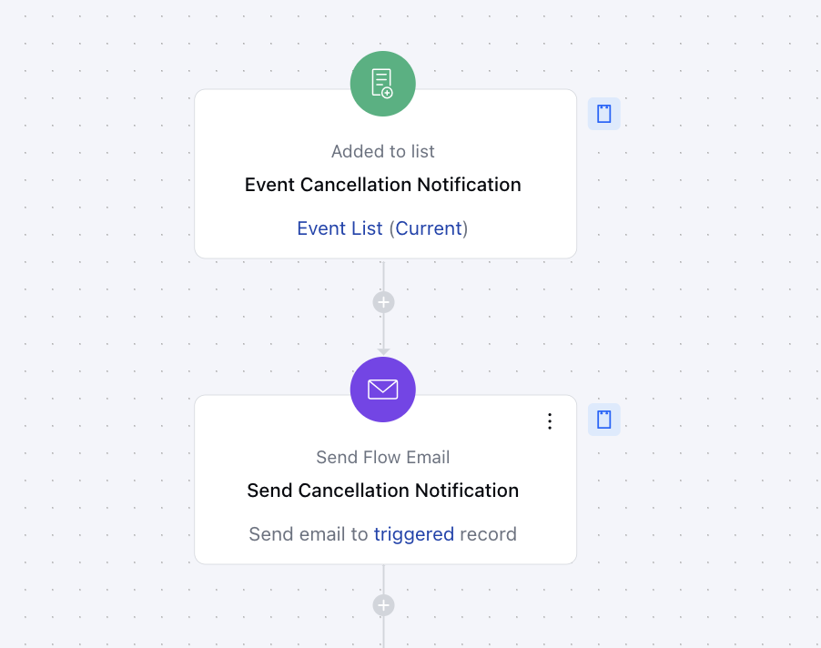
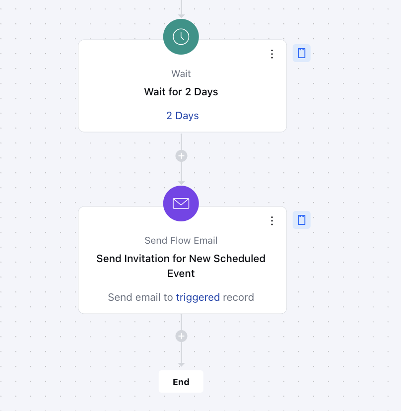

This Smart flow is designed to automatically notify customers when an event is canceled and provide them with the details of the new event date. It ensures clear communication and keeps customers informed, helping to maintain engagement and minimize confusion. The flow simplifies the process of rescheduling and keeps customers updated seamlessly.

###  **Topics covered:**

- [Business Type](#business-type)
- [Template Type](#template-type)
- [Use Case](#use-case)
- [Key Features of the Flow](#key-features-of-the-flow-clear-communication-sends-a-cancellation-email-right-away-to-let-customers-know-about-the-change)
- [Steps Used in Creating the Flow](#steps-used-in-creating-the-flow-trigger-added-to-listhttpssupportsalesmateiohcen-usarticles37770968037273)
- [Break up of items Used in the Flow](#breakup-of-items-used-in-the-flow)
- [Benefits](#benefits)

###  Business Type

This flow is perfect for businesses that host events, whether B2B, B2C, or SaaS. It helps keep customers informed and ensures smooth communication about any changes to scheduled events.

###  Template Type

This flow is great for event organizers and customer support teams. It automates the process of notifying customers about event cancellations and reschedules, saving time and keeping customers in the loop.

###  Use Case

The flow helps businesses manage event changes by automatically sending a cancellation email and a follow-up email with reschedule details, ensuring customers stay informed and feel invited to the new event date.

###  Key Features of the Flow **Clear Communication**: Sends a cancellation email right away to let customers know about the change.

- **Timely Follow-Ups**: After 2 days, the flow sends a follow-up email with the new event details and an invitation to join.

- **Saves Time**: Automates the entire process, so businesses don’t have to worry about sending reminders manually.

- **Efficient Event Management**: Makes handling event changes smooth and professional, ensuring customers are always in the know.

###  Steps Used in Creating the Flow **Trigger**:
[**Added to List**](#steps-used-in-creating-the-flow-trigger-added-to-listhttpssupportsalesmateiohcen-usarticles37770968037273)

Description: We will trigger the flow as soon as the contact is added to the list related to the event **Practical use case**: We will create a particular list with the name of the event and add the contacts to the list so the flow can get triggered for those contacts and the list will be selected in the trigger itself ** Send Cancellation Notification **Action**: We will be sending out a notification email to the contacts about the cancellation of the event using the [** send flow email **](#key-features-of-the-flow-clear-communication-sends-a-cancellation-email-right-away-to-let-customers-know-about-the-change) action

- * Set Frequency using [Wait](#key-features-of-the-flow-clear-communication-sends-a-cancellation-email-right-away-to-let-customers-know-about-the-change) action ***Action**: We’ll wait 2 days to give clients time to review the cancellation email, prepare for the next event, and process the change.

- **Send Invitation for New Scheduled Event **Action **: Send an email invitation to attendees for the newly scheduled event, providing all relevant details and ensuring they are informed and encouraged to participate using the Send Flow email action.

###  Breakup of Items Used in the Flow

###  Trigger **Added to List**: The flow begins when contacts are added to a specific list in Salesmate.

###  Actions **Send Cancellation Email**: Sends an email to inform customers about the canceled event.

- **Wait for 2 Days**: Pauses for 2 days, giving customers time to process the cancellation.

- **Send Reschedule Invitation**: Sends a follow-up email with details about the new event and an invitation to participate.

###  End **Exit Flow**: Ends the flow after the rescheduled invitation is sent.

###  Benefits

The "Event Cancellation and Reschedule" flow makes sure customers are quickly and clearly informed about any changes to your event. It builds better customer relationships by providing helpful updates on time. The flow saves businesses time by automating communication, reducing manual work. Plus, it encourages more participation by sending a friendly invitation to the rescheduled event. This makes managing event changes effortless and professional.
