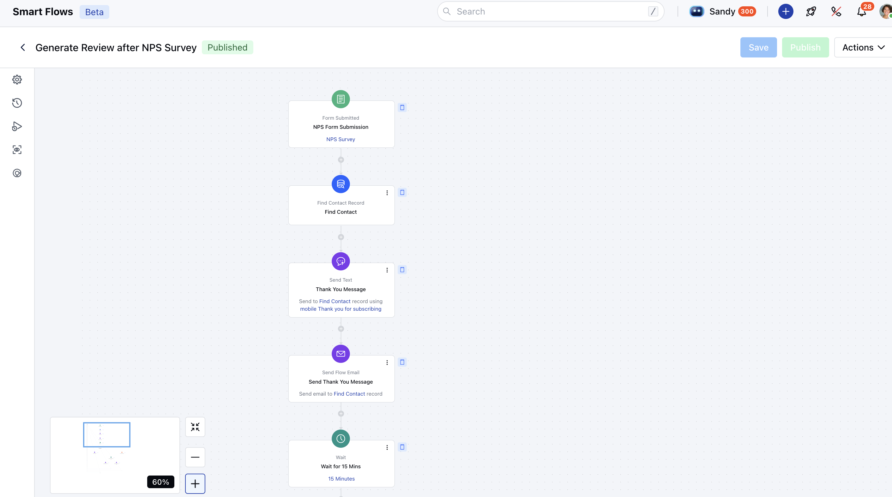
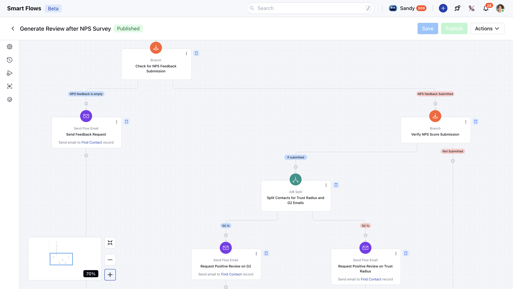

This **Smart Flow** automates the process of review collection by sending personalized emails to customers, encouraging them to share their experiences on trusted review platforms.

###  **Topics covered:**

- [Business Type](#business-type)
- [Template Type](#template-type)
- [Use Case](#use-case)
- [Key Features of the Flow](#key-features-of-the-flow-personalized-follow-ups-automatically-sends-tailored-emails-based-on-the-respondents-nps-score)
- [Steps Used to Create Flow](#steps-used-to-create-flow-form-submitted-triggerform-submittedhttpssupportsalesmateiohcen-usarticles37775479211289-form-submitted-description-this-flow-triggers-when-the-customers-submits-a-feedback-using-this-form-further-initiating-the-actions-of-thanking-them-for-leaving-a-review)
- [Breakup of Items used in the Flow](#steps-used-to-create-flow-form-submitted-triggerform-submittedhttpssupportsalesmateiohcen-usarticles37775479211289-form-submitted-description-this-flow-triggers-when-the-customers-submits-a-feedback-using-this-form-further-initiating-the-actions-of-thanking-them-for-leaving-a-review)
- [Benefits](#benefits)

###  Business Type

This flow will suits the business like SaaS, Ecommerce, Customer Facing Platforms who wants to build trust in the market by collecting positive reviews from their happy clients.

###  Template Type

The template automates the process of encouraging clients to share positive feedback on review platforms while streamlining engagement with customers who provide negative feedback.

###  Use Case

This flow can serve as the initial step to enhance your reputation on trusted review platforms by encouraging customers with positive feedback to share reviews publicly, while effectively engaging dissatisfied customers to address their concerns.

###  Key Features of the Flow- **Personalized Follow-Ups:** Automatically sends tailored emails based on the respondent's NPS score.

- **Engagement with Promoters:** Encourages satisfied customers to leave reviews on trusted platforms or share their positive experiences.

- **Detractor Management:** Directs detractors to private feedback channels for resolution, minimizing public complaints.

- **Reputation Enhancement:** Boosts positive online reviews while addressing negative feedback to improve customer satisfaction and brand image

###  Steps Used to Create Flow **Form Submitted (Trigger)**[Form Submitted](#steps-used-to-create-flow-form-submitted-triggerform-submittedhttpssupportsalesmateiohcen-usarticles37775479211289-form-submitted-description-this-flow-triggers-when-the-customers-submits-a-feedback-using-this-form-further-initiating-the-actions-of-thanking-them-for-leaving-a-review):- **Description:** This Flow triggers when the customers submits a feedback using this form further initiating the actions of thanking them for leaving a review.

- **Practical Use Case:** This trigger activates an automation flow when a customer submits the NPS form, enabling actions based on their feedback, such as sending thank-you emails, addressing concerns, or following up with promoters for testimonials to enhance engagement and service.

- **Find Record(Condition)**[Find Record:](https://support.salesmate.io/hc/en-us/articles/38138036610201-Find-Records)- **Description:** This action is used to find the record who filled out the NPS form

- **Practical Use Case:** The find record condition lets you search the record in your Salesmate account basis on the condition/criteria. In this flow, the condition is used to find the record who has filled the NPS form to take further action.

- **Send Text (Action)**[Send Text](https://support.salesmate.io/hc/en-us/articles/38138168474905-Send-Text):- **Description:** This action is used to send a Thank You message to the user who filled out the NPS form

- **Practical Use Case:** The send text action can be used as a way of communication with your customers. In this flow, this action is used to send a thank you message to the customer for filling out the NPS form.

- **Send Flow Email (Action):**[Send Flow E-mail](https://support.salesmate.io/hc/en-us/articles/38138164432409-Send-Flow-Email):- **Description:** This Action is used to send a Thank You Email to the user who filled out the NPS form

- **Practical Use Case:** The Send Flow Email action can be used whenever you wish to send out an E-mail to a customer within the Smart Flow. At this step, this action is used to send a thank you E-mail to the customer for filling out the NPS form.

- **Wait (Condition):**[Wait](#steps-used-to-create-flow-form-submitted-triggerform-submittedhttpssupportsalesmateiohcen-usarticles37775479211289-form-submitted-description-this-flow-triggers-when-the-customers-submits-a-feedback-using-this-form-further-initiating-the-actions-of-thanking-them-for-leaving-a-review):- **Description:** The wait time set for 15 minutes after which it will send an Email and a Text. Depending upon your industry or use case, you can define the the wait time as per your convenience

- **Practical Use Case:** This action pauses the flow for 15 minutes before checking for any NPS feedback submitted by the customer. The delay ensures that there is adequate time for the form submission to be processed and recorded, allowing the system to accurately evaluate the customer's feedback before proceeding with further actions.

- *Branch (Condition)**[Branch](#steps-used-to-create-flow-form-submitted-triggerform-submittedhttpssupportsalesmateiohcen-usarticles37775479211289-form-submitted-description-this-flow-triggers-when-the-customers-submits-a-feedback-using-this-form-further-initiating-the-actions-of-thanking-them-for-leaving-a-review):- **Description:** The flow will split into two paths using this condition depending if the customer has filled in the NPS score while filling out the NPS form.

- **Practical Use Case:** This action checks whether the NPS feedback field has been filled out. If empty, it triggers actions like sending a reminder or follow-up request. If feedback is provided, the workflow proceeds with actions based on the responses.

- **Send Flow Email (Action):**[Send Flow E-mail](https://support.salesmate.io/hc/en-us/articles/38138164432409-Send-Flow-Email):- **Description:** This action will send out an E-mail with the survey form link asking the customer to fill out the NPS survey score.

- **Practical Use Case:** Within the branch, if it is determined that the client has filled out the NPS form but not the NPS score, this action is used to send an email to the customer requesting feedback on their experience, including a survey or form link to gather insights for future improvements.

- **Branch (Condition)**[Branch](#steps-used-to-create-flow-form-submitted-triggerform-submittedhttpssupportsalesmateiohcen-usarticles37775479211289-form-submitted-description-this-flow-triggers-when-the-customers-submits-a-feedback-using-this-form-further-initiating-the-actions-of-thanking-them-for-leaving-a-review):- **Description:** If the NPS score is submitted, this branching will split the flow in two paths.

- **Practical Use Case:** This action checks if an NPS score has been submitted. If available, the flow proceeds to analyze the feedback and take appropriate actions, such as addressing concerns from detractors or engaging promoters.

- **A/B Split (Condition)**[A/B Split](https://support.salesmate.io/hc/en-us/articles/38138391340185-A-B-Split):- **Description:** This condition will split the contacts in two segments diverting the users to post a review on different platforms to ensure reviews are equally posted.

- **Practical Use Case:** This action divides contacts into two groups, with one group receiving emails related to Trust Radius and the other receiving emails related to G2. This segmentation ensures that contacts are targeted with relevant content based on the respective review platforms, optimizing engagement and response rates.

- **Send Flow Email (Action):**[Send Flow E-mail](https://support.salesmate.io/hc/en-us/articles/38138164432409-Send-Flow-Email):- **Description:** This action sends out an E-mail to clients asking to fill out a survey on one of the trusted platform.

- **Practical Use Case:** Send an email to half of the clients asking for a positive review on G2, encouraging them to share their experience and help improve your product’s reputation.

- **Send Flow Email (Action):**[Send Flow E-mail](https://support.salesmate.io/hc/en-us/articles/38138164432409-Send-Flow-Email):- **Description:** This action sends out an E-mail to clients asking to fill out a survey on one of the trusted platform.

- **Practical Use Case:** Send an email to half of the clients asking for a positive review on Trust Radius, encouraging them to share their experience and help improve your product’s reputation.

- **End** The Flow will end once it has taken the appropriate action.

###  Breakup of Items used in the Flow ** Trigger:**Form Submitted**: This Flow triggers when the customers submits a feedback using this form further initiating the actions of thanking them for leaving a review.

- **Condition:**Wait **: The wait time set for 15 minutes after which it will send an Email and a Text. Depending upon your industry or use case, you can define the the wait time as per your convenience** Branch:**The flow will split into two paths using this condition depending if the customer has filled in the NPS score.

- ** A/B Split **: This condition will split the contacts in two segments diverting the users to post a review on different platforms to ensure reviews are equally posted.

- ** Find Record **: This action is used to find the record who filled out the NPS form** Action:**Send Text**: This action is used to send a Thank You message to the user who filled out the NPS form **Send Flow E-mail**: This Action is used to send a Thank You Email to the user who filled out the NPS form **Send Flow Email**: After the branch condition checks and finds that the contact has not filled NPS score, this action will send them an E-mail to share their feedback **Send Flow Email**: This action will use one of the branch of A/B split and send an E-mail asking the client to submit a positive feedback on one of the platform ** Send Flow Email **: This action will use the second branch of A/B split and send an E-mail asking the client to submit a positive feedback on the second platform

###  Benefits

This automation enhances customer engagement by turning promoters into advocates through positive reviews, while effectively managing detractor feedback to resolve issues privately. It strengthens brand reputation, improves customer satisfaction, and streamlines the follow-up process, saving time and effort.
