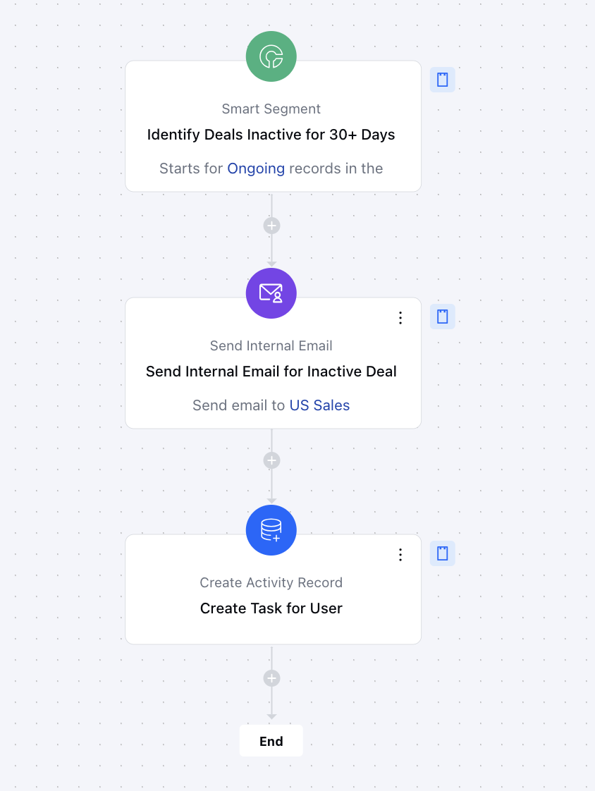

This flow keeps your sales pipeline active by automatically identifying deals that have been inactive for over 30 days. It sends timely follow-up notifications and assigns tasks to re-engage prospects, helping sales teams stay proactive and maintain efficiency.

###  **Topics covered:**

- [Business Type](#business-type)
- [Template Type](#template-type)
- [Use Case](#use-case)
- [Key Features of the Flow](#key-features-of-the-flow)
- [Steps used in Creating the Flow](#breakup-of-items-used-in-the-flow-trigger-smart-segment-the-flow-activates-automatically-when-a-deal-has-been-inactive-for-over-30-days-ensuring-no-stagnant-opportunity-is-overlooked)
- [Benefits](#benefits)

###  Business Type

Ideal for **SaaS**,**B2B**, and **service companies** that prioritize maintaining a healthy sales pipeline and boosting engagement.

###  Template Type

Designed for **Campaigns** and **Follow-Up Automation**, this flow streamlines deal management and engagement.

###  Use Case

Perfect for deal re-engagement, sales pipeline optimization, and proactive management of inactive deals.

###  Key Features of the Flow

- **Automated Deal Monitoring:** Detects deals inactive for 30+ days to prevent stagnation.

- **Internal Notifications:** Notifies the deal owner about inactive deals to prompt action.

- **Task Assignment:** Creates follow-up tasks for re-engagement, ensuring no deal is overlooked.

- **Sales Pipeline Health:** Improves pipeline management and maintains consistent deal progress.

###  Breakup of Items Used in the Flow** Trigger **Smart Segment:** The flow activates automatically when a deal has been inactive for over 30 days, ensuring no stagnant opportunity is overlooked.

- **Actions**- **Send Internal Email:** Sends an email to the assigned deal owner, notifying them about the inactive deal and prompting action.

- **Create Activity:** Automatically generates a task in the CRM for the deal owner to re-engage with the prospect and move the deal forward.

- **End** The flow concludes when the assigned follow-up task is completed, and the deal is successfully re-engaged or moved to the next stage.

###  Steps to Create Get Notification on Rotten Deals Flow

You can **[click here](https://support.salesmate.io/hc/en-us/articles/42361349454873-Get-Notification-on-Rotten-Deals#)** to learn how to create a new Smart Flow or access the Flow Templates.

- **Trigger:**[Smart Segment](#breakup-of-items-used-in-the-flow-trigger-smart-segment-the-flow-activates-automatically-when-a-deal-has-been-inactive-for-over-30-days-ensuring-no-stagnant-opportunity-is-overlooked)**- **Description:** Detects deals with no activity for 30+ days to prevent stagnation

- **Use Case:** Helps sales teams identify inactive deals early and take timely action.

- **Action:**[Send Internal Email Notification](#breakup-of-items-used-in-the-flow-trigger-smart-segment-the-flow-activates-automatically-when-a-deal-has-been-inactive-for-over-30-days-ensuring-no-stagnant-opportunity-is-overlooked):**- **Description:** Sends an automated email to the deal owner, alerting them about an inactive deal.

- **Use Case:** Helps sales teams stay proactive by prompting immediate follow-up action **[Create an Activity](#breakup-of-items-used-in-the-flow-trigger-smart-segment-the-flow-activates-automatically-when-a-deal-has-been-inactive-for-over-30-days-ensuring-no-stagnant-opportunity-is-overlooked) :**- **Description:** Automatically generates a follow-up task in the CRM for the deal owner.

- **Use Case:** Ensures timely re-engagement with prospects and prevents deals from being overlooked.

###  Benefits

- **Proactive Deal Management:** Automates the detection of stagnant deals, ensuring no opportunity is missed.

- **Improved Conversion Rates:** Timely follow-ups boost engagement and increase the likelihood of closing deals.

- **Efficiency through Automation:** Reduces manual effort, allowing sales teams to focus on meaningful tasks while automating deal monitoring and follow-ups.

- **Ideal for B2B, SaaS, and Service Companies**:
 Particularly beneficial for industries with long sales cycles, where consistent engagement is essential to prevent deals from going dormant.
