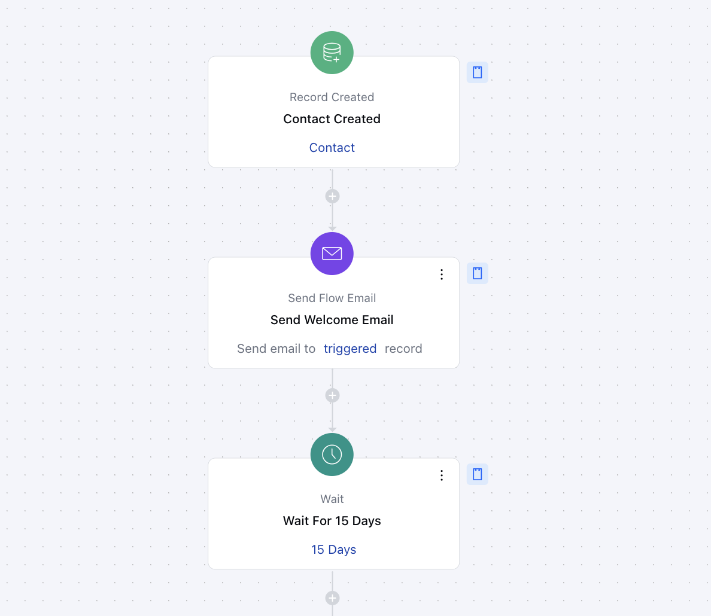
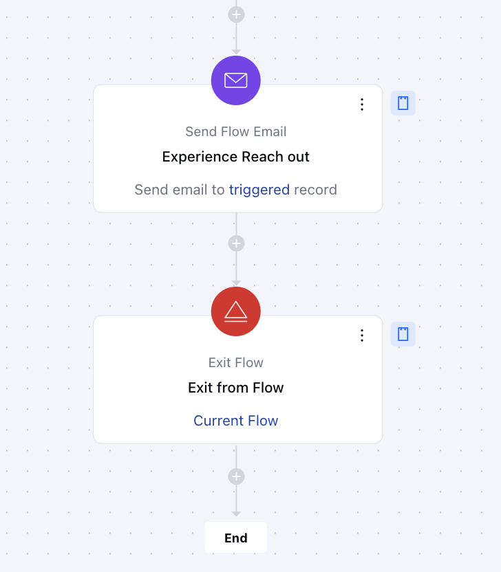

This smart flow is designed to automatically welcome new customers, ensuring they feel valued from the start. It sends personalized messages and follow-ups to engage them and gather feedback, nurturing the relationship over time. Automating these interactions strengthens customer loyalty and enhances their overall experience.

### **Topics covered:**

- [Business Type](#business-type)
- [Template Type](#template-type)
- [Use Case](#use-case)
- [Key Features of the Flow](#key-features-of-the-flow-automatic-welcome-emails-sends-a-friendly-welcome-email-as-soon-as-a-new-user-is-added-making-them-feel-acknowledged-right-away)
- [Steps Used in Creating the Flow](#steps-used-in-creating-the-flow-triggerrecord-createdhttpssupportsalesmateiohcen-usarticles36763966875289description-this-flow-starts-as-soon-as-a-contact-is-created-in-your-salesmate-account-practical-use-case-this-flow-sends-a-welcome-email-whenever-a-new-contact-is-created-with-the-type-set-to-lead-this-helps-establish-immediate-engagement-providing-new-customers-with-key-information-and-a-positive-first-impression)
- [Break up of Items Used in the Flow](#steps-used-in-creating-the-flow-triggerrecord-createdhttpssupportsalesmateiohcen-usarticles36763966875289description-this-flow-starts-as-soon-as-a-contact-is-created-in-your-salesmate-account-practical-use-case-this-flow-sends-a-welcome-email-whenever-a-new-contact-is-created-with-the-type-set-to-lead-this-helps-establish-immediate-engagement-providing-new-customers-with-key-information-and-a-positive-first-impression)
- [Benefits](#benefits)

### Business Type

Great for B2C and e-commerce businesses to improve customer experience, make it easier to manage leads, and follow up better for smoother interactions.

### Template type

Ideal for customer success teams to manage new leads effectively, this flow helps maintain engagement by sending follow-up emails at scheduled intervals. It ensures clients feel connected and supported, making it a valuable flow for the lead nurturing process.

### Use Case

This template helps the team stay engaged with new users after they connect with us. After 15 days, we will send them a follow-up email to inquire about their experience with us.

### Key Features of the Flow **Automatic Welcome Emails**: Sends a friendly welcome email as soon as a new user is added, making them feel acknowledged right away.

- **Consistent Follow-Ups**: Ensures that new users stay engaged with a follow-up email after 15 days to check in on their experience.

- **Gathering Feedback**: This makes it easy to ask users for feedback after they’ve had some time to explore, helping improve future interactions.

- **Easy Lead Management**: Helps keep new users connected and supported without any extra effort, making the process smooth and efficient.

### Steps used in creating the flow **Trigger**:**[Record Created](#steps-used-in-creating-the-flow-triggerrecord-createdhttpssupportsalesmateiohcen-usarticles36763966875289description-this-flow-starts-as-soon-as-a-contact-is-created-in-your-salesmate-account-practical-use-case-this-flow-sends-a-welcome-email-whenever-a-new-contact-is-created-with-the-type-set-to-lead-this-helps-establish-immediate-engagement-providing-new-customers-with-key-information-and-a-positive-first-impression)**Description**: This flow starts as soon as a contact is created in your Salesmate account **Practical Use case**: This flow sends a welcome email whenever a new contact is created with the type set to "Lead." This helps establish immediate engagement, providing new customers with key information and a positive first impression.

- **Send Welcome Email** As soon as the flow is triggered the welcome email will be sent using the
- [**send flow email**](#key-features-of-the-flow-automatic-welcome-emails-sends-a-friendly-welcome-email-as-soon-as-a-new-user-is-added-making-them-feel-acknowledged-right-away)
action **Set frequency using wait action **Action **: Introduce delays of 15 days before sending the next follow-up email using the
[** Wait **](#key-features-of-the-flow-automatic-welcome-emails-sends-a-friendly-welcome-email-as-soon-as-a-new-user-is-added-making-them-feel-acknowledged-right-away)
action.

- ** Practical Use Case **: This ensures there is enough gap between the first email and the follow-up email so the client can share the feedback accordingly

- * Experience Reach out ***Action **: Send a follow-up email after 15 days to gather feedback on the customer’s trial experience, addressing satisfaction, challenges, and impressions using the send flow email action.

### Breakup of Items Used in the Flow

### Trigger **Record Created**: Starts the flow when a new contact record is created in Salesmate.

### Actions **Send Welcome Email**: Automatically sends a personalized welcome email to the new user.

- **Wait for 15 Days**: Pauses the flow for 15 days, giving the user time to explore your offerings.

- **Send Experience Follow-Up Email**: Sends an email to ask for feedback and encourage further engagement after the 15-day period.

### End **Exit Flow**: Ends the flow after the second email is sent, completing the process.

### Benefits

The New User Welcome Flow brings plenty of benefits. It helps create a better experience for your customers by sending personalized emails that make them feel appreciated and informed. It also boosts engagement by encouraging users to check out what you offer and share their feedback. Plus, it saves time by automating onboarding and follow-ups, so you don’t have to handle everything manually. The best part? It’s flexible and works well for different businesses and industries.
